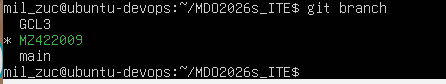
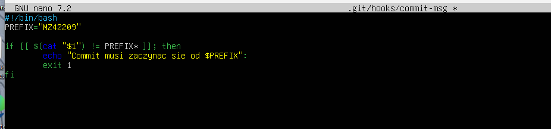
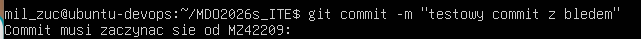
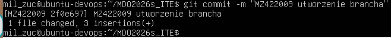
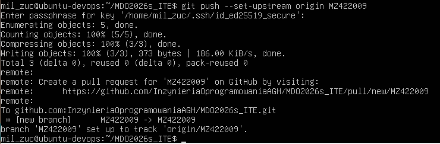

# Sprawozdanie 1 #

## Lab 1 ##

### Wykonane kroki: ###
###1) Wybranie odpowiedniego brancha. ###

###2) Tresc skryptu hooka - commit-msg. ###

###3) Wykonanie commitu z celowym bledem, aby sprawdzic poprawnosc skryptu. ###

###4) Wykonanie prawidlowego commita. ###

###5) Polecenie git push. ###

