# Sprawozdanie 1 #

# Lab 1 #
Wykonane kroki:
## 1.1. Dodanie klucza SSH do GitHub.
## 1.2. Branch.
Utworzenie nowej własnej gałęzi (branch) oraz sprawdzenie poprawności wybrania odpowiedniego brancha.

  

## 1.3. Skrypt Git hook
Napisanie skryptu Git hooka - commit-msg, który werfikuje czy każdy commit zaczyna się poprawnym kodem (inicjały&nrindeksu).Skrypt należy umieścić w odpowiednim miejscu (.git/hooks), aby uruchamiał się przy każdym commicie.
### Kod skryptu: ###

  

### Testowanie: ###
Wykonanie commitu z celowym bledem, aby sprawdzic poprawnosc skryptu.

  

Wykonanie prawidlowego commita.

  

## 1.4. Polecenie git push -> wysłanie zrobionych rzeczy do githuba.

  

# Lab 2 #
Wykonane kroki:
## 2.1. Docker
Zainstalowanie dockera (pakiet docker.io) w systemie Ubuntu 24.04.1 . Weryfikacja wersji:

  

## 2.2. Obrazy
Pobranie obrazów: `hello-world`, `busybox`, `ubuntu`, `mariadb`, `node` za pomocą polecenia *sudo docker pull nazwa_obrazu*. Lista pobranych obrazów z ich rozmiarami:

  

## 2.3. hello-world
Testowe uruchomienie obrazu hello-world.

  

## 2.4. busybox
Podlaczenie sie interaktywnie do kontenera z obrazu busybox. Poprzez wywołanie "echo $?" sprawdzamy kod zakończenia ostatnio wykonanego polecenia, czyli w tym przypadku poprawność wykonania busybox.

  

## 2.5. ubuntu
Uruchomienie "systemu w kontenerze"(ubuntu) + zaprezentowanie PID1 dla "bash", co potwierdza izolację od procesów hosta.

  

## 2.6. Dockerfile
Stworzenie pliku Dockerfile, który bazuje na obrazie ubuntu, instaluje "git", określa katalog roboczy oraz klonuje nasze repozytorium.
### Kod Dockerfile: ###

  

Budowa obrazu za pomocą utworzonego pliku Dockerfile oraz weryfikacja poprawności klonowania:

  
  

## 2.7. Wyświetlenie listy uruchomionych kontenerów:

  

## 2.8. Usuniecie kontenerow i obrazow z lokalnego magazynu:
  
  

# Lab 3 #
Wykonane kroki:

## 3.1. Wybór repozytorium z kodem oprogramowania.
Do realizacji zadania wybrano projekt **Express.js**, czyli framework *Node.js* przeznaczony do budowy aplikacji webowych. Repozytorium zawiera kod źródłowy, zależności instalowane przez `npm` oraz testy uruchamiane poleceniem `npm test`, dzięki czemu nadaje się do demonstracji procesu *build* i *test* w kontenerach Dockera.

## 3.2. Etap build - Dockerfile.bld
Utworzono plik Dockerfile odpowiedzialny za przygotowanie środowiska oraz budowę aplikacji.
### Kod Dockerfile.bld: ###

  

Za pomocą polecenia *sudo docker build -t express-build -f Dockerfile.bld .* zbudowano ten obraz. Oto tego wynik:

  

## 3.3. Etap testów - Dockerfile.test
Utworzono drugi Dockerfile bazujący na obrazie build. Ten Dockerfile ustawia katalog roboczy oraz uruchamia testy poleceniem *npm test*.
### Kod Dockerfile.test: ###

  

Następnie zbudowano tym razem ten obraz.

  

## 3.4. Weryfikacja obrazów
Sprawdzono dostępne obrazy:

  

## 3.5. Przygotowanie do wdrożenia (deploy) – pytania i odpowiedzi
**Czy program nadaje się do wdrażania i publikowania jako kontener, czy taki sposób interakcji nadaje się tylko do builda?**

Program może zostać opublikowany jako kontener, jeśli jest usługą działającą poprawnie w środowisku serwerowym, np. API lub aplikacją webową. Nie każdy projekt nadaje się jednak do takiej formy wdrożenia. W niektórych przypadkach kontener lepiej wykorzystać jedynie do budowania i testowania aplikacji.

**Jeżeli program miałby być publikowany jako kontener – czy trzeba go oczyścić z pozostałości po buildzie?**

Tak. Finalny obraz nie powinien zawierać narzędzi developerskich, cache pakietów ani zbędnych plików. Dzięki temu obraz jest mniejszy, bezpieczniejszy i łatwiejszy do wdrożenia.

**Czy dedykowany etap deploy-and-publish powinien być oddzielną ścieżką?**

Tak. Oddzielenie etapu build, test i deploy upraszcza organizację procesu CI/CD. Pozwala to na lepszą kontrolę nad tym, co trafia do finalnego artefaktu.

**Czy zbudowany program należałoby dystrybuować jako pakiet, np. JAR, DEB, RPM, EGG?**

Zależy to od typu projektu. Dla części aplikacji lepszy będzie obraz kontenera, a dla innych bardziej odpowiedni będzie klasyczny pakiet instalacyjny, np. DEB lub RPM.

**W jaki sposób zapewnić taki format? Dodatkowy krok, trzeci kontener?**

Tak. Można zastosować dodatkowy etap lub osobny kontener odpowiedzialny za przygotowanie końcowego artefaktu. Przykładowo: pierwszy etap wykonuje build, drugi testy, a trzeci tworzy finalny pakiet lub obraz gotowy do publikacji.

# Lab 4 #
Wykonane kroki:

## 4.1. Woluminy Dockera i zachowanie stanu
Na początku utworzono dwa woluminy: wejściowy i wyjściowy. Wolumin wejściowy został przeznaczony na kod źródłowy projektu, a wyjściowy na zapis wyników pracy kontenera.

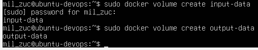

Następnie uruchomiony został kontener bazowy `express-build` z podpiętymi właśnie stworzonymi woluminami pod katalogi `/input` oraz `/output`.

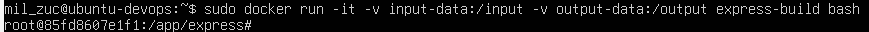

**Jak to zostało wykonane i dlaczego ta metoda?**

W celu sklonowania repozytorium do woluminu wejściowego wykorzystano uruchomienie kontenera pomocniczego z podpiętym woluminem (`input-data`) i wykonanie operacji `git clone` wewnątrz kontenera.
Takie rozwiązanie pozwala na zapisanie danych bezpośrednio w woluminie Dockera, który jest niezależny od cyklu życia kontenera.

-Nie zastosowano *bind mount* z lokalnym katalogiem, ponieważ dane miały być przechowywane w zarządzanym przez Dockera woluminie, co zapewnia większą przenośność i izolację od systemu hosta.

-Nie wykorzystano również bezpośredniego kopiowania do katalogu Dockera (`/var/lib/docker`), ponieważ nie jest to zalecana praktyka — katalog ten jest zarządzany przez silnik Dockera i nie powinien być modyfikowany ręcznie.

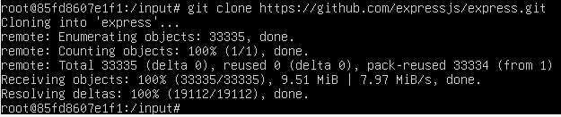

Po udanym sklonowaniu, wykonano instalację zależności poleceniem `npm install` (będąc dalej wewnątrz kontenera). Teraz można już skopiować gotowy katalog projektu do wolumina wyjściowego.

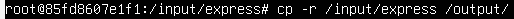

### Sprawdzenie wyników ###
W celu weryfikacji zapisania wyników na woluminie wyjsciowym po wyłączeniu kontenera, uruchomiono nowy kontener i sprawdzono zawartość woluminu `output-data`, potwierdzając zachowanie danych po zakończeniu pracy poprzedniego kontenera.

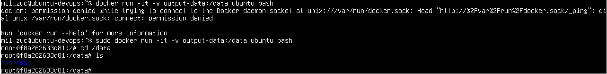

### Wniosek ###
Woluminy Dockera umożliwiają zachowanie stanu między kolejnymi kontenerami. Dzięki temu dane wejściowe i wyniki pracy nie zostały utracone po zakończeniu działania pojedynczej instancji kontenera.

## 4.2. Łączność między kontenerami
### a) Połączenie w domyślnej sieci Dockera (adres IP)
W celu zbadania komunikacji sieciowej uruchomiono kontener z serwerem *iperf3*.

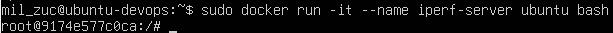
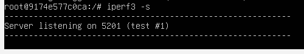

Następnie uruchomiono drugi kontener i wykonano w nim połączenie z użyciem adresu IP servera:

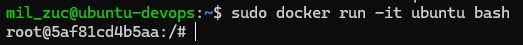
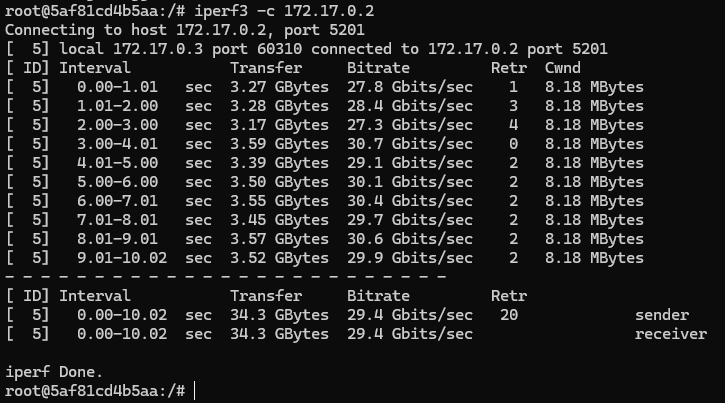

**Opis:** W tym przypadku komunikacja odbywa się w domyślnej sieci Dockera, gdzie kontenery identyfikowane są przez adresy IP.

### b) Połączenie w dedykowanej sieci (po nazwie kontenera)
Utworzono własną sieć mostkową oraz uruchomiono kontener serwera w tej sieci:

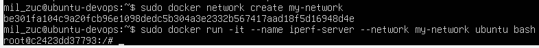
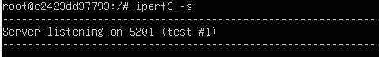

Nastepnie uruchomiono drugi kontener clienta i wykonano w nim połączenie po nazwie kontenera:

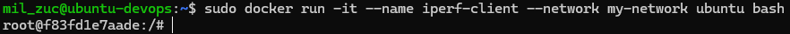
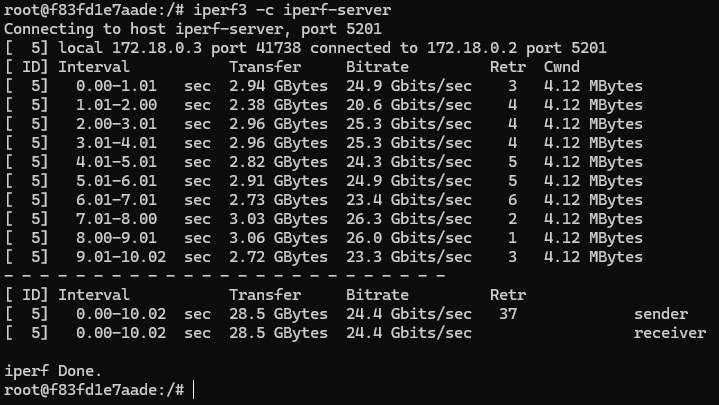

**Opis:** W dedykowanej sieci Dockera możliwe jest używanie nazw kontenerów zamiast adresów IP dzięki wbudowanemu mechanizmowi DNS.

### c) Połączenie z hosta
Uruchomiono kontener z mapowaniem portu, a w nim uruchomiono server iperf3:

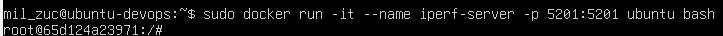
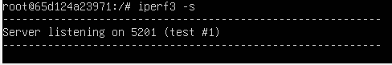

Następnie z poziomu hosta wykonano połączenie do `localhost`:

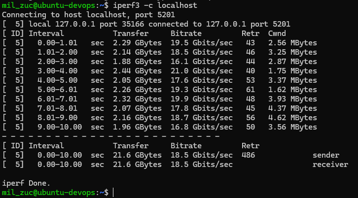

**Opis:** Mapowanie portów (`-p`) umożliwia dostęp do usług działających w kontenerze z poziomu systemu hosta.

## 4.3. Usługa SSHD w kontenerze
W kontenerze Ubuntu uruchomiono usługę *OpenSSH Server* (`service ssh start`) oraz sprawdzono obecność procesu *sshd* (`ps aux | grep ssh`).

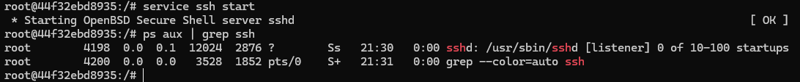

Następnie z hosta wykonano połączenie SSH do kontenera z użyciem wcześniej utworzonego użytkownika `mil` i portu `2222`.

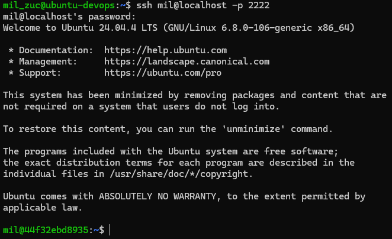

**Opis:** Usługa *SSHD* została uruchomiona w kontenerze i udostępniona przez mapowanie portu. Dzięki temu możliwe było połączenie z kontenerem z poziomu hosta przy użyciu protokołu SSH.

## 4.4. Kontenerowa instancja Jenkins
W pierwszym kroku uruchomiono kontener `jenkins-docker` oparty o obraz *Docker-in-Docker*.

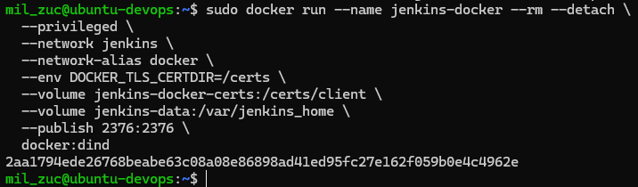

Następnie uruchomiono właściwy kontener `jenkins`, skonfigurowany do współpracy z `jenkins-docker`.

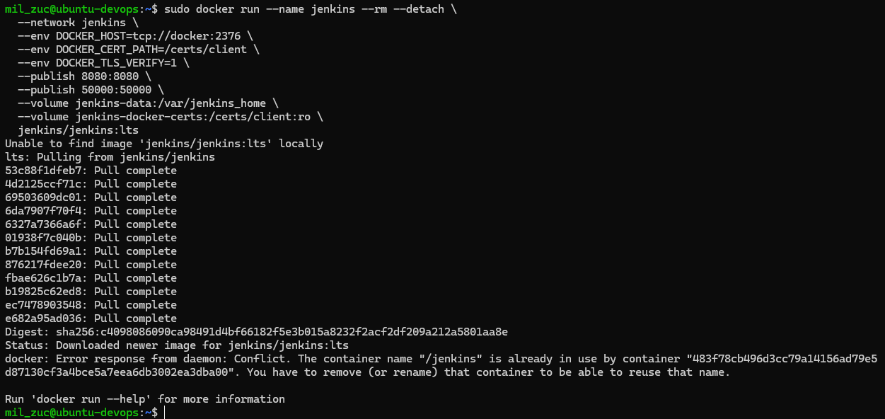

Stan obu kontenerów zweryfikowano poleceniem `docker ps`.

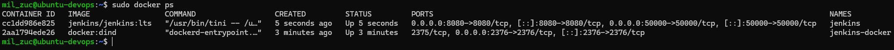

Po wejściu na adres serwera Jenkins w przeglądarce uzyskano ekran odblokowania instancji i wpisano hasło odczytane z terminala.

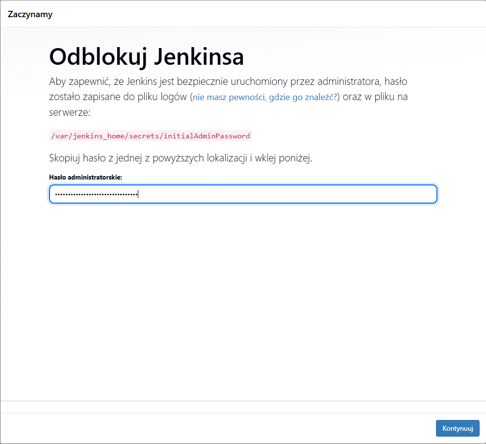

Kolejny ekran potwierdził przejście do etapu instalacji sugerowanych wtyczek. (co zostało zrealizowane)

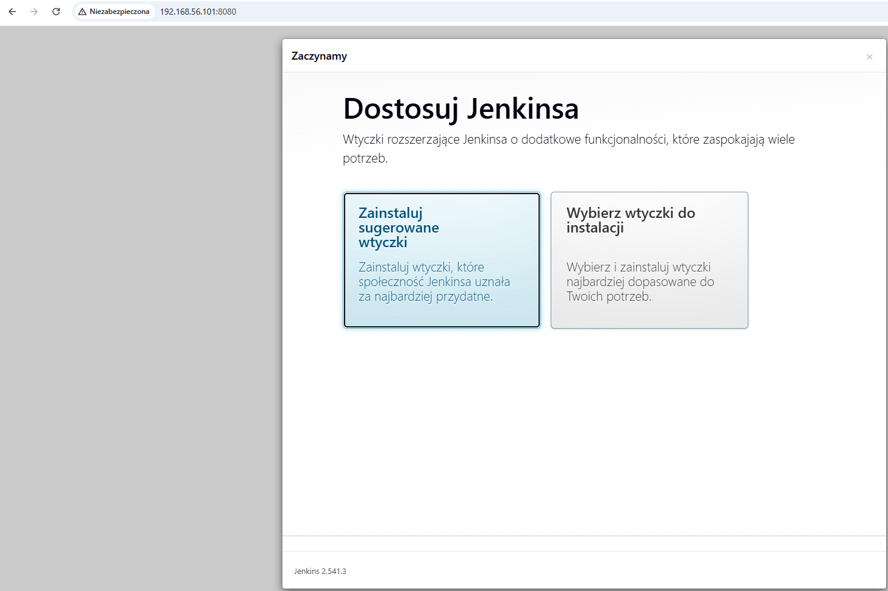

## Podsumowanie

Wykonane ćwiczenia pokazały, że automatyzacja i konteneryzacja znacząco upraszczają organizację pracy z projektem. Zastosowanie *Git Hooks* umożliwiło wymuszenie ustalonych reguł pracy z repozytorium, co poprawia spójność historii zmian.
Wprowadzenie Dockera do procesu budowania i testowania pozwoliło odseparować środowisko uruchomieniowe od systemu hosta. Dzięki temu ten sam proces może zostać wykonany w identyczny sposób niezależnie od maszyny, na której pracuje użytkownik.
Istotnym elementem okazało się również wykorzystanie woluminów i sieci Dockera. Woluminy umożliwiają zachowanie danych poza czasem życia kontenera, natomiast sieci pozwalają na prostą i uporządkowaną komunikację między uruchomionymi usługami.
Uruchomienie instancji Jenkins potwierdziło, że narzędzia ciągłej integracji mogą być wdrażane w modelu kontenerowym i stanowić centralny element dalszej automatyzacji procesu wytwarzania oprogramowania.
