# Sprawozdanie 1 #

## Lab 1 ##

## Wykonane kroki: ##
## 1. Dodanie klucza SSH do GitHub.
## 2. Utworzenie nowej własnej gałęzi (branch) oraz sprawdzenie poprawności wybrania odpowiedniego brancha.

  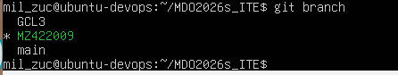

## 3. Napisanie skryptu Git hooka - commit-msg, który werfikuje czy każdy commit zaczyna się poprawnym kodem (inicjały&nrindeksu).Skrypt należy umieścić w odpowiednim miejscu (.git/hooks), aby uruchamiał się przy każdym commicie.
### Kod skryptu: ###

  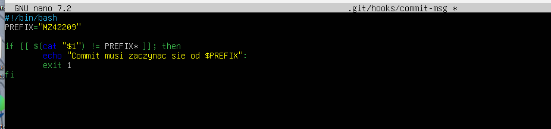

### Testowanie: ###
Wykonanie commitu z celowym bledem, aby sprawdzic poprawnosc skryptu.

  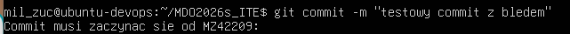

Wykonanie prawidlowego commita.

  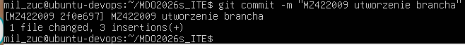

## 4. Polecenie git push -> wysłanie zrobionych rzeczy do githuba.

  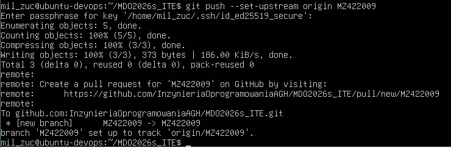

## Lab 2 ##

## Wykonane kroki: ##
## 1. Zainstalowanie dockera (pakiet docker.io) w systemie Ubuntu 24.04.1 . Weryfikacja wersji:

  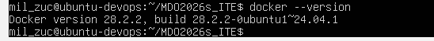

## 2. Pobranie obrazów: 'hello-world', 'busybox', 'ubuntu', 'mariadb', 'node' za pomocą polecenia "sudo docker pull nazwa_obrazu". Lista pobranych obrazów z ich rozmiarami:

  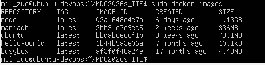

## 3. Testowe uruchomienie obrazu hello-world.

  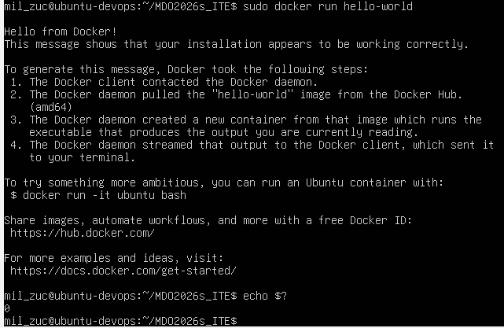

## 4. Podlaczenie sie interaktywnie do kontenera z obrazu busybox. Poprzez wywołanie "echo $?" sprawdzamy kod zakończenia ostatnio wykonanego polecenia, czyli w tym przypadku poprawność wykonania busybox.

  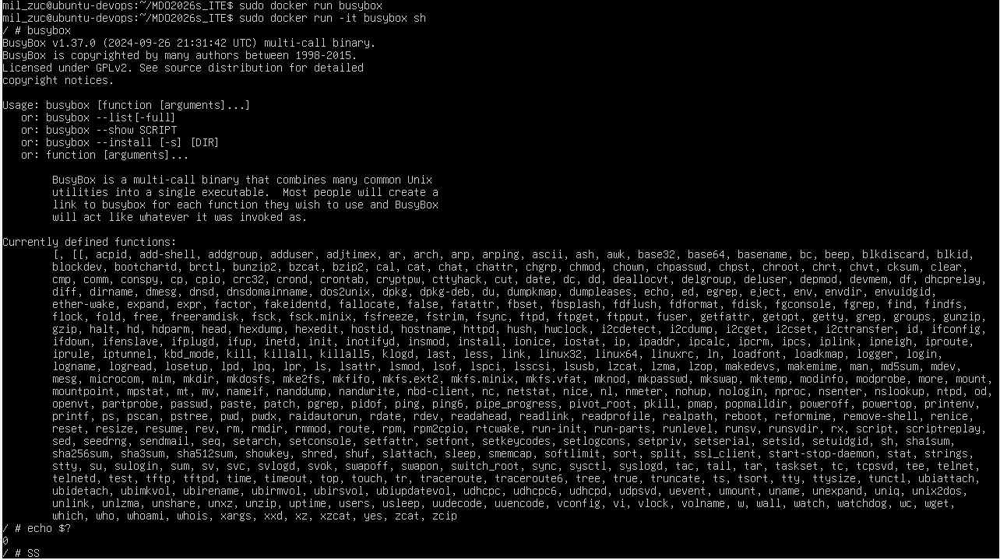

## 5. Uruchomienie "systemu w kontenerze"(ubuntu) + zaprezentowanie PID1 dla "bash", co potwierdza izolację od procesów hosta.

  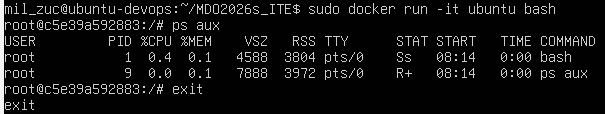

## 6. Stworzenie pliku Dockerfile, który bazuje na obrazie ubuntu, instaluje "git", określa katalog roboczy oraz klonuje nasze repozytorium.
### Kod Dockerfile: ###

  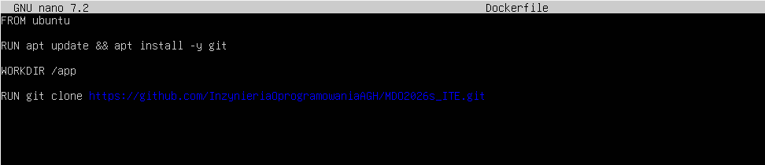

## 7. Budowa obrazu za pomocą utworzonego pliku Dockerfile oraz weryfikacja poprawności klonowania:

  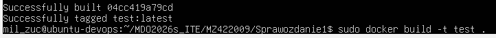
  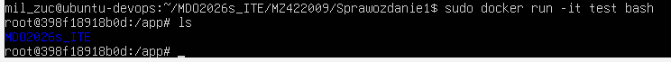

## 8. Wyświetlenie listy uruchomionych kontenerów:

  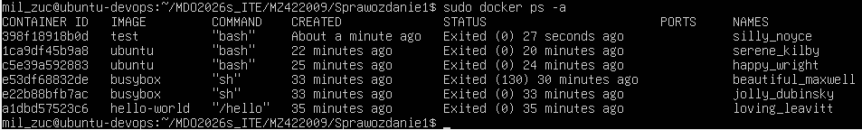

## 9. Usuniecie kontenerow i obrazow z lokalnego magazynu:
  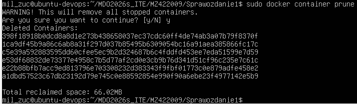
  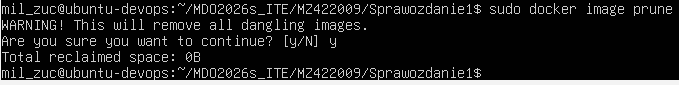

## Lab 3 ##

## Wykonane kroki: ##

## 1. Wybór repozytorium z kodem oprogramowania.
Do realizacji zadania wybrano projekt **Express.js**, czyli framework *Node.js* przeznaczony do budowy aplikacji webowych. Repozytorium zawiera kod źródłowy, zależności instalowane przez `npm` oraz testy uruchamiane poleceniem `npm test`, dzięki czemu nadaje się do demonstracji procesu *build* i *test* w kontenerach Dockera.

## 2. Etap build - Dockerfile.bld
Utworzono plik Dockerfile odpowiedzialny za przygotowanie środowiska oraz budowę aplikacji.
### Kod Dockerfile.bld: ###

  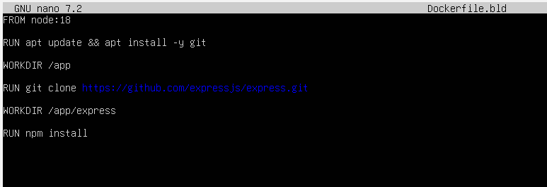

Za pomocą polecenia *sudo docker build -t express-build -f Dockerfile.bld .* zbudowano ten obraz. Oto tego wynik:

  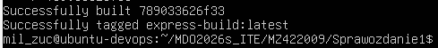
  
## 3. Etap testów - Dockerfile.test
Utworzono drugi Dockerfile bazujący na obrazie build. Ten Dockerfile ustawia katalog roboczy oraz uruchamia testy poleceniem *npm test*.
### Kod Dockerfile.test: ###

  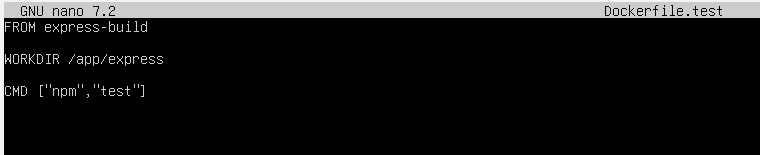

Następnie zbudowano tym razem ten obraz.

  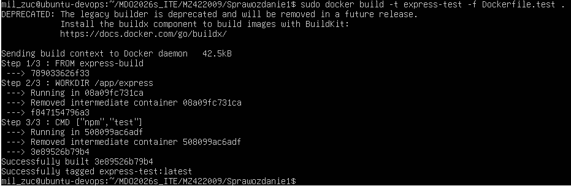

## 4. Weryfikacja obrazów
Sprawdzono dostępne obrazy:

  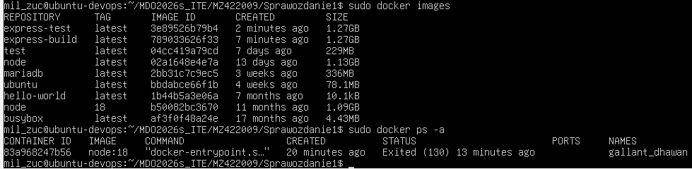
