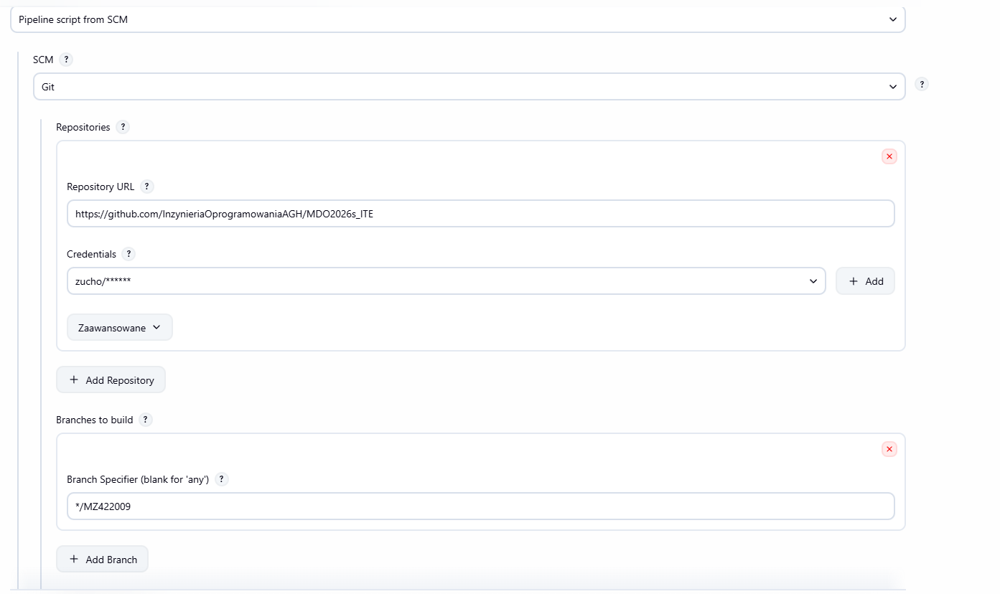
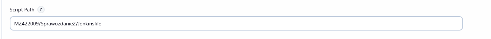
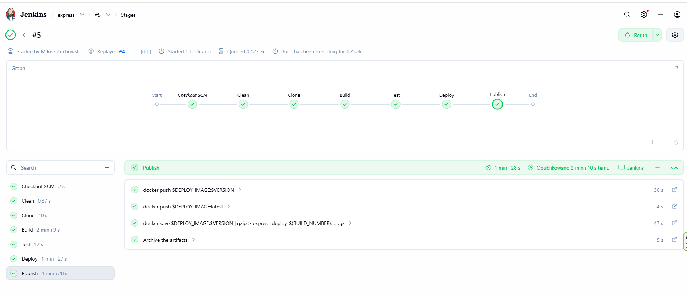
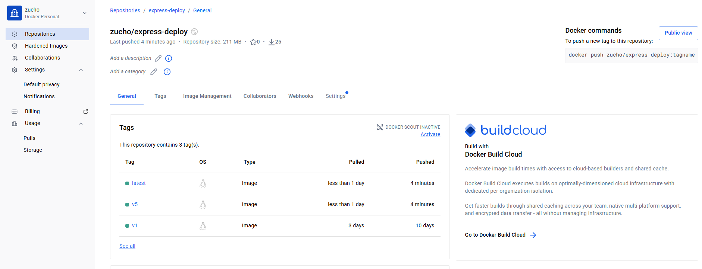

# Sprawozdanie 2 #

# Lab 5 #
Wykonane kroki:
## 5.1. Przygotowanie instancji Jenkins
Pobranie i uruchomienie kontenera `docker:dind`, który pełni rolę serwera Docker dla Jenkinsa.


Utworzono własny plik Dockerfile.jenkins, który rozszerza obraz jenkins/jenkins o instalację klienta Docker (docker-ce-cli) oraz wymaganych narzędzi systemowych, na podstawie instrukcji instalacji Jenkinsa: https://www.jenkins.io/doc/book/installing/docker/ .

### Kod Dockerfile.jenkins : ###


Kolejno zbudowano obraz blueocean na podstawie obrazu Jenkinsa:


Uruchomienie swojego własnego kontenera myjenkins-blueocean:


## 5.2. Konfiguracja Jenkins
Po wejściu w przeglądarce na adres `http://localhost:8080` wykonano:

### -> odblokowanie instancji za pomocą hasła z kontenera: ###


### -> instalacja wtyczek ###

### -> utworzenie użytkownika administratora: ###


W celu sprawdzenia poprawnego uruchomienia serwera Jenkins wyświetlono logi kontenera poleceniem z zrzutu ekranu poniżej:


## 5.3. Zadania testowe w Jenkins typu Freestyle project
Po uruchomieniu i skonfigurowaniu Jenkinsa utworzono kilka prostych zadań testowych, aby sprawdzić poprawność działania środowiska CI.

### Projekt wyświetlający uname ###
Utworzono zadanie typu Freestyle project, w którym wykonano polecenie `uname -a`:


Zadanie zakończyło się poprawnie, a w logach konsoli widoczny był wynik polecenia systemowego.

### Projekt z nieparzystą godziną ###
Utworzono kolejne zadanie testowe, które miało zwracać błąd, gdy aktualna godzina jest nieparzysta. Wykorzystano prosty skrypt powłoki sprawdzający wartość godziny.
```bash
HOUR=$(date +%H)
if [ $((10#$HOUR % 2)) -eq 1 ]; then
    exit 1
fi
```
W moim przypadku wykonanie zadania zakończyło się błędem, co potwierdziło poprawne działanie mechanizmu oznaczania builda jako nieudanego. Oto potwierdzenie:


### Projekt pobierający obraz ubuntu ###
Celem następnego zadania było pobranie obrazu kontenera ubuntu z użyciem polecenia `docker pull ubuntu` :


Otrzymany sukces zadania potwierdza, że Jenkins może wykonywać polecenia Docker i komunikować się ze środowiskiem kontenerowym.

## 5.4. Zadania testowe w Jenkins typu pipeline
Po zapoznaniu się z Jenkinsem i zadaniami typu Freestyle project, należy przejść do ćwiczeń z typem pipeline. Pierwszą i znaczącą różnicą jest wybór typu obiektu przy tworzeniu projektu, czyli `pipeline` zamiast wcześniejszego `Freestyle Project`.

### Pierwszy pipeline (bez SCM) ###
Utworzono pierwszy obiekt typu pipeline bez wykorzystania repozytorium Git (pipeline wpisany ręcznie w Jenkinsie).
Pipeline składał się z prostych etapów testowych:

`hello` – wyświetlenie komunikatu
`end` – zakończenie pipeline


Wykonanie pipeline zakończyło się statusem SUCCESS, co potwierdza poprawną konfigurację środowiska Jenkins oraz działania pipeline.

 
### Dodanie do pipeline operacje Git i Docker ###
W tym etapie wcześniejszy pipeline został rozszerzony o: `klonowanie repozytorium (Clone repo)` i `budowę obrazu Docker (Build custom Dockerfile)`.


Podczas wykonania wystąpił błąd na etapie klonowania repozytorium, co spowodowało zatrzymanie pipeline. To ma pokazać jak wygląda błąd w jednym z etapów pipeline i jak to się zachowuje. W tym przypadku błąd spowodowała niepoprawna konfiguracja dostępu do repozytorium w Jenkins. 

# Lab 6 #
Podczas tych laboratorium otrzymalismy indywidualne instrukcje do wykonania. W moim przypadku celem ćwiczenia było przygotowanie obrazu Docker aplikacji oraz jego publikacja w repozytorium Docker Hub. Zostało to ręcznie przygotowane bez wykorzystania narzędzi CI/CD, które będzie zatomatyzowane później.
Wykonane kroki:

## 6.1. Utworzenie pliku Dockerfile.deploy
Zdefiniowano plik `Dockerfile.deploy` budujący obraz aplikacji: 
```
FROM node:18-slim

RUN apt update && apt install -y git

WORKDIR /app

RUN git clone https://github.com/expressjs/express.git

WORKDIR /app/express

RUN npm install --omit-dev

CMD ["node", "-v"]
```
Plik wykorzystuje obraz bazowy node:18-slim, instaluje repozytorium Express oraz zależności aplikacji.


## 6.2. Budowa obrazu Docker
Obraz został zbudowany lokalnie:

 

*Ważne:* Wykorzystano parametr `--no-cache`, który zapewnia budowę od zera bez użycia cache.

## 6.3. Uruchomienie kontenera


Otrzymany wynik `v18.20.8` potwierdza poprawne działanie środowiska Node.js w kontenerze.

## 6.4. Autoryzacja w Docker Hub
Wykonano logowanie do rejestru za pomocą polecenia `sudo docker login`


Jak widać na zrzucie ekranu powyżej logowanie zakończyło się statusem *Login Succeeded*.

## 6.5. Tagowanie obrazu
Obraz został oznaczony tagami:


## 6.6. Publikacja obrazu
Obraz został wysłany do Docker Hub:


Proces zakończył się poprawnie – wszystkie warstwy zostały przesłane.

### Weryfikacja: ###
W repozytorium Docker Hub dostępny jest obraz: `zucho/express-deploy`, tagi: `v1`, `latest`.


Potwierdza to poprawną publikację artefaktu.

# Lab 7 #
Celem ćwiczenia było zautomatyzowanie procesu budowy, testowania oraz publikacji obrazu Docker przy użyciu narzędzia Jenkins Pipeline.
Wykonane kroki:

## 7.1. Jenkins pipeline i Jenkinsfile
Jenkins Pipeline umożliwia nam zdefiniowanie procesu CI/CD jako kodu w pliku Jenkinsfile. Pipeline składa się z etapów (stages), które są wykonywane sekwencyjnie.
W tym kroku zdefiniowaliśmy dokładnie każdy krok pipeline w pliku Jenkinsfile. W moim przypadku pipeline składa się z etapów:
`Checkout SCM` – pobranie repozytorium z GitHuba,
`Clean` – wyczyszczenie katalogu roboczego,
`Clone` – przygotowanie kodu aplikacji Express,
`Build` – budowa obrazu buildowego,
`Test` – uruchomienie testów,
`Deploy` – przygotowanie obrazu docelowego,
`Publish` – wysłanie obrazu do Docker Hub oraz zapis artefaktu. Dzięki użyciu *${BUILD_NUMBER}* każdy artefakt otrzymuje unikalną wersję.

### Treść pliku Jenkinsfile: ###

```
pipeline {
    agent any

    environment {
        DOCKERHUB_USER = 'zucho'
        IMAGE_NAME = 'express-deploy'
        BUILD_IMAGE = 'express-bldr:latest'
        TEST_IMAGE = 'express-tester:latest'
        DEPLOY_IMAGE = 'zucho/express-deploy'
        VERSION = "v${BUILD_NUMBER}"
    }

    stages {
        stage('Clean') {
            steps {
                deleteDir()
            }
        }

        stage('Clone') {
            steps {
                checkout scm
                sh 'ls -la'
                sh 'ls -la MZ422009/Sprawozdanie2'
            }
        }

        stage('Build') {
            steps {
                dir('MZ422009/Sprawozdanie2') {
                    sh 'docker build --no-cache -f Dockerfile.bld -t $BUILD_IMAGE .'
                }
            }
        }

        stage('Test') {
            steps {
                dir('MZ422009/Sprawozdanie2') {
                    sh 'docker build --no-cache -f Dockerfile.test -t $TEST_IMAGE .'
                    sh 'docker run --rm $TEST_IMAGE'
                }
            }
        }

        stage('Deploy') {
            steps {
                dir('MZ422009/Sprawozdanie2') {
                    sh 'docker build --no-cache -f Dockerfile.deploy -t $DEPLOY_IMAGE:$VERSION -t $DEPLOY_IMAGE:latest .'
                    sh 'docker run --rm $DEPLOY_IMAGE:$VERSION'
                }
            }
        }

        stage('Publish') {
            steps {
                sh 'docker push $DEPLOY_IMAGE:$VERSION'
                sh 'docker push $DEPLOY_IMAGE:latest'
                sh 'docker save $DEPLOY_IMAGE:$VERSION | gzip > express-deploy-${BUILD_NUMBER}.tar.gz'
                archiveArtifacts artifacts: "express-deploy-${BUILD_NUMBER}.tar.gz", fingerprint: true
            }
        }
    }
}
```

## 7.2. Przebieg wykonania

### Krok 1 - utworzenie pipeline w Jenkins ###
Utworzono nowy projekt typu Pipeline i wybrano opcję - `Pipeline script from SCM`

### Krok 2 - konfiguracja repozytorium ###
Ustawiono:

*->* SCM: Git
*->* Repository URL: link do repozytorium projektu
*->* Credentials: konto Git
*->* Branch: wybranie brancha, w moim przypadku */MZ422009



### Krok 3 - ustawienie ścieżki do Jenkinsfile ###
W okienku `Script Path` ustawiamy swoją ścieżkę do pliku Jenkinsfile.



### Krok 4 - uruchomienie pipeline ###
Moje pierwsze uruchiomienia nie przechodziły, ponieważ problem pojawił się z etapem Clone repo. Błąd wynikał z niepoprawnej konfiguracji (prosty błąd w linku do repozytorium). Po naprawieniu błędu pipeline wykonał się poprawnie, ponieważ przeszedł wszystkie etapy kończąc je statusem *SUCCESS*.



### Krok 5 - publikacja obrazu i weryfikacja w Docker Hub ###
W etapie publish wykonano podobne kroki co w lab 6 ręcznie, czyli: `docker tag`, `docker push` i `archiwizację artefaktu (docker save)`. Obraz został zapisany jako `express-deploy-${BUILD_NUMBER}.tar.gz`. Następnie zweryfikowano obecność obrazu w Docker Hub:
*->* repozytorium: `zucho/express-deploy`
*->* dostępne tagi: `latest`, wersjonowane (`v1`, `v5` lub build number).




# Wnioski #
Zastosowanie Jenkins Pipeline umożliwiło pełną automatyzację procesu budowy i publikacji obrazu Docker. W porównaniu do podejścia ręcznego z poprzedniego ćwiczenia, rozwiązanie to eliminuje błędy użytkownika oraz zapewnia powtarzalność procesu. Pipeline realizuje kompletny proces CI/CD i generuje artefakt gotowy do wdrożenia. 
