# Sprawozdanie 2 #

# Lab 5 #
Wykonane kroki:
## 5.1. Przygotowanie instancji Jenkins
Pobranie i uruchomienie kontenera `docker:dind`, który pełni rolę serwera Docker dla Jenkinsa.

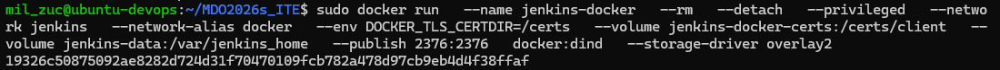

Utworzono własny plik Dockerfile.jenkins, który rozszerza obraz jenkins/jenkins o instalację klienta Docker (docker-ce-cli) oraz wymaganych narzędzi systemowych, na podstawie instrukcji instalacji Jenkinsa: https://www.jenkins.io/doc/book/installing/docker/ .

### Kod Dockerfile.jenkins : ###
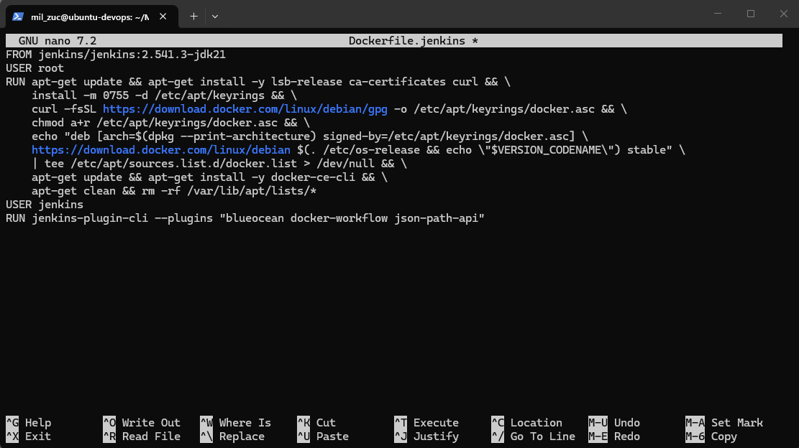

Kolejno zbudowano obraz blueocean na podstawie obrazu Jenkinsa:

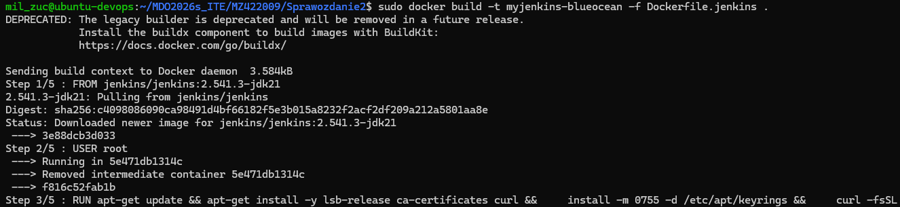

Uruchomienie swojego własnego kontenera myjenkins-blueocean:

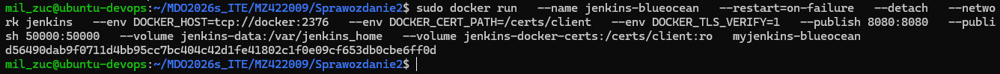


## 5.2. Konfiguracja Jenkins
Po wejściu w przeglądarce na adres `http://localhost:8080` wykonano:

### -> odblokowanie instancji za pomocą hasła z kontenera: ###

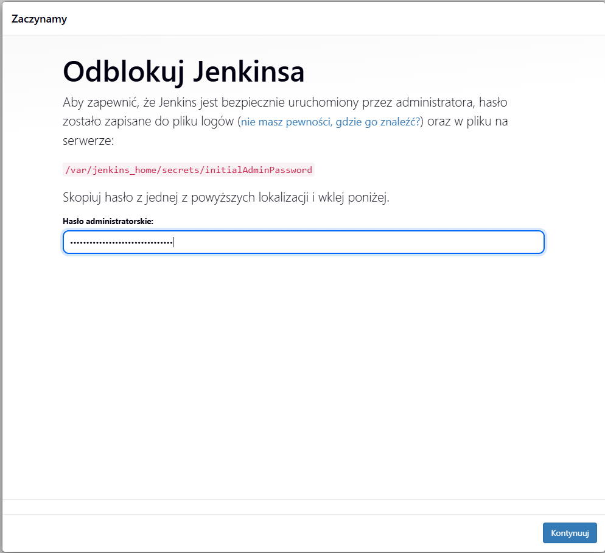

### -> instalacja wtyczek ###

### -> utworzenie użytkownika administratora: ###

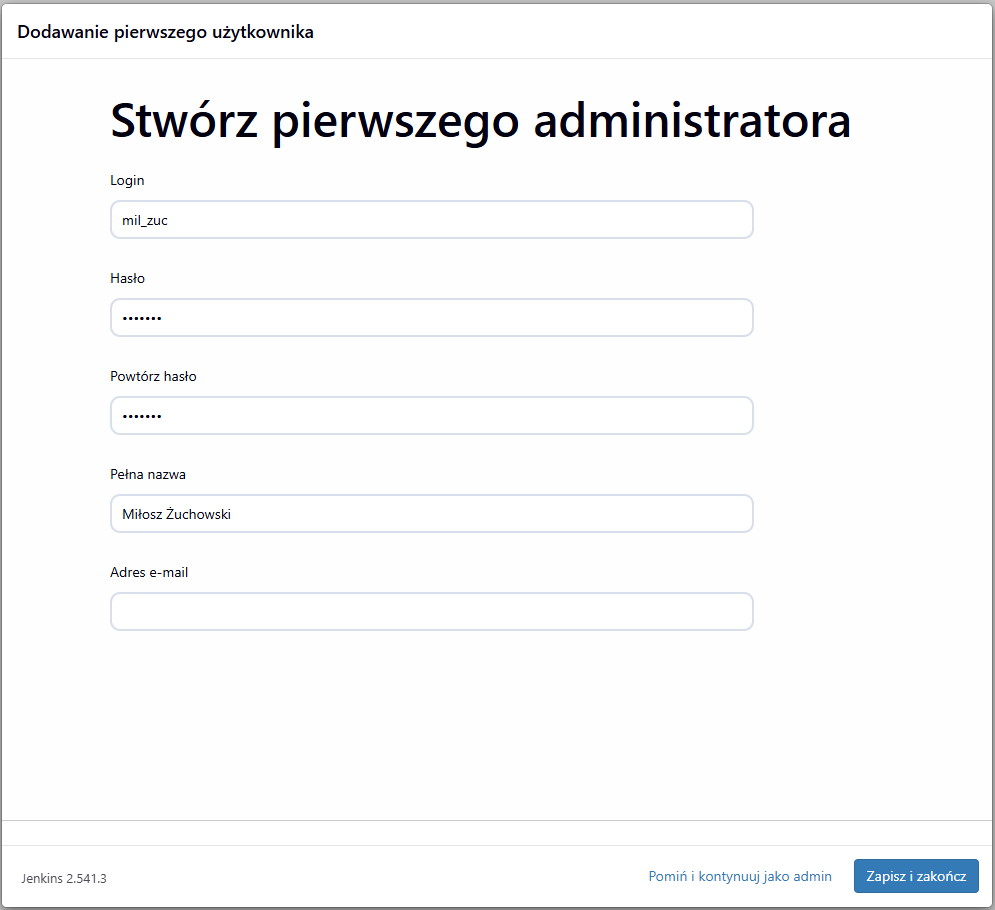

W celu sprawdzenia poprawnego uruchomienia serwera Jenkins wyświetlono logi kontenera poleceniem z zrzutu ekranu poniżej:

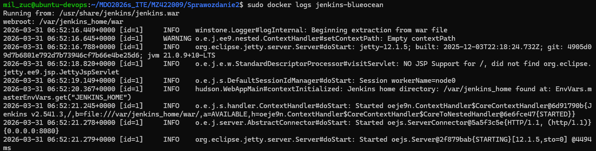


## 5.3. Zadania testowe w Jenkins typu Freestyle project
Po uruchomieniu i skonfigurowaniu Jenkinsa utworzono kilka prostych zadań testowych, aby sprawdzić poprawność działania środowiska CI.

### Projekt wyświetlający uname ###
Utworzono zadanie typu Freestyle project, w którym wykonano polecenie `uname -a`:

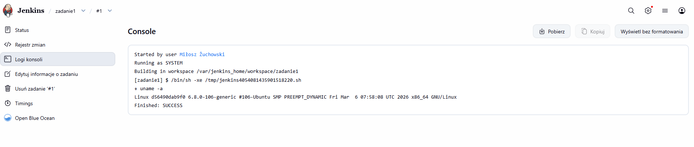
Zadanie zakończyło się poprawnie, a w logach konsoli widoczny był wynik polecenia systemowego.

### Projekt z nieparzystą godziną ###
Utworzono kolejne zadanie testowe, które miało zwracać błąd, gdy aktualna godzina jest nieparzysta. Wykorzystano prosty skrypt powłoki sprawdzający wartość godziny.
```bash
HOUR=$(date +%H)
if [ $((10#$HOUR % 2)) -eq 1 ]; then
    exit 1
fi
```
W moim przypadku wykonanie zadania zakończyło się błędem, co potwierdziło poprawne działanie mechanizmu oznaczania builda jako nieudanego. Oto potwierdzenie:

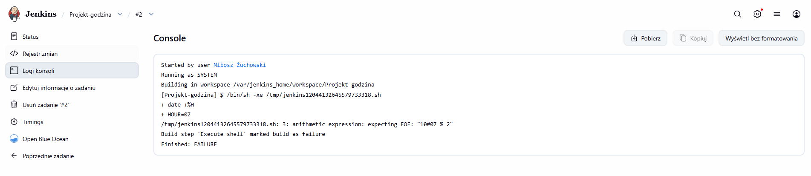

### Projekt pobierający obraz ubuntu ###
Celem następnego zadania było pobranie obrazu kontenera ubuntu z użyciem polecenia `docker pull ubuntu` :

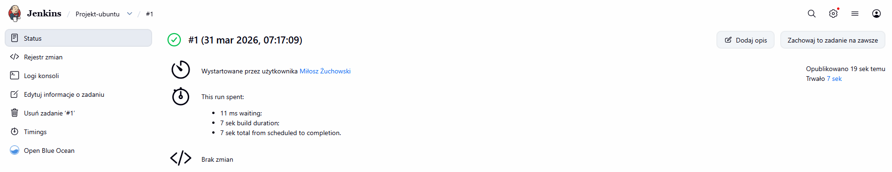

Otrzymany sukces zadania potwierdza, że Jenkins może wykonywać polecenia Docker i komunikować się ze środowiskiem kontenerowym.

## 5.4. Zadania testowe w Jenkins typu pipeline
Po zapoznaniu się z Jenkinsem i zadaniami typu Freestyle project, należy przejść do ćwiczeń z typem pipeline. Pierwszą i znaczącą różnicą jest wybór typu obiektu przy tworzeniu projektu, czyli `pipeline` zamiast wcześniejszego `Freestyle Project`.

### Pierwszy pipeline (bez SCM) ###
Utworzono pierwszy obiekt typu pipeline bez wykorzystania repozytorium Git (pipeline wpisany ręcznie w Jenkinsie).
Pipeline składał się z prostych etapów testowych:

`hello` – wyświetlenie komunikatu
`end` – zakończenie pipeline

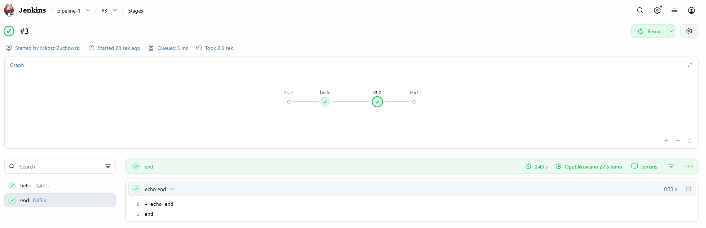

Wykonanie pipeline zakończyło się statusem SUCCESS, co potwierdza poprawną konfigurację środowiska Jenkins oraz działania pipeline.

 
### Dodanie do pipeline operacje Git i Docker ###
W tym etapie wcześniejszy pipeline został rozszerzony o: `klonowanie repozytorium (Clone repo)` i `budowę obrazu Docker (Build custom Dockerfile)`.

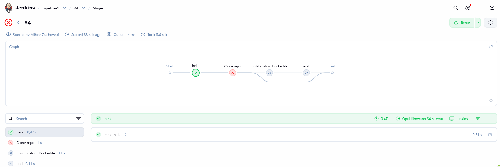

Podczas wykonania wystąpił błąd na etapie klonowania repozytorium, co spowodowało zatrzymanie pipeline. To ma pokazać jak wygląda błąd w jednym z etapów pipeline i jak to się zachowuje. W tym przypadku błąd spowodowała niepoprawna konfiguracja dostępu do repozytorium w Jenkins. 

# Lab 6 #
Podczas tych laboratorium otrzymalismy indywidualne instrukcje do wykonania. W moim przypadku celem ćwiczenia było przygotowanie obrazu Docker aplikacji oraz jego publikacja w repozytorium Docker Hub. Zostało to ręcznie przygotowane bez wykorzystania narzędzi CI/CD, które będzie zatomatyzowane później.
Wykonane kroki:

## 6.1. Utworzenie pliku Dockerfile.deploy
Zdefiniowano plik `Dockerfile.deploy` budujący obraz aplikacji: 
```
FROM node:18-slim

RUN apt update && apt install -y git

WORKDIR /app

RUN git clone https://github.com/expressjs/express.git

WORKDIR /app/express

RUN npm install --omit-dev

CMD ["node", "-v"]
```
Plik wykorzystuje obraz bazowy node:18-slim, instaluje repozytorium Express oraz zależności aplikacji.

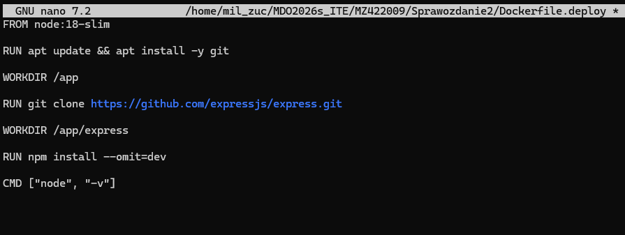

## 6.2. Budowa obrazu Docker
Obraz został zbudowany lokalnie:

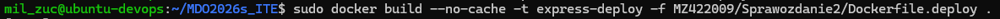 

*Ważne:* Wykorzystano parametr `--no-cache`, który zapewnia budowę od zera bez użycia cache.

## 6.3. Uruchomienie kontenera

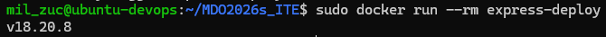

Otrzymany wynik `v18.20.8` potwierdza poprawne działanie środowiska Node.js w kontenerze.

## 6.4. Autoryzacja w Docker Hub
Wykonano logowanie do rejestru za pomocą polecenia `sudo docker login`

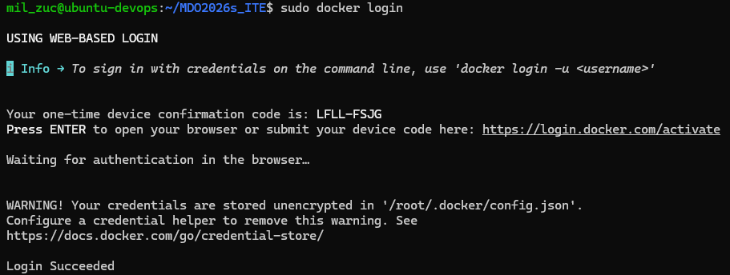

Jak widać na zrzucie ekranu powyżej logowanie zakończyło się statusem *Login Succeeded*.

## 6.5. Tagowanie obrazu
Obraz został oznaczony tagami:

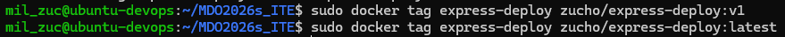

## 6.6. Publikacja obrazu
Obraz został wysłany do Docker Hub:

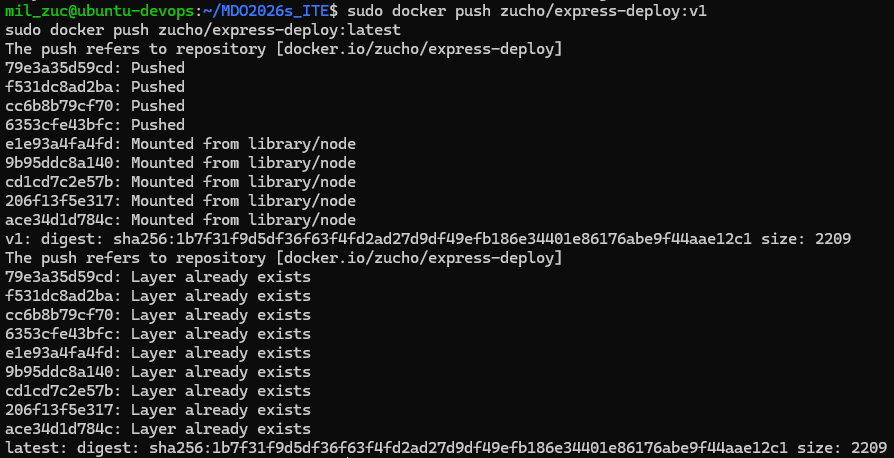

Proces zakończył się poprawnie – wszystkie warstwy zostały przesłane.

### Weryfikacja: ###
W repozytorium Docker Hub dostępny jest obraz: `zucho/express-deploy`, tagi: `v1`, `latest`.

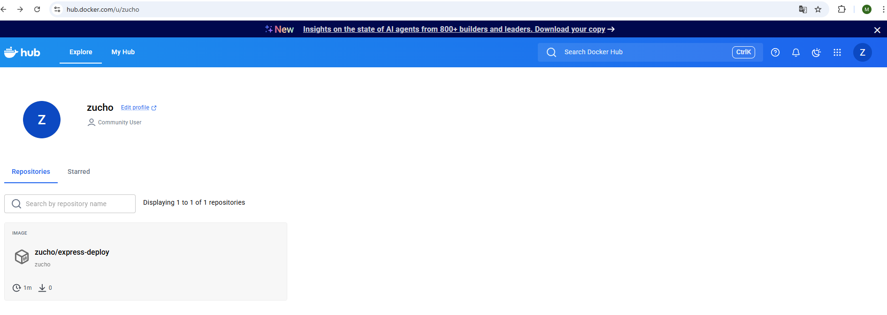

Potwierdza to poprawną publikację artefaktu.
