# Sprawozdanie 3 #

# Lab 8 #
Celem laboratorium było zapoznanie się z narzędziem Ansible służącym do automatyzacji administracji systemami oraz zdalnego wykonywania poleceń na wielu maszynach jednocześnie.
Wykonane kroki:
## 8.1. Przygotowanie środowiska
W pierwszym etapie przygotowano drugą maszynę wirtualną z systemem `linux` przeznaczoną do zarządzania przez Ansible.

### Konfiguracja nazwy hosta ###
Maszynie docelowej przypisano nazwę `ansible-target`, zgodnie z wymaganiami instrukcji.

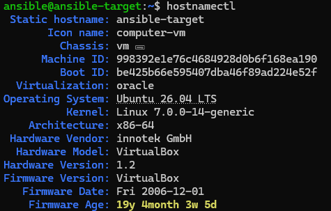

### Konfiguracja usługi SSH ###
Widoczny status `active (running)` potwierdza poprawne działanie serwera OpenSSH.

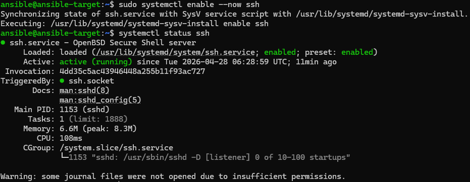

## 8.2. Instalacja Ansible
Na głównej maszynie wirtualnej zainstalowano pakiet Ansible z repozytorium systemowego Ubuntu.

Po zakończeniu instalacji została sprawdzona poprawność wykonania polecenia:

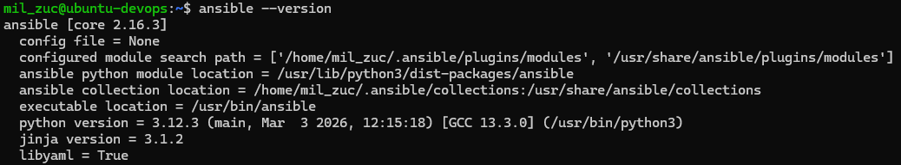

Wyświetlona wersja `ansible-core 2.16.3` potwierdza poprawną instalację narzędzia.

## 8.3. Konfiguracja komunikacji pomiędzy maszynami
Aby umożliwić komunikację przy użyciu nazw hostów, skonfigurowano plik `/etc/hosts`. Dodane do niego zostało IP oraz nazwa hosta na utworzonej maszyny ansible.

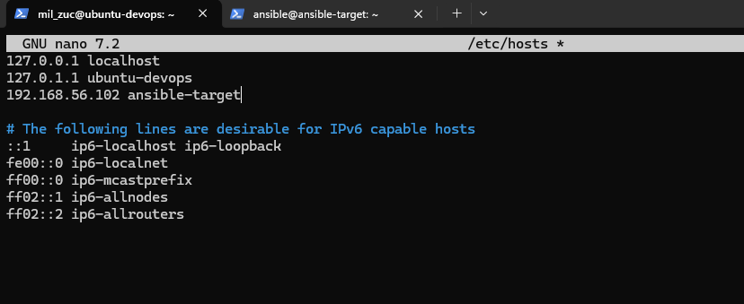

Następnie zweryfikowano poprawność działania rozwiązywania nazw DNS poprzez wykonanie polecenia ping z nazwa hosta.

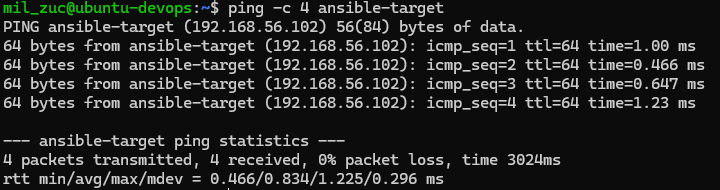

Otrzymane odpowiedzi ICMP potwierdzają poprawną komunikację pomiędzy maszynami.

## 8.4. Konfiguracja uwierzytelniania SSH

W celu wyeliminowania konieczności podawania hasła podczas logowania wykonano wymianę kluczy SSH pomiędzy maszynami przy użyciu polecenia `ssh-copy-id`.

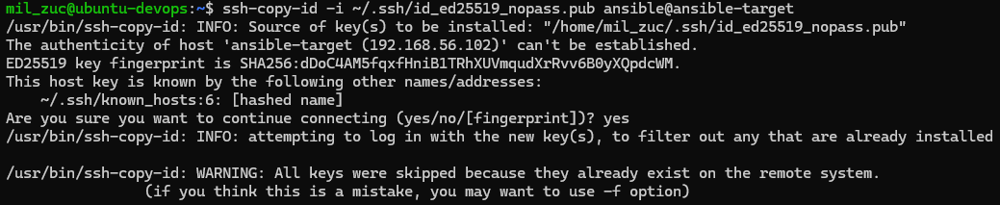

Następnie sprawdzono tego efekt, czyli możliwość logowania bez użycia hasła.

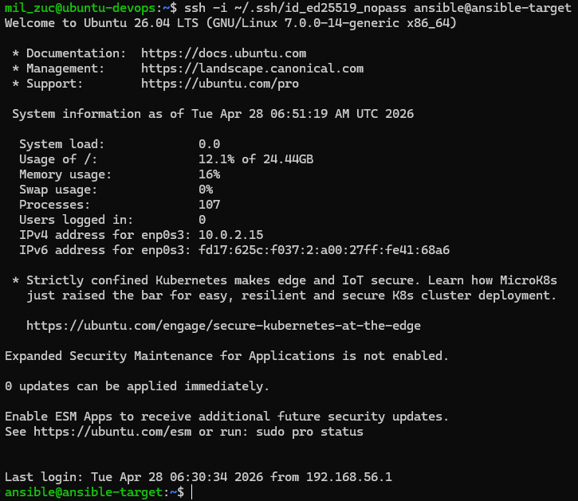

Udało się nawiązać połączenie poprawnie, co potwierdza prawidłową konfigurację kluczy SSH.

## 8.5. Utworzenie pliku inwentaryzacji
Kolejnym krokiem było utworzenie pliku [inventory.ini](inventory.ini), zawierającego definicje grup zarządzanych hostów.

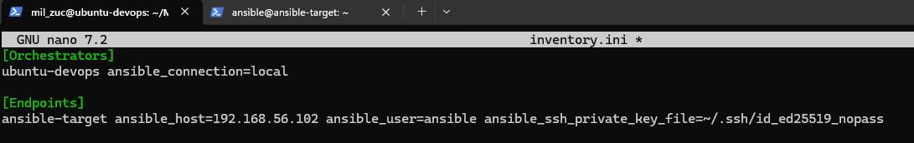

W pliku utworzono grupy:

`Orchestrators` – maszyna zarządzająca,
`Endpoints` – maszyna docelowa ansible-target.

## 8.6. Weryfikacja połączenia za pomocą modułu ping

Wykonano polecenie `ansible all -i inventory.ini -m ping`, aby sprawdzić działanie.

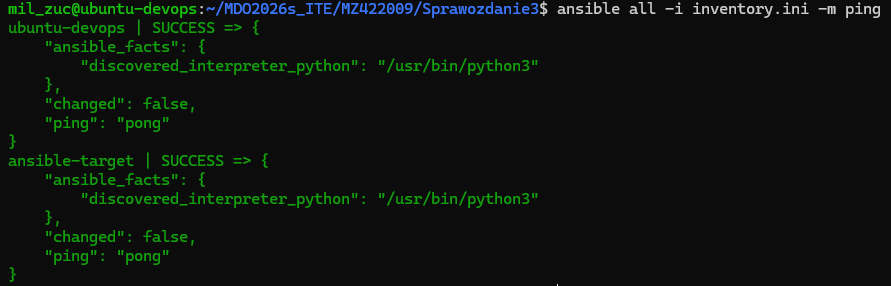

Obie maszyny zwróciły odpowiedź `pong`, co potwierdza poprawną komunikację z wykorzystaniem Ansible.

## 8.7. Utworzenie pierwszego playbooka

Przygotowano prosty playbook o nazwie [ping.yml](ping.yml), którego zadaniem było wykonanie testu połączenia dla wszystkich hostów.

### Kod playbooka: ###

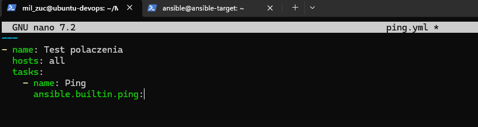

Treść playbooka wykorzystuje moduł `ansible.builtin.ping`, który służy do sprawdzenia dostępności hosta oraz poprawności komunikacji pomiędzy kontrolerem Ansible a maszyną zdalną. Moduł nie wysyła pakietów ICMP jak systemowe polecenie ping, lecz testuje możliwość wykonania modułów Ansible na zdalnym hoście i w przypadku sukcesu zwraca odpowiedź pong.

## 8.8. Uruchomienie playbooka

Playbook został uruchomiony za pomocą polecenia `ansible-playbook -i inventory.ini ping.yml`.

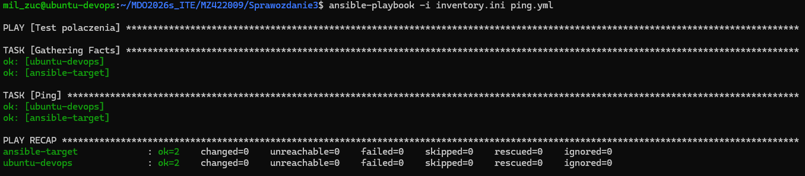

Wszystkie zadania zakończyły się statusem ok, a raport końcowy nie wykazał błędów ani niedostępnych hostów, więc wszystko wykonało się jak należy.

## 8.9. Kopiowanie pliku inwentaryzacji na maszynę docelową
Przygotowano playbook o nazwie [copy_inventory.yml](copy_inventory.yml), którego zadaniem było skopiowanie pliku `inventory.ini` na maszynę z grupy `Endpoints`.

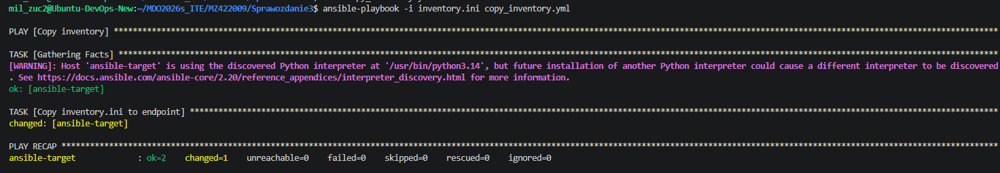

Do wykonania zadania użyto modułu `ansible.builtin.copy`, który umożliwia kopiowanie plików z maszyny zarządzającej na hosty zdalne. Wynik changed=1 oznacza, że plik został utworzony lub zmodyfikowany na maszynie docelowej.

Następnie ten sam playbook został uruchomiony ponownie, bez zmiany pliku źródłowego, jednak wynik był już inny. `changed=0` oznacza, że Ansible wykrył zgodność stanu docelowego z oczekiwanym i nie wykonał niepotrzebnej zmiany. Pokazuje to stabilne działanie playbooków.

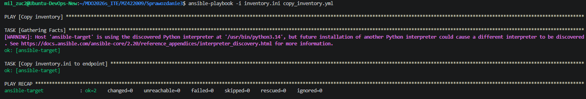

## 8.10. Aktualizacja pakietów systemowych
W tym podpunkcie przygotowano playbook [update_system.yml](update_system.yml), który aktualizuje listę pakietów oraz wykonuje aktualizację zainstalowanego oprogramowania na maszynie docelowej. 

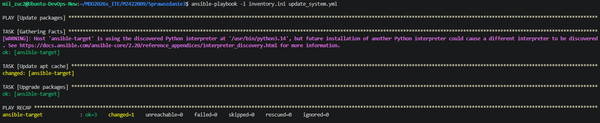

Tym razem do wykonania operacji użyto modułu `ansible.builtin.apt`, przeznaczonego do zarządzania pakietami w systemach Ubuntu. Playbook został wykonany z uprawnieniami administratora przez `become: yes`.

## 8.11. Restart usług sshd i rngd
Podobnie jak we wcześniejszych przypadkach utworzono nowy playbook [restart_ssh.yml](restart_ssh.yml), którego zadaniem jest wykonanie restartu usługi SSH na maszynie docelowej. Wykorzystano kolejny moduł, tym razem `ansible.builtin.service`. 

Adekwatnie wykonano polecenie dla usługi rngd. Playbook [restart_rngd.yml](restart_rngd.yml). 

Po tym etapie zostało sprawdzone jeszcze działanie przy niedostępnym hoście. Aby to przetestować wstrzymano usługę SSH na maszynie `ansible-target`, a nastepnie wykonano test połączenia Ansible, który oznaczył maszynę docelową jako `UNREACHABLE`, co potwierdza brak możliwości połączenia.

## 8.12. Instalacja Dockera na maszynie docelowej
Znowu przygotowano playbook, tym razem taki który instaluje pakiety `docker.io` oraz `python3-docker` na maszynie docelowej, a następnie uruchomiono go. Playbook [install_docker.yml](install_docker.yml).

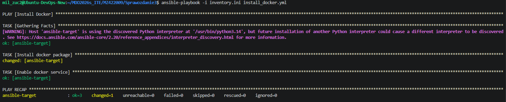

Poprawność wykonania zweryfikowałem wykonując na maszynie docelowej polecenia, `docker --version` i `systemctl status docker`.

## 8.13. Pobranie obrazu z Docker Hub
Za pomocą playbooka [pull_image.yml](pull_image.yml) pobrano obraz aplikacji opublikowany wcześniej w Docker Hub. 
Do pobrania obrazu wykorzystano moduł `community.docker.docker_image`, który pozwala zarządzać obrazami Docker z poziomu Ansible.

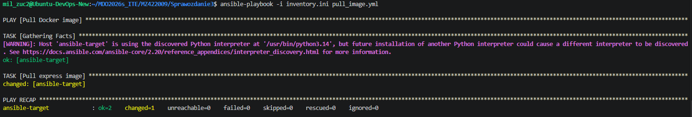

## 8.14. Uruchomienie kontenera na maszynie docelowej
Następnie przygotowano playbook [run_container.yml](run_container.yml), który uruchamia kontener z obrazem `zucho/express-deploy:latest`.

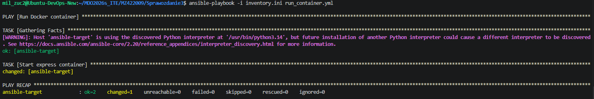

Po wykonaniu playbooka sprawdzono listę działających kontenerów na maszynie docelowej poleceniem `docker ps`.

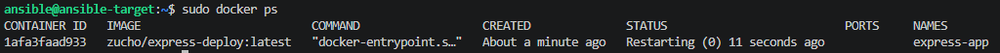

## 8.15. Zatrzymanie i usunięcie kontenera
Przygotowano playbook [remove_container.yml](remove_container.yml), którego miał zatrzymać oraz usunąć kontener `express-app`.

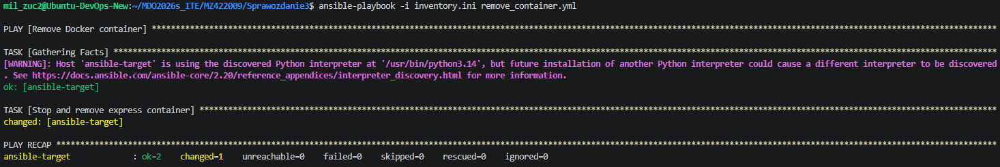

Po wykonaniu tego na maszynie docelowej kontener nie był już widoczny jak wcześniej.

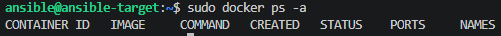

## 8.16. Sanity check maszyny docelowej
Na końcu przygotowano prosty playbook [sanity_check.yml](sanity_check.yml), którego zadaniem było sprawdzenie podstawowego stanu maszyny docelowej przed lub po wdrożeniu.
Playbook sprawdza dostępność usługi SSH, działanie Dockera oraz wyświetla jego wersję. Pozwala to szybko potwierdzić, że środowisko docelowe jest gotowe do dalszych operacji.

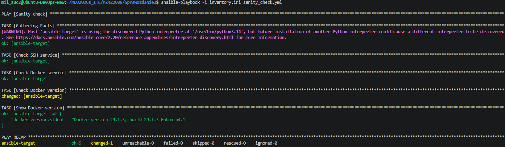

## 8.17. Utworzenie roli Ansible
Na koniec tych laboratorium, aby uporządkować playbooki utworzyłem szkielet roli Ansible za pomocą polecenia `ansible-galaxy role init`. Polecenie utworzyło strukturę katalogów roli docker_deploy, zawierającą między innymi katalogi `tasks`, `handlers`, `defaults`, `vars` oraz plik `meta/main.yml`. Taka struktura umożliwia późniejsze przeniesienie zadań z playbooków do roli i wielokrotne wykorzystanie ich w innych projektach.

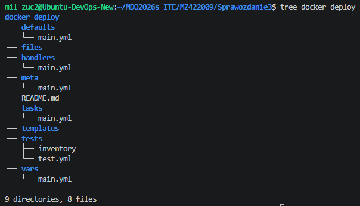

# Lab 9 #
Celem ćwiczenia było przygotowanie instalacji nienadzorowanej systemu Fedora Server z wykorzystaniem pliku odpowiedzi Kickstart. W ramach zadania utworzono własny plik konfiguracyjny instalatora, przeprowadzono automatyczną instalację systemu oraz rozszerzono proces wdrożenia o automatyczną instalację środowiska Docker i konfigurację usługi uruchamiającej aplikację kontenerową po pierwszym uruchomieniu systemu.

## 9.1. Przygotowanie pliku odpowiedzi Kickstart
Po wykonaniu ręcznej instalacji Fedory pobrano wygenerowany przez instalator plik odpowiedzi `/root/anaconda-ks.cfg`. Plik ten zawiera konfigurację instalacji wykonaną wcześniej ręcznie i może zostać użyty jako baza do instalacji nienadzorowanej.

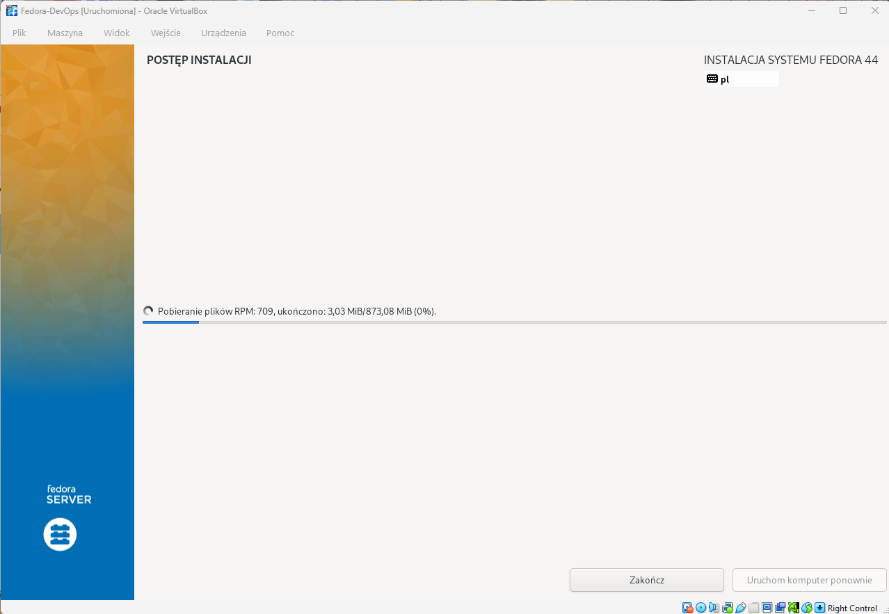

Następnie plik został przeanalizowany i zmodyfikowany pod wymagania zadania.

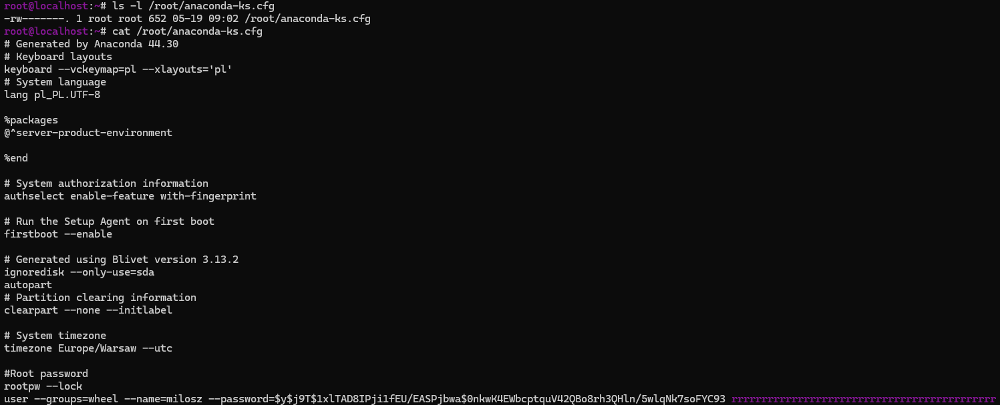

## 9.2. Modyfikacja pliku Kickstart
Na podstawie wygenerowanego pliku przygotowano własną konfigurację instalacji. W pliku ustawiono między innymi język systemu, źródła pakietów, konfigurację sieci, nazwę hosta oraz użytkownika systemowego. Zastosowano także automatyczne partycjonowanie dysku oraz czyszczenie wcześniejszych danych, dzięki czemu instalacja mogła zostać wykonana bez ręcznego wybierania partycji. Dodano również instalację Dockera oraz konfigurację pozwalającą uruchomić aplikację kontenerową po starcie systemu.
Finalnie treść pliku prezentuje się następująco: [anaconda-ks.cfg](anaconda-ks.cfg).

## 9.3. Uruchomienie instalacji nienadzorowanej
Przygotowany plik odpowiedzi został udostępniony przez prosty serwer HTTP, a następnie wskazany instalatorowi Fedory w parametrze startowym `inst.ks`.

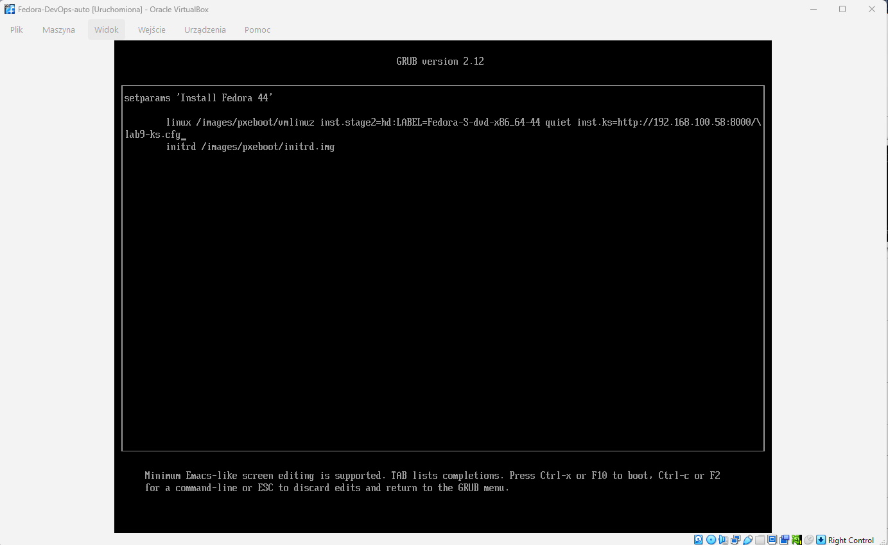

Po dopisaniu adresu pliku Kickstart instalator został uruchomiony. Od tego momentu instalacja przebiegała automatycznie, bez konieczności ręcznego wybierania ustawień w instalatorze.
*WAŻNE:*Na zrzucie ekranu widać przy komendzie nazwe lab9-ks.cfg, jest to nazwa mojego początkowego pliku, jednak później wykonanłem tą instalację na nowo już z nowego uzupełnionego pliku z nazwą anaconda-ks.cfg.

### Postęp instalacji - Ukończone: ###

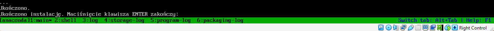

## 9.4. Weryfikacja zainstalowanego systemu
Po pierwszym uruchomieniu systemu zalogowano się na utworzonego użytkownika milosz i sprawdzono podstawową konfigurację systemu. Polecenia `hostname`, `whoami`, `docker --version` oraz `lsblk` potwierdziły, że:

1) nazwa hosta została ustawiona jako fedora-lab9-auto,
2) użytkownik milosz został utworzony poprawnie,
3) Docker został zainstalowany,
4) dysk został automatycznie podzielony na partycje.

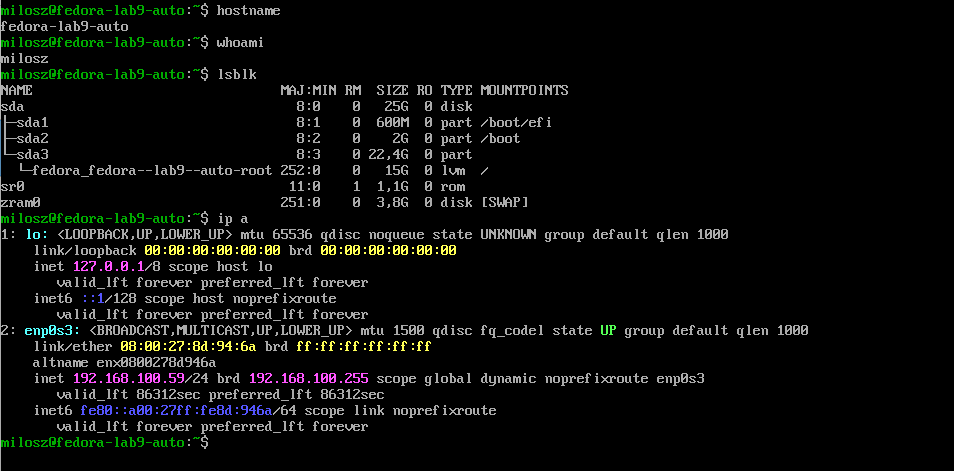

## 9.5. Weryfikacja usługi Docker
Następnie dokonałem sprawdzenia statusu usługi Docker za pomocą polecenia `systemctl status docker` :

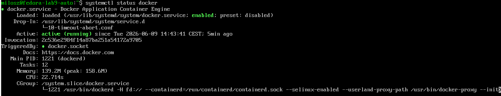

Status `active (running)` potwierdza, że usługa Docker została poprawnie uruchomiona i jest włączona po starcie systemu.

## 9.6. Weryfikacja automatycznego uruchomienia aplikacji
Ostatnim etapem tych laboratoriów była weryfikacja usługi `express-app`, utworzonej w pliku Kickstart. Usługa ta odpowiada za pobranie obrazu aplikacji z Docker Hub oraz uruchomienie kontenera.

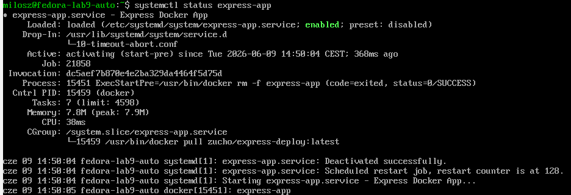

Ponownie widoczny status `active` oraz wpisy związane z poleceniami Dockera potwierdzają, że aplikacja kontenerowa została uruchomiona automatycznie po starcie systemu.

# Lab 10 #
Celem tych laboratorium było zapoznanie się z podstawami platformy Kubernetes. W ramach ćwiczeń uruchomiono lokalny klaster Minikube, wdrożono własną aplikację kontenerową, skonfigurowano usługi sieciowe, przeprowadzono skalowanie wdrożeń oraz przetestowano różne strategie aktualizacji aplikacji.

## 10.1. Uruchomienie klastra Kubernates
Na sam początek uruchomiono lokalny klaster Kubernetes przy użyciu narzędzia Minikube. Następnie sprawdzono poprawność działania wszystkich podstawowych komponentów klastra.

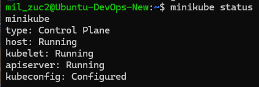

Po uruchomieniu klastra zweryfikowano również dostępność węzła roboczego za pomocą polecenia `kubectl get nodes`. Widoczny status `Ready` potwierdza nam poprawne uruchomienie środowiska Kubernetes.

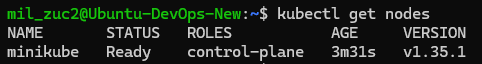

## 10.2. Uruchomienie Dashboard Kubernetes
Kolejnym krokiem było uruchomienie Dashboard Kubernetes umożliwiającego graficzne zarządzanie zasobami klastra. Dashboard pozwala monitorować deploymenty, pody, usługi oraz pozostałe zasoby klastra z poziomu przeglądarki internetowej.

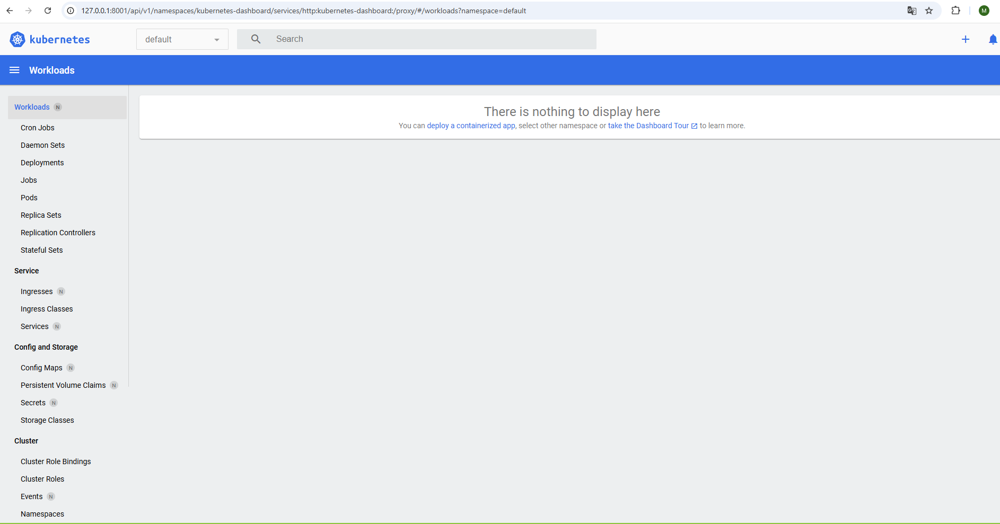

## 10.3. Utworzenie deploymentu aplikacji
Przygotowano plik konfiguracyjny [deployment.yaml](deployment.yaml), definiujący wdrożenie aplikacji kontenerowej. (ilość replik początkowo była równa 1, jak na SS poniżej).

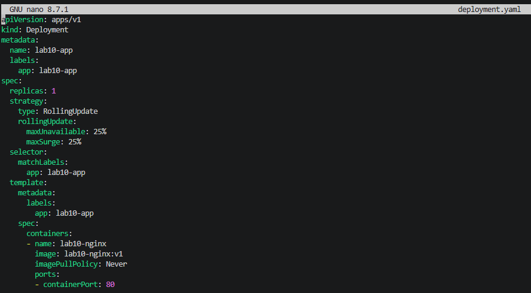

Następnie zastosowano konfigurację i uruchomiono deployment.

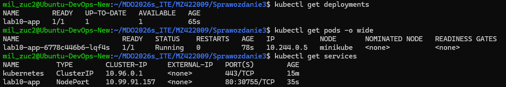

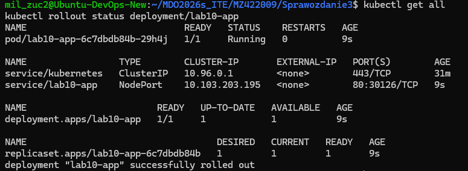

## 10.4. Weryfikacja działania deploymentu w Dashboard
Po uruchomieniu wdrożenia sprawdzono widoczność zasobów w Dashboard Kubernetes. 
### Deployment ###

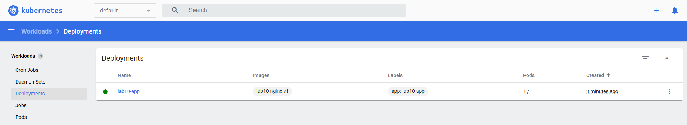

### Pod ###

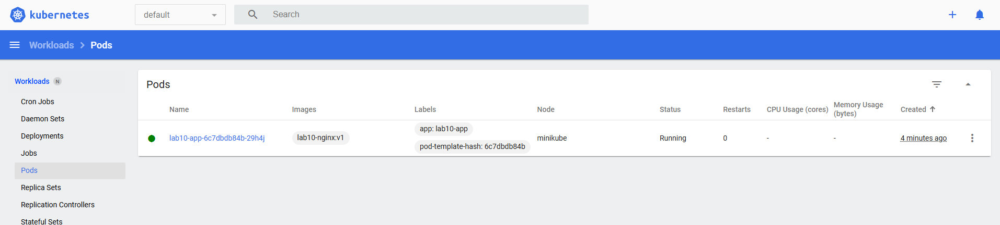

### Service ###

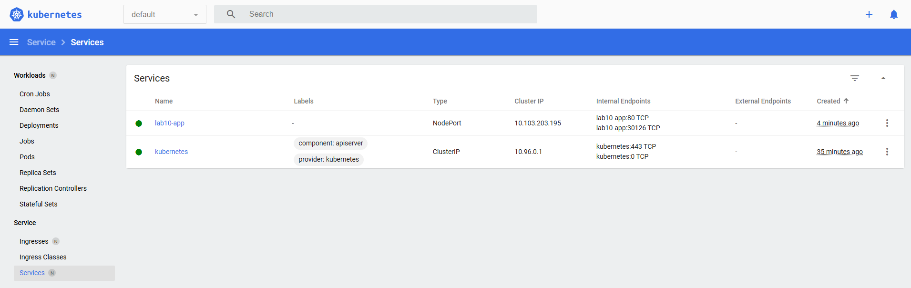

## 10.5. Udostępnienie aplikacji
Aby umożliwić dostęp do aplikacji przygotowano plik [service.yaml](service.yaml), definiujący usługę typu `NodePort`.

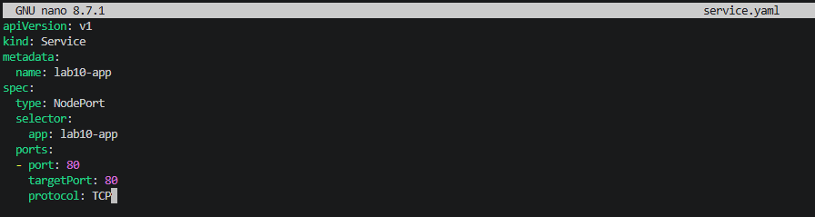

Następnie wykonano test przy użyciu polecenia `curl`, a otrzymana odpowiedź HTML potwierdza poprawne działanie aplikacji uruchomionej w klastrze Kubernetes.

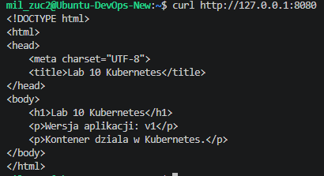

Dodatkowo sprawdzono poprawność działania aplikacji przy użyciu przeglądarki internetowej.

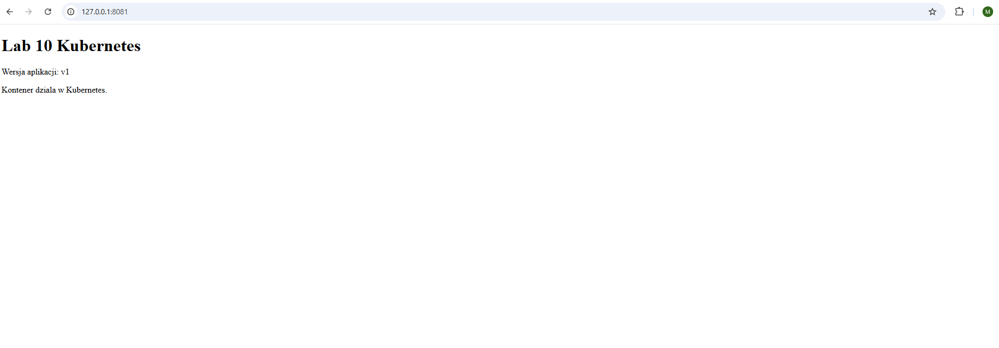

## 10.6. Skalowanie deploymentu
W kolejnym etapie przetestowano mechanizm skalowania deploymentu. Początkowo zwiększono liczbę replik do 4.

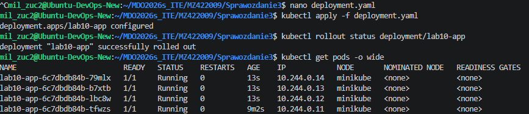

Następnie zgodnie z instrukcją zwiększono liczbę instancji do 8.

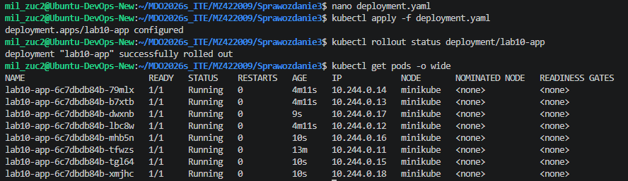

Po sprawdzeniu działania większej liczby podów wykonano zmniejszenie liczby replik i zaobserowano różnicę.

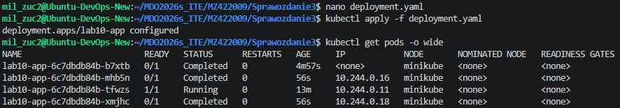

Na końcu przetestowano całkowite zatrzymanie aplikacji poprzez ustawienie liczby replik na 0.

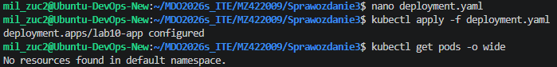

Widoczny komunikat `No resources found in default namespace` potwierdza usunięcie wszystkich podów deploymentu.

## 10.7. Przygotowanie nowej wersji obrazu
W tym etapie przygotowano nową wersję obrazu aplikacji oznaczoną jako `v2`. Następnie zaimportowano ją do środowiska Minikube.

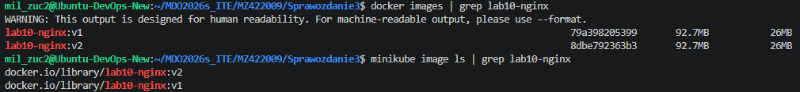

Po wdrożeniu nowej wersji zweryfikowano działanie aplikacji, a wyświetlona zawartość (v2) potwierdza, że Kubernetes uruchomił nową wersję.

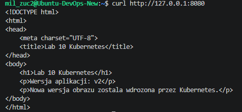

## 10.8. Test błędnego wdrożenia
W celu sprawdzenia zachowania Kubernetes podczas nieudanego wdrożenia przygotowano wadliwy obraz kontenera oznaczony jako `bad`.

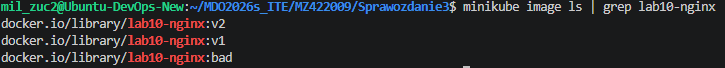

Po wdrożeniu błędnej wersji aplikacji pody przechodziły w stan `CrashLoopBackOff`. Stan ten oznacza nieudane próby uruchomienia kontenera i automatyczne ponawianie startu przez Kubernetes.

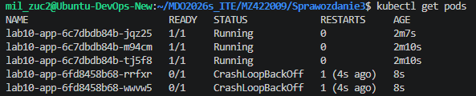

## 10.9. Kontrola wdrożenia
Przygotowano skrypt [check_deploy.sh](check_deploy.sh), którego zadaniem było monitorowanie stanu deploymentu i sprawdzanie gotowości wszystkich replik. Po uruchomieniu skrypt potwierdził poprawne wdrożenie aplikacji.

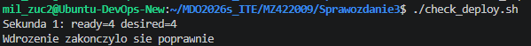

## 10.10. Strategie wdrożenia
W tej części instrukcji przetestowano strategię `Recreate`, która usuwa stare instancje aplikacji przed uruchomieniem nowych.

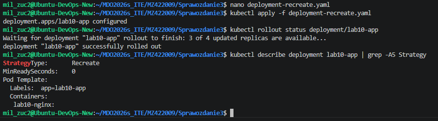

Kolejna przetestowana strategia to `RollingUpdate` (z parametrami `maxUnavailable` > 1 i `maxSurge` > 20%), umożliwiającej stopniową wymianę podów bez zatrzymywania całej aplikacji.

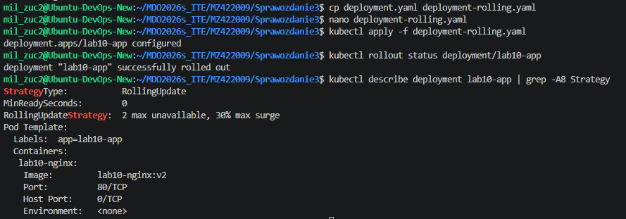

Następną wersją wdrożenia było `Canary Deployment workload`, pozwalające na równoległe uruchomienie nowej wersji aplikacji. Plik [deployment-canary.yaml](deployment-canary.yaml).
Po wdrożeniu uruchomione zostały jednocześnie pody wersji podstawowej oraz wersji testowej. Ta wersja rozwiązania umożliwia testowanie nowych wersji aplikacji bez wpływu na całość ruchu produkcyjnego.

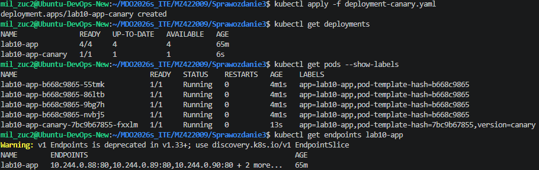

## 10.11. Wykorzystanie etykiet
Ostatnim etapem laboratorium było wykorzystanie etykiet (*labels*) do oznaczania i filtrowania zasobów Kubernetes. Etykiety pozwalają na grupowanie oraz wyszukiwanie wybranych deploymentów, podów i usług.

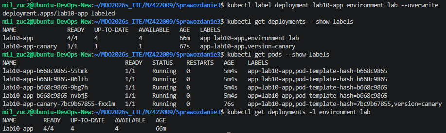

# Lab 11 #
Celem tego ćwiczenia było zapoznanie się z metodami eksponowania aplikacji działających w Kubernetes oraz dalsze wykorzystanie mechanizmów skalowania deploymentów. W ramach laboratorium sprawdzono różne sposoby udostępniania aplikacji, utworzono usługę sieciową oraz przeprowadzono skalowanie wdrożenia przy użyciu poleceń i plików YAML.

## 11.1. Wdrożenie większej liczby podów
Na początku sprawdzono działanie deploymentu z większą liczbą replik. W klastrze widoczna była duża liczba uruchomionych podów aplikacji `lab10-app`.

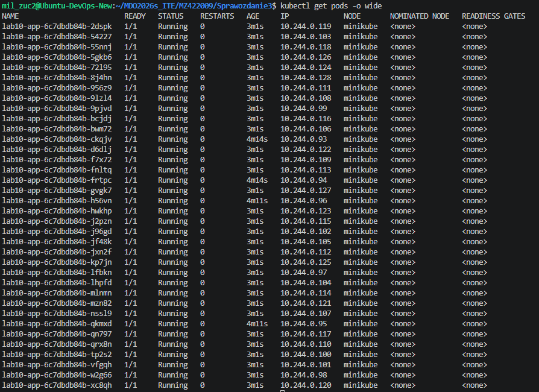

## 11.2. Eksponowanie pojedynczego poda
Pierwszym sposobem udostępnienia aplikacji było przekierowanie portu bezpośrednio do jednego wybranego poda za pomocą polecenia `kubectl port-forward`.

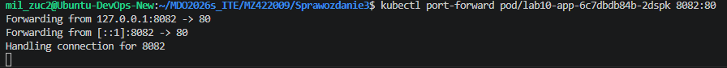

### Działanie aplikacji przez curl w drugim terminalu: ###

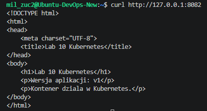

## 11.3. Eksponowanie deploymentu
Kolejnym sposobem było przekierowanie portu bezpośrednio do deploymentu `lab10-app`.

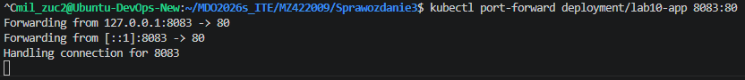

### Działanie aplikacji przez curl w drugim terminalu: ###

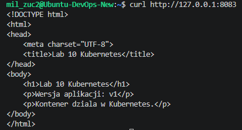

Potwierdza to możliwość dostępu do aplikacji przez deployment.

## 11.4. Eksponowanie deploymentu jako Service
Następnie deployment został wyeksponowany jako usługa typu `NodePort` przy użyciu dedykowanego polecenia `kubectl expose deployment`.

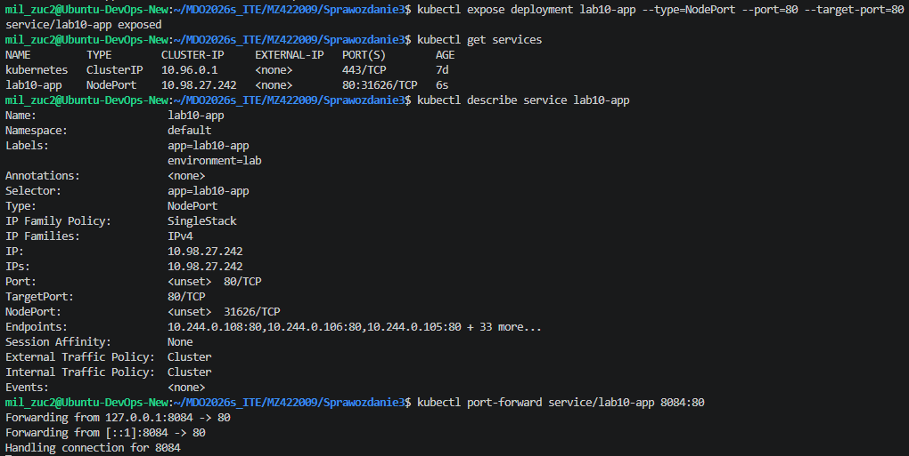

Po utworzeniu usługi wykonano przekierowanie portu do service i sprawdzono działanie aplikacji.

### Działanie aplikacji przez curl w drugim terminalu: ###

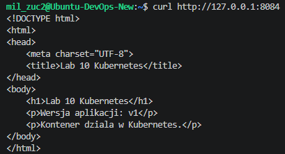

## 11.5. Eksponowanie deploymentu za pomocą pliku YAML
Utworzono usługę Kubernetes z pliku [service.yaml](service.yaml). Po zastosowaniu pliku sprawdzono szczegóły utworzonej usługi oraz wykonano przekierowanie portu.

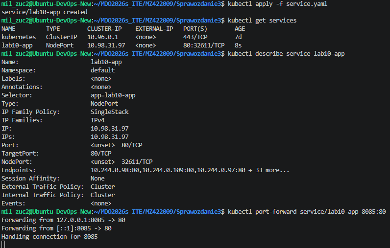

### Działanie aplikacji przez curl w drugim terminalu: ###

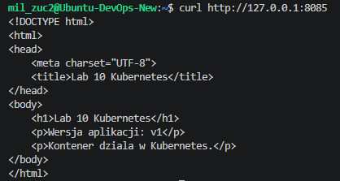

## 11.6. Skalowanie deploymentu poleceniem scale
Przetestowano skalowanie deploymentu za pomocą polecenia `kubectl scale`. Najpierw ustawiono liczbę replik na 6.

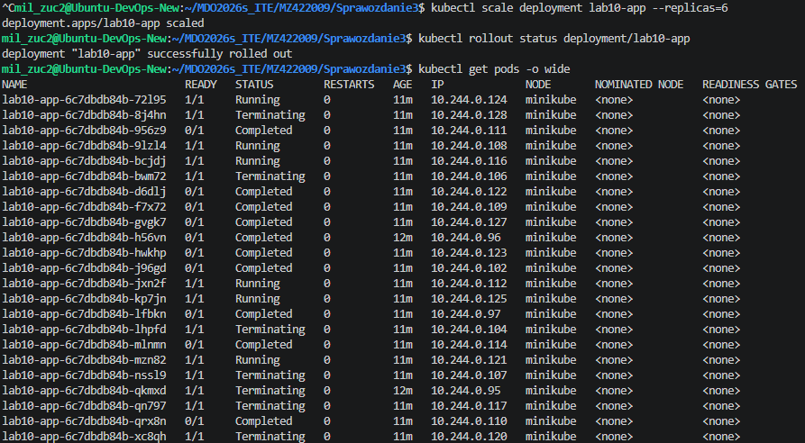

Następnie zwiększono liczbę replik do 12.

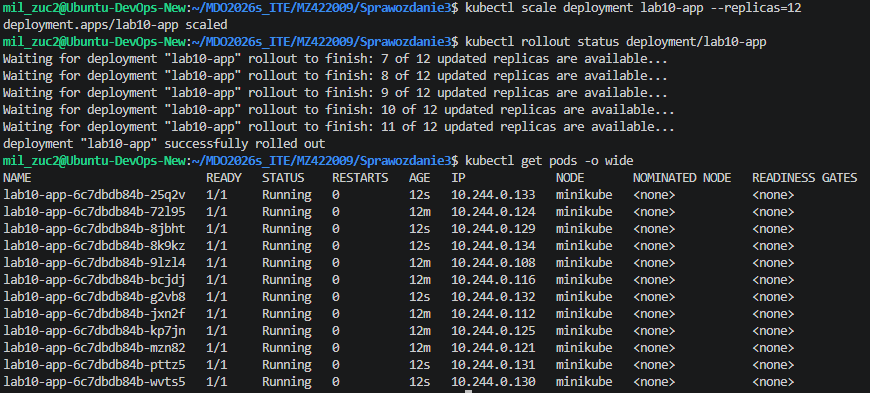

Widoczne dodatkowe pody potwierdzają, że Kubernetes automatycznie dostosował liczbę działających instancji aplikacji.

## 11.7. Skalowanie deploymentu przez plik YAML
Oprócz skalowania poleceniem, przetestowano również zmianę liczby replik przez modyfikację pliku deploymentu. Przygotowano plik [deployment-12.yaml](deployment-12.yaml) dla 12 replik, a następnie zastosowano go w klastrze.

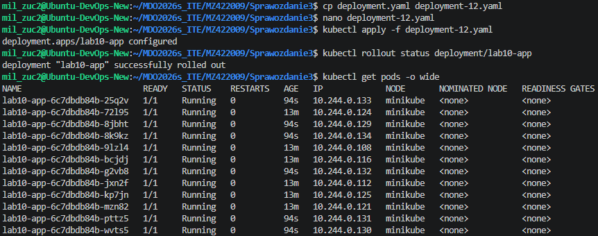

Następnie przygotowałem kolejną wersję pliku, zmniejszającą liczbę replik do 3.

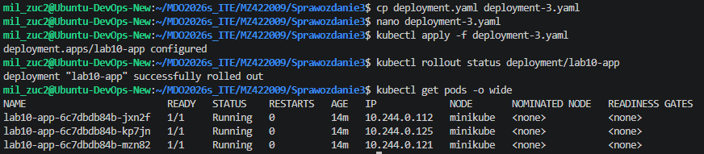

Po zastosowaniu konfiguracji Kubernetes usunął nadmiarowe pody i pozostawił tylko wymaganą liczbę działających instancji.

## WAŻNA informacja!
Pomiędzy laboratorium 8 a 9 moja pierwsza maszyna wirtualna zwróciła mi błąd I/O. Mimo próby jej ratowania finalnie stworzyłem nową maszynę stąd różnica w nazwach użytkownika na zrzutach ekranu (mil_zuc-mil_zuc2). 

# Podsumowanie #
Wykonane laboratoria pozwolił mi przejść przez kolejne etapy budowy nowoczesnego środowiska DevOps – od automatyzacji administracji systemami przy użyciu Ansible, przez przygotowanie nienadzorowanej instalacji systemu operacyjnego z wykorzystaniem Kickstart, aż po wdrażanie i zarządzanie aplikacjami kontenerowymi w Kubernetes. Podczas wykonywania laboratoriów skonfigurowałem komunikację pomiędzy maszynami, przygotowałem własne playbooki Ansible, zautomatyzowałem instalację systemu Fedora przy użyciu Kickstart oraz wdrażałem aplikacje kontenerowe w środowisku Kubernetes. Dodatkowo przetestowałem mechanizmy skalowania, aktualizacji oraz eksponowania usług, co pozwoliło lepiej zrozumieć sposób działania współczesnych platform kontenerowych. Zdobyta wiedza stanowi solidną podstawę do dalszej pracy z narzędziami wykorzystywanymi w środowiskach DevOps.
