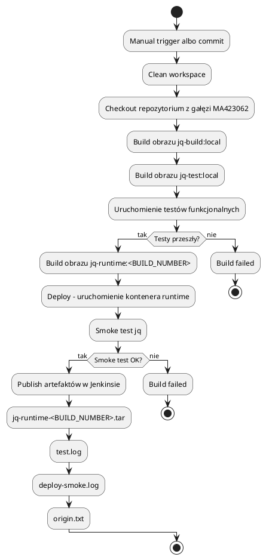
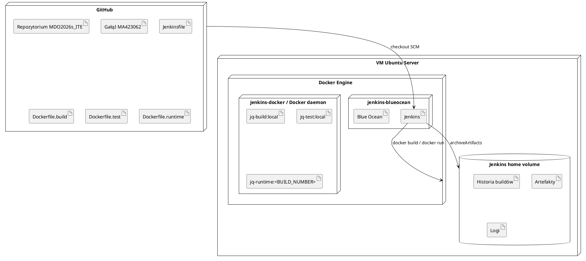

# Sprawozdanie z laboratoriów 05, 06 i 07

## Metody DevOps — Jenkins, pipeline CI/CD, Docker, Ansible

**Autor:** Mateusz  
**Repozytorium:** `MDO2026s_ITE`  
**Gałąź:** `MA423062`  
**Środowisko główne:** Ubuntu Server w VirtualBox  
**Środowisko CI:** Jenkins Blue Ocean uruchomiony w kontenerze Docker  
**Aplikacja użyta w pipeline:** `jq`  
**Zakres sprawozdania:** laboratoria 05, 06 i 07

---

## 1. Cel wykonanych laboratoriów

Celem laboratoriów 05, 06 i 07 było przygotowanie procesu CI/CD dla wybranej aplikacji oraz stopniowe doprowadzenie go od ręcznie definiowanego pipeline’u w Jenkinsie do wersjonowanego `Jenkinsfile` znajdującego się w repozytorium.

W moim rozwiązaniu przygotowałem pipeline dla programu `jq`. Proces obejmuje pobranie kodu, zbudowanie obrazu buildowego, zbudowanie obrazu testowego, uruchomienie testów, przygotowanie obrazu runtime/deploy, wykonanie smoke testu oraz opublikowanie artefaktu jako pliku `.tar` w historii builda Jenkinsa.


## 2. Struktura repozytorium

Prace wykonywałem na gałęzi:

```bash
MA423062
```

Główne pliki użyte w rozwiązaniu:

```text
MDO2026s_ITE/
├── Jenkinsfile
├── Dockers/
│   ├── Dockerfile.build
│   ├── Dockerfile.test
│   ├── Dockerfile.runtime
│   ├── jq-functional-tests.sh
│   └── docker-compose.yml
├── READMEs/
├── demo-build/
└── README.md
```

`Jenkinsfile` znajduje się w głównym katalogu repozytorium, a nie w katalogu `Dockers`. Jest to istotne, ponieważ Jenkins ma pobierać definicję pipeline’u z SCM.


## 2.1. Organizacja plików w repozytorium

Pliki techniczne zostawiłem tam, gdzie są faktycznie używane przez pipeline. `Jenkinsfile` leży w katalogu głównym repozytorium, a pliki Dockerowe i skrypt testowy są w katalogu `Dockers`:

```text
Jenkinsfile
Dockers/Dockerfile.build
Dockers/Dockerfile.test
Dockers/Dockerfile.runtime
Dockers/jq-functional-tests.sh
```

Sprawozdanie i zrzuty ekranu trzymam osobno, w jednym katalogu dokumentacyjnym. Dzięki temu pliki uruchamiane przez Jenkinsa nie mieszają się z materiałami opisowymi. Przy takim układzie łatwiej też sprawdzić pull request, bo zmiany techniczne są oddzielone od dokumentacji.

Przyjęta struktura dla materiałów sprawozdawczych:

```text
Sprawozdanie5_6_7/
├── sprawozdanie_lab_05_06_07.md
└── screenshots/
    ├── 01-github-repository-structure.png
    ├── 02-docker-ps-jenkins.png
    ├── 03-jenkins-blueocean.png
    └── ...
```


---

## 2.2. Środowisko pracy i okoliczności wykonania

Ćwiczenia wykonywałem na komputerze z systemem Windows jako systemem hosta. Środowisko laboratoryjne uruchomiłem w Oracle VirtualBox jako maszynę wirtualną z Ubuntu Server. Główna VM była używana do pracy z repozytorium Git, Dockerem, Jenkinsem oraz Ansible.

Jenkins działał w kontenerze Docker o nazwie `jenkins-blueocean`, z obrazem `myjenkins-blueocean:2.541.3-1`. Dodatkowo działał kontener `jenkins-docker` oparty o obraz `docker:dind`, wykorzystywany jako środowisko dockerowe dla Jenkinsa. Dostęp do Jenkinsa z systemu hosta odbywał się przez port `8080`.

Do części Ansible utworzyłem drugą maszynę wirtualną `ansible-target`. Komunikację między główną VM i `ansible-target` skonfigurowałem przez drugi interfejs sieciowy `enp0s8`. Po problemach z DHCP VirtualBoxa ustawiłem statyczne adresy IP:

```text
główna VM:       10.10.10.10/24
ansible-target:  10.10.10.11/24
```

Interfejs `enp0s3` pozostawiłem do zwykłego dostępu do internetu przez NAT VirtualBoxa. Dzięki temu rozdzieliłem dostęp do internetu od komunikacji między VM-kami.

Do sprawdzenia środowiska użyłem następujących komend:

```bash
uname -a
lsb_release -a
docker version
docker ps
ip a
ansible --version
```

**Zrzut ekranu: wersja jądra systemu widoczna w logu `uname -a`**


**Zrzut ekranu: kontenery środowiska Jenkins widoczne w `docker ps`**


**Zrzut ekranu: sprawdzenie łączności z `ansible-target` pod adresem `10.10.10.11`**


---

# Laboratorium 05

## 3. Przygotowanie Jenkinsa

W ramach laboratorium 05 przygotowałem środowisko Jenkins uruchomione w kontenerze Docker. W moim środowisku działały następujące kontenery:

```bash
docker ps
```

Przykładowy istotny fragment wyniku:

```text
jenkins-blueocean   myjenkins-blueocean:2.541.3-1
jenkins-docker      docker:dind
```

Kontener `jenkins-blueocean` pełni rolę interfejsu Jenkinsa z Blue Ocean, natomiast `jenkins-docker` zapewnia środowisko Docker-in-Docker lub dostęp do osobnego demona Dockera używanego przez Jenkinsa.

**Zrzut ekranu: wynik `docker ps` pokazujący kontenery Jenkinsa**


Jenkins był dostępny przez przeglądarkę pod adresem:

```text
http://localhost:8080
```

W przypadku pracy w VirtualBoxie dostęp był możliwy dzięki przekierowaniu portu `8080` z VM na system hosta.

**Zrzut ekranu: widok przebiegu pipeline w Jenkins Blue Ocean**


---

## 4. Wstępne zadania w Jenkinsie

W pierwszej części laboratorium 05 sprawdziłem działanie prostych zadań w Jenkinsie.

### 4.1. Projekt wypisujący `uname`

Utworzyłem prosty projekt/pipeline, którego zadaniem było wykonanie komendy:

```bash
uname -a
```

Celem było sprawdzenie, czy Jenkins może wykonywać polecenia shellowe w swoim środowisku.

Oczekiwany wynik zawierał informacje o jądrze systemu Linux, architekturze i środowisku wykonania.

**Zrzut ekranu: konsola Jenkinsa z wynikiem `uname -a`**


---

### 4.2. Projekt warunkowo zwracający błąd

Przygotowałem także testowy projekt, którego celem było sprawdzenie, czy Jenkins poprawnie oznacza build jako nieudany, gdy skrypt kończy się kodem błędu.

Przykładowa logika:

```bash
hour=$(date +%H)

if [ $((hour % 2)) -eq 1 ]; then
    echo "Godzina jest nieparzysta, build kończy się błędem."
    exit 1
else
    echo "Godzina jest parzysta, build kończy się powodzeniem."
fi
```

Ten krok potwierdził, że Jenkins poprawnie interpretuje kod wyjścia procesu.

**Zrzut ekranu: build zakończony sukcesem albo błędem zależnie od godziny**


---

### 4.3. Pobranie obrazu `ubuntu`

W kolejnym kroku sprawdziłem, czy Jenkins może korzystać z Dockera. Wykonałem pobranie obrazu:

```bash
docker pull ubuntu:24.04
```

Ten test był istotny, ponieważ dalszy pipeline wymaga budowania i uruchamiania obrazów Docker.

**Zrzut ekranu: `docker pull ubuntu:24.04` w Jenkinsie**


---

## 5. Pierwszy pipeline wpisany bezpośrednio w Jenkinsie

Na etapie laboratorium 05 utworzyłem obiekt typu `Pipeline` w Jenkinsie i początkowo wpisałem jego treść bezpośrednio w konfiguracji joba. Był to etap przejściowy, służący do sprawdzenia składni pipeline’u oraz komunikacji z repozytorium i Dockerem.

W tym etapie pipeline wykonywał między innymi:

```text
Sanity
Checkout
Build
Test
```

Ta forma była dobra do szybkiego sprawdzenia składni i działania Dockera, ale konfiguracja zostawała wtedy tylko w Jenkinsie. Po sprawdzeniu pipeline’u przeniosłem jego definicję do pliku `Jenkinsfile` w repozytorium.

**Zrzut ekranu: konfiguracja pierwszego pipeline’u wpisanego ręcznie**


---

## 6. Różnica między pipeline’em w Jenkinsie a Jenkinsfile w SCM

Pierwsza wersja pipeline’u wpisana bezpośrednio w Jenkinsie była użyteczna do testowania, ale nie była wersjonowana razem z repozytorium. Ostatecznie użyłem opcji:

```text
Pipeline script from SCM
```

Dzięki temu Jenkins pobiera `Jenkinsfile` z repozytorium GitHub z gałęzi `MA423062`.

## 6.1. Wnioski z części sieciowej i pomiarowej

W części sieciowej sprawdzałem, jak komunikują się kontenery i maszyny wirtualne oraz jak działa publikowanie portów. Najważniejsza obserwacja jest taka, że samo uruchomienie kontenera z usługą nie oznacza jeszcze, że usługa jest dostępna z zewnątrz. Dostęp z hosta albo z innej maszyny wymaga właściwej konfiguracji sieci lub opublikowania portu.

W przypadku Dockera kontenery uruchomione w tej samej sieci bridge mogą komunikować się bezpośrednio w ramach tej sieci. Jeżeli jednak chcę dostać się do usługi z hosta lub spoza sieci kontenerowej, muszę użyć mapowania portów, na przykład `-p 5201:5201`. To rozdziela dwa pojęcia: port otwarty wewnątrz kontenera i port opublikowany na hoście.

W części z VirtualBoxem zauważyłem analogiczny problem. To, że Windows mógł połączyć się z VM przez przekierowanie portów, nie oznaczało jeszcze, że główna VM mogła połączyć się z `ansible-target`. Połączenie Windows → VM przechodziło przez hosta i port forwarding, natomiast Ansible wymagało komunikacji VM → VM. Dlatego potrzebna była osobna sieć między maszynami i poprawny adres `ansible-target` dostępny z głównej VM.

W praktyce DHCP w VirtualBoxie przydzielało adresy, które utrudniały diagnozę, ponieważ mieszały się z adresami zwykłego NAT-a. Z tego powodu finalnie użyłem statycznych adresów na `enp0s8`. Wniosek z tego ćwiczenia jest taki, że przy konfiguracjach wielointerfejsowych trzeba świadomie rozróżniać interfejs do internetu od interfejsu do komunikacji wewnętrznej.

Wyniki pomiarów `iperf3` umieszczam w tabeli. Wartości liczbowe zostawiłem do uzupełnienia na podstawie konkretnego uruchomienia testów, żeby nie wpisywać danych niepochodzących z mojego środowiska.

| Test | Klient | Serwer | Sposób połączenia | Wynik | Wniosek |
|---|---|---|---|---|---|
| 1 | kontener | kontener | ta sama sieć Docker bridge | DO UZUPEŁNIENIA | Ruch pozostaje lokalny w sieci Dockera |
| 2 | host/VM | kontener | port opublikowany przez `-p` | DO UZUPEŁNIENIA | Dostęp działa dopiero po publikacji portu |
| 3 | główna VM | ansible-target | osobny interfejs VM-VM | DO UZUPEŁNIENIA | Wymagana jest poprawna adresacja i routing |

**Zrzut ekranu: test sieciowy `iperf3`**


**Zrzut ekranu: uruchomienie kontenera Jenkinsa z mapowaniem portów**


---

# Laboratorium 06

## 7. Wybór aplikacji

Do realizacji pipeline’u wybrałem program `jq`, czyli narzędzie command-line służące do przetwarzania danych JSON.

Wybrałem `jq`, ponieważ:

- jest to realny program open source,
- można go zbudować ze źródeł,
- posiada proces budowania oparty o standardowe narzędzia Linuksa,
- można go łatwo uruchomić w kontenerze,
- można dla niego przygotować prosty i jednoznaczny smoke test,
- efekt końcowy można dystrybuować jako obraz Dockera zapisany do pliku `.tar`.

---

## 8. Licencja

Program `jq` jest projektem open source. Na potrzeby laboratorium uznałem, że może zostać użyty w procesie CI/CD, ponieważ jego licencja pozwala na korzystanie z kodu, budowanie go oraz redystrybucję w ramach przygotowanego artefaktu.


---

## 9. Decyzja dotycząca forka

Nie tworzyłem osobnego forka repozytorium `jq`, ponieważ nie modyfikowałem kodu źródłowego samej aplikacji. Moje repozytorium zawiera jedynie pliki opisujące proces CI/CD, czyli `Dockerfile`, skrypt testowy i `Jenkinsfile`.

Pipeline pobiera konkretną wersję `jq`, buduje ją w kontrolowanym środowisku, testuje i pakuje wynik do obrazu runtime.

---

## 10. Ścieżka pipeline’u

Zgodnie z założeniem laboratoriów przygotowałem pipeline realizujący następującą ścieżkę:

```text
manual trigger / commit
↓
clone
↓
build
↓
test
↓
deploy
↓
publish
```

W moim rozwiązaniu odpowiada to etapom:

```text
Clean workspace
Checkout from SCM
Build builder image
Build tester image
Test
Build deployable image
Deploy
Publish
```

---

## 11. Diagram aktywności procesu CI/CD

Poniżej znajduje się diagram procesu CI/CD w PlantUML.



**Zrzut ekranu: roboczy diagram procesu CI/CD**


---

## 12. Diagram wdrożeniowy

Poniżej znajduje się uproszczony diagram wdrożeniowy.




---

## 13. Obraz buildowy

Do budowania aplikacji użyłem pliku:

```text
Dockers/Dockerfile.build
```

Obraz buildowy bazuje na `ubuntu:24.04`, instaluje narzędzia potrzebne do kompilacji, pobiera źródła `jq`, inicjalizuje submoduły i buduje program.

Kopiowalna zawartość pliku:

```dockerfile
FROM ubuntu:24.04

ENV DEBIAN_FRONTEND=noninteractive
ARG JQ_VERSION=jq-1.8.1

RUN apt-get update && apt-get install -y \
    git \
    ca-certificates \
    build-essential \
    autoconf \
    automake \
    libtool \
    pkg-config \
    flex \
    bison \
    && rm -rf /var/lib/apt/lists/*

WORKDIR /opt

RUN git clone --depth 1 --branch ${JQ_VERSION} https://github.com/jqlang/jq.git

WORKDIR /opt/jq

RUN git submodule update --init --depth 1 && \
    autoreconf -i && \
    ./configure --with-oniguruma=builtin && \
    make -j"$(nproc)"

RUN ./jq --version

CMD ["/bin/bash"]
```

Komenda lokalnego builda:

```bash
docker build --pull --no-cache -t jq-build:local -f Dockers/Dockerfile.build Dockers
```

**Zrzut ekranu: poprawne zbudowanie `jq-build:local`**


---

## 14. Obraz testowy

Obraz testowy jest oparty o obraz buildowy:

```dockerfile
FROM jq-build:local
```

Dzięki temu testy są wykonywane na programie zbudowanym w poprzednim etapie.

Plik:

```text
Dockers/Dockerfile.test
```

Kopiowalna zawartość:

```dockerfile
FROM jq-build:local

WORKDIR /opt/jq

COPY jq-functional-tests.sh /usr/local/bin/jq-functional-tests.sh

RUN chmod +x /usr/local/bin/jq-functional-tests.sh

CMD ["/usr/local/bin/jq-functional-tests.sh"]
```

Skrypt testowy:

```text
Dockers/jq-functional-tests.sh
```

Kopiowalna zawartość:

```bash
#!/usr/bin/env bash
set -euo pipefail

JQ="/opt/jq/jq"

pass=0
fail=0

run_test() {
    name="$1"
    input="$2"
    filter="$3"
    expected="$4"

    echo "Running test: $name"

    actual="$(printf "%s\n" "$input" | "$JQ" -r "$filter")"

    if [ "$actual" = "$expected" ]; then
        echo "PASS: $name"
        pass=$((pass + 1))
    else
        echo "FAIL: $name"
        echo "Expected: $expected"
        echo "Actual:   $actual"
        fail=$((fail + 1))
    fi

    echo
}

echo "jq version:"
"$JQ" --version
echo

run_test "extract number from object" \
    '{"answer":42}' \
    '.answer' \
    '42'

run_test "array length" \
    '[1,2,3,4]' \
    'length' \
    '4'

run_test "nested object field" \
    '{"user":{"name":"Jan"}}' \
    '.user.name' \
    'Jan'

run_test "array mapping" \
    '[1,2,3]' \
    'map(. * 2) | join(",")' \
    '2,4,6'

echo "============================================================================"
echo "Functional test summary"
echo "============================================================================"
echo "# PASS: $pass"
echo "# FAIL: $fail"
echo "============================================================================"

if [ "$fail" -ne 0 ]; then
    exit 1
fi
```

Komendy lokalnego testu:

```bash
docker build --no-cache -t jq-test:local -f Dockers/Dockerfile.test Dockers
docker run --rm jq-test:local
```

Oczekiwany wynik:

```text
jq version:
jq-1.8.1

Running test: extract number from object
PASS: extract number from object

Running test: array length
PASS: array length

Running test: nested object field
PASS: nested object field

Running test: array mapping
PASS: array mapping

============================================================================
Functional test summary
============================================================================
# PASS: 4
# FAIL: 0
============================================================================
```

**Zrzut ekranu: testy funkcjonalne `jq-test:local`**


## 14.1. Komentarz dotyczący `CMD` w `Dockerfile.test`

W `Dockerfile.test` zostawiłem instrukcję:

```dockerfile
CMD ["/usr/local/bin/jq-functional-tests.sh"]
```

W tym rozwiązaniu obraz `jq-test:local` jest uruchamialnym kontenerem testowym. Po jego zbudowaniu mogę odpalić testy lokalnie jedną komendą:

```bash
docker run jq-test:local
```

Takie rozwiązanie upraszcza lokalne sprawdzanie i etap `Test` w Jenkinsie. Obraz testowy nie jest jednak artefaktem produkcyjnym. Nie służy do wdrożenia aplikacji, tylko do jednorazowego wykonania testów w CI.

Alternatywnie można byłoby usunąć `CMD` z `Dockerfile.test` i podać komendę testową jawnie w `Jenkinsfile`:

```bash
docker run jq-test:local /usr/local/bin/jq-functional-tests.sh
```

Zostawiłem `CMD`, ponieważ w moim układzie obraz testowy pełni rolę gotowego, samouruchamialnego test runnera. Końcowym artefaktem pozostaje dopiero obraz `jq-runtime:<BUILD_NUMBER>`, a nie `jq-test:local`.

---

## 15. Problem z pełną test-suite `jq`

Pierwotnie próbowałem uruchamiać pełną test-suite projektu `jq` za pomocą:

```bash
make check
```

W środowisku kontenerowym jeden z testów zakończył się niepowodzeniem:

```text
# TOTAL: 9
# PASS:  8
# FAIL:  1
FAIL: tests/shtest
```

Nie ukrywałem tego problemu. Uznałem, że pełna upstreamowa test-suite może być zależna od szczegółów środowiska, dlatego w finalnym pipeline zastosowałem deterministyczne testy funkcjonalne. Testy te sprawdzają działanie zbudowanego programu `jq` na konkretnych wejściach JSON.

Ta decyzja jest rozbieżnością względem pierwotnego planu, w którym zakładałem użycie `make check`. Rozbieżność została udokumentowana, a finalne testy nadal weryfikują realne działanie zbudowanej aplikacji.

**Zrzut ekranu: nieudane `make check` z `FAIL: tests/shtest`**


---

## 16. Obraz deploy/runtime

Obraz runtime przygotowałem w pliku:

```text
Dockers/Dockerfile.runtime
```

Nie użyłem obrazu buildowego jako obrazu docelowego, ponieważ zawiera on narzędzia potrzebne tylko do kompilacji, takie jak `git`, `build-essential`, `autoconf`, `automake` i inne zależności developerskie.

Obraz runtime ma służyć do uruchamiania gotowego programu.

Kopiowalna zawartość:

```dockerfile
FROM jq-build:local AS builder

WORKDIR /opt/jq

RUN make install

FROM ubuntu:24.04

RUN apt-get update && apt-get install -y --no-install-recommends \
    libonig5 \
    ca-certificates \
    && rm -rf /var/lib/apt/lists/*

COPY --from=builder /usr/local/bin/jq /usr/local/bin/jq
COPY --from=builder /usr/local/lib/libjq.so* /usr/local/lib/

RUN ldconfig

ENTRYPOINT ["jq"]
CMD ["--version"]
```

W czasie przygotowania obrazu runtime wystąpiły dwa problemy.

Pierwszy problem polegał na tym, że skopiowanie `/opt/jq/jq` kopiowało wrapper wygenerowany przez `libtool`, a nie właściwy plik binarny. Skutkowało to błędem:

```text
/usr/local/bin/jq: error: '/usr/local/bin/.libs/jq' does not exist
This script is just a wrapper for jq.
```

Rozwiązaniem było wykonanie `make install` i skopiowanie zainstalowanego programu z `/usr/local/bin/jq`.

Drugi problem dotyczył brakującej biblioteki:

```text
libonig.so.5: cannot open shared object file
```

Rozwiązaniem było zainstalowanie w obrazie runtime pakietu:

```bash
libonig5
```

Po poprawkach obraz runtime uruchamia się poprawnie.

Komenda testowa:

```bash
echo '{"answer":42}' | docker run --rm -i jq-runtime:local '.answer'
```

Oczekiwany wynik:

```text
42
```

**Zrzut ekranu: działający smoke test obrazu runtime**


---

## 17. Publikowany artefakt

Jako artefakt publikowany przez Jenkins wybrałem obraz Dockera zapisany do pliku `.tar`.

Przykład nazwy:

```text
jq-runtime-3.tar
```

Wybrałem tę formę, ponieważ taki artefakt można pobrać z historii builda Jenkinsa, załadować poleceniem `docker load` i uruchomić bez ponownego budowania aplikacji.

Publikowane artefakty:

```text
jq-runtime-<BUILD_NUMBER>.tar
test.log
deploy-smoke.log
runtime-image-inspect.json
origin.txt
```

Plik `origin.txt` zawiera informacje o pochodzeniu artefaktu: repozytorium, gałąź, numer builda, nazwę obrazu runtime i ostatni commit.

---

## 18. Wersjonowanie artefaktu

Artefakt jest wersjonowany numerem builda Jenkinsa.

Przykład:

```text
jq-runtime:3
jq-runtime-3.tar
```

Dzięki temu można powiązać konkretny artefakt z konkretnym przebiegiem pipeline’u.

---

# Laboratorium 07

## 19. Jenkinsfile w repozytorium

W laboratorium 07 przeniosłem definicję pipeline’u do pliku:

```text
Jenkinsfile
```

Plik znajduje się w głównym katalogu repozytorium na gałęzi:

```text
MA423062
```

W Jenkinsie skonfigurowałem job jako:

```text
Pipeline script from SCM
```

Konfiguracja joba:

```text
SCM: Git
Repository URL: https://github.com/InzynieriaOprogramowaniaAGH/MDO2026s_ITE.git
Branch Specifier: */MA423062
Script Path: Jenkinsfile
```

**Zrzut ekranu: konfiguracja `Pipeline script from SCM`**


**Zrzut ekranu: `Jenkinsfile` widoczny w edytorze**


---

## 20. Końcowy Jenkinsfile

Kopiowalna treść pliku `Jenkinsfile`:

```groovy
pipeline {
    agent any

    options {
        timestamps()
        disableConcurrentBuilds()
    }

    environment {
        REPO_URL = 'https://github.com/InzynieriaOprogramowaniaAGH/MDO2026s_ITE.git'
        REPO_BRANCH = 'MA423062'

        BUILDER_IMAGE = 'jq-build:local'
        TEST_IMAGE = 'jq-test:local'
        RUNTIME_IMAGE = "jq-runtime:${BUILD_NUMBER}"
        ARTIFACT_NAME = "jq-runtime-${BUILD_NUMBER}.tar"
    }

    stages {
        stage('Clean workspace') {
            steps {
                deleteDir()
                sh '''
                    echo "Workspace after cleanup:"
                    pwd
                    ls -la
                '''
            }
        }

        stage('Checkout from SCM') {
            steps {
                git branch: "${REPO_BRANCH}",
                    url: "${REPO_URL}"

                sh '''
                    echo "Checked out commit:"
                    git log -1 --oneline

                    echo "Repository files:"
                    ls -la

                    echo "Docker files:"
                    ls -la Dockers

                    test -f Jenkinsfile
                    test -f Dockers/Dockerfile.build
                    test -f Dockers/Dockerfile.test
                    test -f Dockers/Dockerfile.runtime
                '''
            }
        }

        stage('Build builder image') {
            steps {
                sh '''
                    docker build --pull --no-cache \
                        -t ${BUILDER_IMAGE} \
                        -f Dockers/Dockerfile.build \
                        Dockers
                '''
            }
        }

        stage('Build tester image') {
            steps {
                sh '''
                    docker build --no-cache \
                        -t ${TEST_IMAGE} \
                        -f Dockers/Dockerfile.test \
                        Dockers
                '''
            }
        }

        stage('Test') {
            steps {
                sh '''#!/bin/bash
                    set -euo pipefail

                    docker rm -f jq-test-run >/dev/null 2>&1 || true

                    docker run --name jq-test-run ${TEST_IMAGE} 2>&1 | tee test.log
                '''
            }
        }

        stage('Build deployable image') {
            steps {
                sh '''
                    docker build --no-cache \
                        -t ${RUNTIME_IMAGE} \
                        -f Dockers/Dockerfile.runtime \
                        Dockers

                    docker image inspect ${RUNTIME_IMAGE} > runtime-image-inspect.json
                '''
            }
        }

        stage('Deploy') {
            steps {
                sh '''#!/bin/bash
                    set -euo pipefail

                    docker rm -f jq-runtime-smoke >/dev/null 2>&1 || true

                    echo '{"answer":42}' | docker run --name jq-runtime-smoke --rm -i ${RUNTIME_IMAGE} '.answer' | tee deploy-smoke.log

                    grep -qx '42' deploy-smoke.log
                '''
            }
        }

        stage('Publish') {
            steps {
                sh '''
                    mkdir -p artifacts

                    docker save ${RUNTIME_IMAGE} -o artifacts/${ARTIFACT_NAME}

                    cp test.log artifacts/test.log
                    cp deploy-smoke.log artifacts/deploy-smoke.log
                    cp runtime-image-inspect.json artifacts/runtime-image-inspect.json

                    echo "Artifact origin:" > artifacts/origin.txt
                    echo "Repository: ${REPO_URL}" >> artifacts/origin.txt
                    echo "Branch: ${REPO_BRANCH}" >> artifacts/origin.txt
                    echo "Build number: ${BUILD_NUMBER}" >> artifacts/origin.txt
                    echo "Runtime image: ${RUNTIME_IMAGE}" >> artifacts/origin.txt
                    git log -1 --oneline >> artifacts/origin.txt
                '''

                archiveArtifacts artifacts: 'artifacts/*',
                                 fingerprint: true,
                                 allowEmptyArchive: false
            }
        }
    }

    post {
        always {
            sh '''
                docker logs jq-test-run > docker-test.log 2>&1 || true
                docker cp jq-test-run:/opt/jq/test-suite.log test-suite.log 2>/dev/null || true
                docker rm -f jq-test-run >/dev/null 2>&1 || true
            '''

            archiveArtifacts artifacts: 'test.log,docker-test.log,test-suite.log',
                             fingerprint: true,
                             allowEmptyArchive: true
        }
    }
}
```

---

## 21. Etapy pipeline’u

Pipeline składa się z następujących etapów:

```text
Clean workspace
Checkout from SCM
Build builder image
Build tester image
Test
Build deployable image
Deploy
Publish
```

### 21.1. Clean workspace

Etap usuwa poprzednią zawartość workspace:

```groovy
deleteDir()
```

Dzięki temu pipeline nie opiera się na plikach zostawionych przez poprzednie uruchomienia.


---

### 21.2. Checkout from SCM

Etap pobiera repozytorium z GitHuba:

```groovy
git branch: "${REPO_BRANCH}",
    url: "${REPO_URL}"
```

Następnie pipeline wypisuje ostatni commit:

```bash
git log -1 --oneline
```

Dzięki temu można sprawdzić, że Jenkins pracuje na aktualnym kodzie z gałęzi `MA423062`.


---

### 21.3. Build builder image

Etap buduje obraz:

```text
jq-build:local
```

Komenda:

```bash
docker build --pull --no-cache \
    -t jq-build:local \
    -f Dockers/Dockerfile.build \
    Dockers
```

**Zrzut ekranu: build obrazu buildowego**


---

### 21.4. Build tester image

Etap buduje obraz:

```text
jq-test:local
```

Komenda:

```bash
docker build --no-cache \
    -t jq-test:local \
    -f Dockers/Dockerfile.test \
    Dockers
```

**Zrzut ekranu: build obrazu testowego**


---

### 21.5. Test

Etap uruchamia testy funkcjonalne w osobnym kontenerze:

```bash
docker run --name jq-test-run jq-test:local
```

Wynik testów jest zapisywany do pliku:

```text
test.log
```

Oczekiwany fragment logu:

```text
Functional test summary
# PASS: 4
# FAIL: 0
```

**Zrzut ekranu: etap `Test` z `PASS: 4`, `FAIL: 0`**


---

### 21.6. Build deployable image

Etap buduje końcowy obraz runtime:

```text
jq-runtime:<BUILD_NUMBER>
```

Przykład:

```text
jq-runtime:3
```

Ten obraz jest właściwym artefaktem typu deployable.

**Zrzut ekranu: budowa obrazu runtime**


---

### 21.7. Deploy

Etap `Deploy` uruchamia końcowy obraz i wykonuje smoke test.

Komenda logicznie odpowiada:

```bash
echo '{"answer":42}' | docker run --rm -i jq-runtime:<BUILD_NUMBER> '.answer'
```

Oczekiwany wynik:

```text
42
```

Jeżeli wynik nie jest równy `42`, etap kończy się błędem.

**Zrzut ekranu: etap `Deploy` z wynikiem `42`**


---

### 21.8. Publish

Etap `Publish` zapisuje obraz runtime do pliku:

```bash
docker save jq-runtime:<BUILD_NUMBER> -o artifacts/jq-runtime-<BUILD_NUMBER>.tar
```

Następnie Jenkins archiwizuje artefakty:

```groovy
archiveArtifacts artifacts: 'artifacts/*',
                 fingerprint: true,
                 allowEmptyArchive: false
```

**Zrzut ekranu: log publikowania i archiwizacji artefaktów w Jenkinsie**


---

## 22. Uruchomienie pipeline’u więcej niż raz

Pipeline uruchomiłem więcej niż jeden raz. Oba przebiegi zakończyły się powodzeniem. Jest to istotne, ponieważ potwierdza, że proces nie działa tylko dzięki przypadkowemu stanowi workspace lub cache.

**Zrzut ekranu: dwa udane buildy pipeline’u**


---

## 23. Weryfikacja artefaktu pobranego z Jenkinsa

Artefakt można pobrać z historii builda Jenkinsa. W moim przypadku skopiowałem artefakt z kontenera `jenkins-blueocean` na VM.

Najpierw znalazłem artefakt:

```bash
docker exec jenkins-blueocean find /var/jenkins_home -name "jq-runtime-*.tar"
```

Przykładowa ścieżka:

```text
/var/jenkins_home/jobs/lab06-07/builds/3/archive/artifacts/jq-runtime-3.tar
```

Następnie skopiowałem plik z kontenera Jenkinsa na VM:

```bash
docker cp jenkins-blueocean:/var/jenkins_home/jobs/lab06-07/builds/3/archive/artifacts/jq-runtime-3.tar ~/jq-runtime-3.tar
```

Sprawdziłem obecność pliku:

```bash
ls -lh ~/jq-runtime-3.tar
```

Załadowałem obraz:

```bash
docker load -i ~/jq-runtime-3.tar
```

Uruchomiłem smoke test pobranego artefaktu:

```bash
echo '{"answer":42}' | docker run --rm -i jq-runtime:3 '.answer'
```

Oczekiwany wynik:

```text
42
```

To potwierdza, że opublikowany artefakt z Jenkinsa jest możliwy do uruchomienia po pobraniu.

**Zrzut ekranu: `docker cp`, `docker load` i uruchomienie artefaktu**


---

# Przygotowanie Ansible

## 24. Utworzenie drugiej maszyny wirtualnej

W ramach przygotowania do kolejnych zajęć utworzyłem drugą maszynę wirtualną w VirtualBoxie. Maszyna ta została przygotowana jako lekki target dla Ansible.

Nazwa maszyny:

```text
ansible-target
```

Na maszynie ustawiłem hostname:

```bash
sudo hostnamectl set-hostname ansible-target
```

Sprawdzenie:

```bash
hostname
```

Oczekiwany wynik:

```text
ansible-target
```

**Zrzut ekranu: hostname `ansible-target`**


---

## 25. Konfiguracja sieci między VM

Do połączenia między główną VM a `ansible-target` użyłem drugiej karty sieciowej `enp0s8`.

Ponieważ DHCP VirtualBoxa powodowało problemy i przydzielało nieoczekiwane adresy, zdecydowałem się na statyczną konfigurację IP.

Na głównej VM ustawiłem:

```text
enp0s8 = 10.10.10.10/24
```

Na `ansible-target` ustawiłem:

```text
enp0s8 = 10.10.10.11/24
```

Nie ustawiałem bramy domyślnej na `enp0s8`, ponieważ internet ma nadal działać przez `enp0s3`.

Przykład konfiguracji Netplan na głównej VM:

```yaml
network:
  version: 2
  renderer: networkd
  ethernets:
    enp0s3:
      dhcp4: true
    enp0s8:
      dhcp4: false
      addresses:
        - 10.10.10.10/24
      optional: true
```

Przykład konfiguracji Netplan na `ansible-target`:

```yaml
network:
  version: 2
  renderer: networkd
  ethernets:
    enp0s3:
      dhcp4: true
    enp0s8:
      dhcp4: false
      addresses:
        - 10.10.10.11/24
      optional: true
```

Konfigurację zastosowałem poleceniem:

```bash
sudo netplan generate
sudo netplan apply
```

**Zrzut ekranu: statyczna konfiguracja Netplan na głównej VM**


**Zrzut ekranu: statyczna konfiguracja Netplan na `ansible-target`**


---

## 26. Wpis w `/etc/hosts`

Na głównej VM dodałem wpis:

```text
10.10.10.11 ansible-target
```

Plik edytowałem poleceniem:

```bash
sudo nano /etc/hosts
```

Sprawdzenie:

```bash
getent hosts ansible-target
```

Oczekiwany wynik:

```text
10.10.10.11 ansible-target
```

**Zrzut ekranu: wpis `ansible-target` w `/etc/hosts`**


---

## 27. Użytkownik `ansible`

Na maszynie `ansible-target` utworzyłem użytkownika:

```bash
sudo adduser ansible
```

Następnie dodałem go do grupy `sudo`:

```bash
sudo usermod -aG sudo ansible
```

Sprawdzenie:

```bash
id ansible
```

Wynik zawiera grupę `sudo`.


---

## 28. SSH na `ansible-target`

Na maszynie `ansible-target` zainstalowałem i uruchomiłem serwer SSH:

```bash
sudo apt update
sudo apt install -y openssh-server tar
sudo systemctl enable --now ssh
```

Sprawdziłem status usługi:

```bash
sudo systemctl status ssh
```

Oczekiwany stan:

```text
active (running)
```


---

## 29. Logowanie SSH z głównej VM

Z głównej VM sprawdziłem logowanie do `ansible-target`:

```bash
ssh ansible@ansible-target
```

Po poprawieniu konfiguracji sieci i wpisu w `/etc/hosts` logowanie działało poprawnie.

Następnie skonfigurowałem logowanie kluczem SSH.

Na głównej VM wygenerowałem klucz:

```bash
ssh-keygen -t ed25519 -C "mdo-ansible"
```

Klucz publiczny:

```text
ssh-ed25519 AAAAC3NzaC1lZDI1NTE5AAAAIPOVH2AqecvZSWkIBuKNIXuTIUX+oSd2Xg/RRDU+HUMK mdo-ansible
```

Klucz został dodany do pliku:

```text
/home/ansible/.ssh/authorized_keys
```

Na `ansible-target` ustawiłem odpowiednie prawa:

```bash
sudo chown -R ansible:ansible /home/ansible/.ssh
sudo chmod 700 /home/ansible/.ssh
sudo chmod 600 /home/ansible/.ssh/authorized_keys
```

Sprawdzenie logowania bez hasła:

```bash
ssh ansible@ansible-target 'hostname && whoami'
```

Oczekiwany wynik:

```text
ansible-target
ansible
```

**Zrzut ekranu: logowanie SSH bez hasła**


---

## 30. Instalacja i test Ansible

Na głównej VM zainstalowałem Ansible:

```bash
sudo apt update
sudo apt install -y ansible openssh-client
```

W przypadku problemów z IPv6 można było wymusić IPv4:

```bash
sudo apt -o Acquire::ForceIPv4=true update
sudo apt -o Acquire::ForceIPv4=true install -y ansible openssh-client
```

Sprawdziłem wersję:

```bash
ansible --version
```

**Zrzut ekranu: `ansible --version`**


Utworzyłem plik inventory:

```bash
nano ~/inventory.ini
```

Zawartość:

```ini
[targets]
ansible-target ansible_user=ansible
```

Test Ansible:

```bash
ansible -i ~/inventory.ini targets -m ping
```

Oczekiwany wynik:

```text
ansible-target | SUCCESS => {
    "changed": false,
    "ping": "pong"
}
```

**Zrzut ekranu: `ansible -m ping`**


---

## 31. Migawka maszyny `ansible-target`

Po przygotowaniu maszyny `ansible-target` wykonałem migawkę w VirtualBoxie.

Nazwa migawki:

```text
ansible-target-ready
```

Opis:

```text
Ubuntu Server z użytkownikiem ansible, SSH, tar i przygotowanym logowaniem z głównej VM.
```

**Zrzut ekranu: migawka `ansible-target-ready` w VirtualBoxie**


---

# 32. Podsumowanie realizacji wymagań

## 32.1. Laboratorium 05

W ramach laboratorium 05:

- uruchomiłem Jenkins Blue Ocean w kontenerze,
- sprawdziłem dostęp do Jenkinsa przez przeglądarkę,
- wykonałem proste zadania testowe,
- sprawdziłem możliwość użycia Dockera z poziomu Jenkinsa,
- przygotowałem pierwszą wersję pipeline’u wpisaną bezpośrednio w Jenkinsie,
- przygotowałem przejście do pipeline’u CI/CD w repozytorium.

## 32.2. Laboratorium 06

W ramach laboratorium 06:

- wybrałem aplikację `jq`,
- uzasadniłem wybór aplikacji,
- sprawdziłem licencję,
- przygotowałem plan procesu CI/CD,
- przygotowałem diagram aktywności,
- przygotowałem diagram wdrożeniowy,
- zdefiniowałem obraz buildowy,
- zdefiniowałem obraz testowy,
- zdefiniowałem obraz runtime/deploy,
- określiłem publikowany artefakt,
- opisałem wersjonowanie artefaktu,
- opisałem sposób identyfikowania pochodzenia artefaktu.

## 32.3. Laboratorium 07

W ramach laboratorium 07:

- przeniosłem definicję pipeline’u do `Jenkinsfile`,
- umieściłem `Jenkinsfile` w repozytorium,
- skonfigurowałem Jenkinsa jako `Pipeline script from SCM`,
- wykonałem cleanup workspace,
- wykonywałem checkout z gałęzi `MA423062`,
- budowałem obrazy Docker,
- uruchamiałem testy,
- wykonywałem deploy obrazu runtime,
- publikowałem artefakt `.tar`,
- uruchomiłem pipeline więcej niż raz,
- pobrałem artefakt z Jenkinsa i uruchomiłem go przez `docker load`,
- przygotowałem maszynę `ansible-target`,
- skonfigurowałem SSH bez hasła,
- wykonałem test Ansible,
- wykonałem migawkę maszyny `ansible-target`.

---

## 33. Rozbieżności względem pierwotnego planu

Pierwotnie planowałem użyć pełnego zestawu testów `jq` uruchamianego przez:

```bash
make check
```

W praktyce jeden z testów upstreamowej test-suite zakończył się błędem w środowisku kontenerowym:

```text
FAIL: tests/shtest
```

Z tego powodu finalny pipeline używa deterministycznych testów funkcjonalnych przygotowanych w pliku `jq-functional-tests.sh`. Testy te sprawdzają najważniejsze funkcje programu `jq` potrzebne do potwierdzenia, że zbudowany program działa poprawnie.

Drugą rozbieżnością była konfiguracja sieci dla `ansible-target`. Początkowo korzystałem z DHCP w sieci VirtualBox `ansible-net`, ale adresy były przydzielane w sposób utrudniający komunikację między VM. Ostatecznie ustawiłem statyczne adresy IP na interfejsie `enp0s8`, co uprościło konfigurację i dało stabilne połączenie SSH.

---


## 33.1. Dodatkowe wnioski techniczne

Najważniejszy wniosek z części Jenkins/Docker: pipeline musi dać się odtworzyć od czystego workspace. Dlatego dodałem etap `Clean workspace` i użyłem checkoutu z SCM, a nie lokalnych plików pozostawionych po poprzednich próbach.

Drugi wniosek dotyczy obrazów Docker. Obraz buildowy, testowy i runtime mają różne role. Obraz buildowy zawiera narzędzia kompilacyjne, obraz testowy zawiera środowisko do wykonania testów, a obraz runtime jest artefaktem przeznaczonym do uruchomienia. Rozdzielenie tych ról ułatwia diagnozę błędów i ogranicza przypadkowe zależności między etapami.

Trzeci wniosek dotyczy sieci. Dostęp do VM przez Windows i port forwarding nie jest tym samym, co dostęp jednej VM do drugiej VM. Do Ansible potrzebne jest połączenie z głównej VM do `ansible-target`, dlatego ostatecznie najważniejsze było poprawne skonfigurowanie interfejsu `enp0s8` i wpisu w `/etc/hosts`.

Czwarty wniosek dotyczy testów. Pełna test-suite zewnętrznego projektu może zależeć od szczegółów środowiska. Jeżeli jeden z testów upstreamowych nie przechodzi, trzeba to opisać i uzasadnić zmianę podejścia. W moim przypadku finalnie użyłem własnych testów funkcjonalnych, które wprost sprawdzają działanie zbudowanego programu.

---

## 34. Wnioski

Wykonane laboratoria pokazały pełny proces przejścia od ręcznego pipeline’u w Jenkinsie do wersjonowanego pipeline’u przechowywanego w repozytorium jako `Jenkinsfile`.

Najważniejszym efektem jest działający pipeline CI/CD, który buduje aplikację, testuje ją, przygotowuje obraz runtime, wykonuje smoke test oraz publikuje artefakt możliwy do pobrania i uruchomienia.

Dodatkowo przygotowałem środowisko pod kolejne laboratoria z Ansible, obejmujące drugą maszynę wirtualną, użytkownika `ansible`, serwer SSH, logowanie bez hasła i test `ansible -m ping`.

Największe problemy techniczne dotyczyły zależności runtime programu `jq`, wrappera `libtool`, pełnej test-suite `jq` oraz konfiguracji sieci między maszynami w VirtualBoxie. Każdy z tych problemów został rozwiązany i opisany w sprawozdaniu, ponieważ pokazuje faktyczny proces dochodzenia do działającego rozwiązania, a nie tylko końcowy stan.
