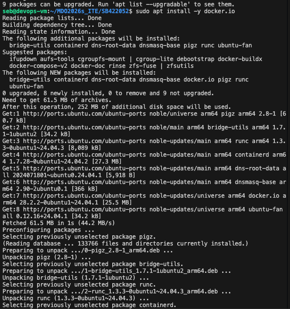
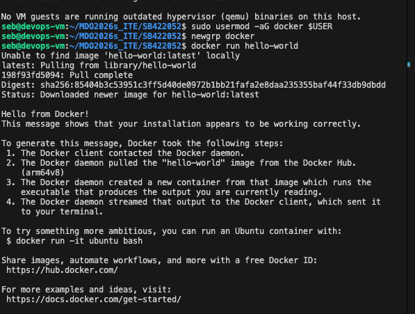

# Sprawozdanie SB422052
Wszystkie punkty zrealizowane: UTM (Ubuntu), SSH, Klucze, Git Hook.

### Dowody wykonania zadań z Dockera:

1. Instalacja środowiska Docker bezpośrednio z repozytorium Ubuntu:

2. Weryfikacja instalacji - uruchomienie testowego kontenera hello-world:

3. Pobranie i interaktywne uruchomienie obrazu busybox oraz weryfikacja wersji:

4. Kontener Ubuntu - aktualizacja pakietów i instalacja procps wewnątrz systemu:

5. Utworzenie pliku Dockerfile (zastosowanie dobrych praktyk m.in. COPY zamiast git clone) i budowa własnego obrazu:

6. Weryfikacja zawartości obrazu, globalne czyszczenie środowiska (prune) i wysłanie pliku na GitHub:
