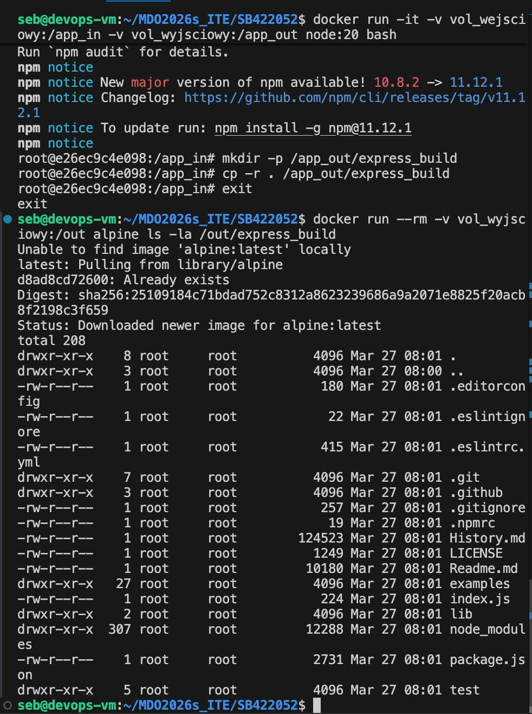
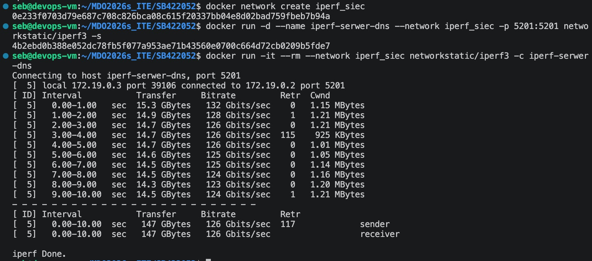

# Sprawozdanie SB422052
Wszystkie punkty zrealizowane: UTM (Ubuntu), SSH, Klucze, Git Hook.

### Dowody wykonania zadań z Dockera:

1. Instalacja środowiska Docker bezpośrednio z repozytorium Ubuntu:

2. Weryfikacja instalacji - uruchomienie testowego kontenera hello-world:

3. Pobranie i interaktywne uruchomienie obrazu busybox oraz weryfikacja wersji:

4. Kontener Ubuntu - aktualizacja pakietów i instalacja procps wewnątrz systemu:

5. Utworzenie pliku Dockerfile (zastosowanie dobrych praktyk m.in. COPY zamiast git clone) i budowa własnego obrazu:

6. Weryfikacja zawartości obrazu, globalne czyszczenie środowiska (prune) i wysłanie pliku na GitHub:

---
---
## Zajęcia 03: Dockerfiles, kontener jako definicja etapu

### 1. Wybór projektu i ręczny build w kontenerze
Jako projekt na zajęcia wybrałem **Express.js** (popularny framework backendowy w środowisku Node.js). 
* Repozytorium: `https://github.com/expressjs/express.git`
* Licencja: otwarta (MIT).
* Środowisko budowania: Zamiast klasycznego `make build` i `make test`, w ekosystemie Node używa się menedżera pakietów. Buildem jest tu `npm install`, a testy odpala się poleceniem `npm test`.

Najpierw przetestowałem wszystko ręcznie. Odpaliłem bazowy kontener w trybie interaktywnym (`docker run -it node:20 bash`), sklonowałem w nim repozytorium, zainstalowałem paczki i uruchomiłem testy. Zadziałało bez problemu, a na końcu testy wyrzuciły bardzo czytelny raport końcowy (poniżej dowód):

 

### 2. Automatyzacja zadania (dwa pliki Dockerfile)
Następnie zautomatyzowałem ten proces i zgodnie z poleceniem rozbiłem go na dwa osobne pliki:
1. `Dockerfile.build` - bierze czystego Node'a, kopiuje kod z repozytorium i instaluje wszystkie zależności (odpowiada za sam etap builda).
2. `Dockerfile.test` - jako bazy używa obrazu zbudowanego krok wcześniej i ma tylko jedno zadanie: odpalić testy jednostkowe.

Tak wygląda wynik zautomatyzowanych testów po zbudowaniu i odpaleniu drugiego obrazu:

### 3. Docker Compose
Żeby nie odpalać tych kontenerów z recznie, spiąłem całość w kompozycję. Utworzyłem plik `docker-compose.yml`, który po wpisaniu `docker compose up` sam zajmuje się zbudowaniem etapu testowego i wyrzuca logi na ekran:

---
---
## Zajęcia 04: Woluminy, Sieci i Jenkins

### 1. Zachowywanie stanu między kontenerami (Woluminy)
 Stworzyłem najpierw dwa nazwane woluminy: `vol_wejsciowy` i `vol_wyjsciowy`.

Do pobrania kodu użyłem tzw. **kontenera pomocniczego** z leciutkim obrazem `alpine/git`. Odpaliłem go z podpiętym woluminem wejściowym, kazałem mu sklonować repozytorium (Express.js) i od razu po tym usunąć kontener (opcja `--rm`). 

Kiedy kod leżał już  na woluminie, uruchomiłem docelowy kontener bazowy (`node:20`). Wszedłem do środka, zainstalowałem pakiety (zrobiłem builda przez `npm install`), a gotowe pliki skopiowałem na drugi wolumin (`vol_wyjsciowy`). 
Poniżej screen pokazujący, że dane przetrwały zamknięcie kontenera (wylistowałem zawartość woluminu wyjściowego z poziomu szybkiego, testowego kontenera alpine):

### 2. Eksponowanie portu i łączność między kontenerami (iperf3)
W tej części zbadałem przepustowość sieci między kontenerami za pomocą narzędzia `iperf3`.

**Krok 1: Domyślna sieć i łączenie po IP**
Najpierw odpaliłem serwer `iperf3` w domyślnej sieci Dockera i wyciągnąłem jego adres IP (np. `172.17.0.2`). Następnie uruchomiłem klienta, który połączył się z tym adresem. Przepustowość była ogromna (rzędu kilkudziesięciu Gbit/s), ponieważ ruch odbywa się w całości wewnątrz pamięci RAM hosta (maszyny wirtualnej), a nie po fizycznym kablu.

**Krok 2: Dedykowana sieć i rozwiązywanie nazw (DNS)**
Następnie utworzyłem własną sieć mostkową (`docker network create iperf_siec`). Dzięki temu mogłem połączyć kontenery używając ich nazw, a nie adresów IP. Odpaliłem serwer z flagą `--network iperf_siec` oraz portem wystawionym na zewnątrz (`-p 5201:5201`), a klienta połączyłem po prostu wpisując nazwę kontenera-serwera (`iperf-serwer-dns`).

**Krok 3: Połączenie spoza Dockera (z hosta)**
Na koniec zainstalowałem `iperf3` bezpośrednio na moim systemie Ubuntu (hoście) i połączyłem się z serwerem działającym w kontenerze, uderzając na `127.0.0.1`. Było to możliwe właśnie dzięki temu, że wcześniej wyeksponowałem port z kontenera na hosta parametrem `-p`.

### 4. Przygotowanie serwera CI Jenkins (z Docker-in-Docker)
Zgodnie z wytycznymi z oficjalnej dokumentacji, postawiłem środowisko Jenkins w oparciu o dwa kontenery i dedykowaną sieć.

**Kroki instalacji:**
1. Utworzyłem sieć mostkową `jenkins` (`docker network create jenkins`).
2. Uruchomiłem kontener "pomocnika" `docker:dind` (Docker-in-Docker) z certyfikatami i przypisałem go do sieci `jenkins`.
3. Uruchomiłem główny kontener z Jenkinsem (`jenkins/jenkins:lts`), eksponując porty `8080` (panel webowy) oraz `50000` (dla agentów) i łącząc go z demonem Docker wewnątrz DinD.
4. Oba kontenery działają poprawnie:

5. Z kontenera wyciągnąłem początkowe hasło administratora (`initialAdminPassword`), odblokowałem instancję pod adresem hosta i zainstalowałem sugerowane wtyczki. Środowisko jest zainicjalizowane i gotowe do pracy:
