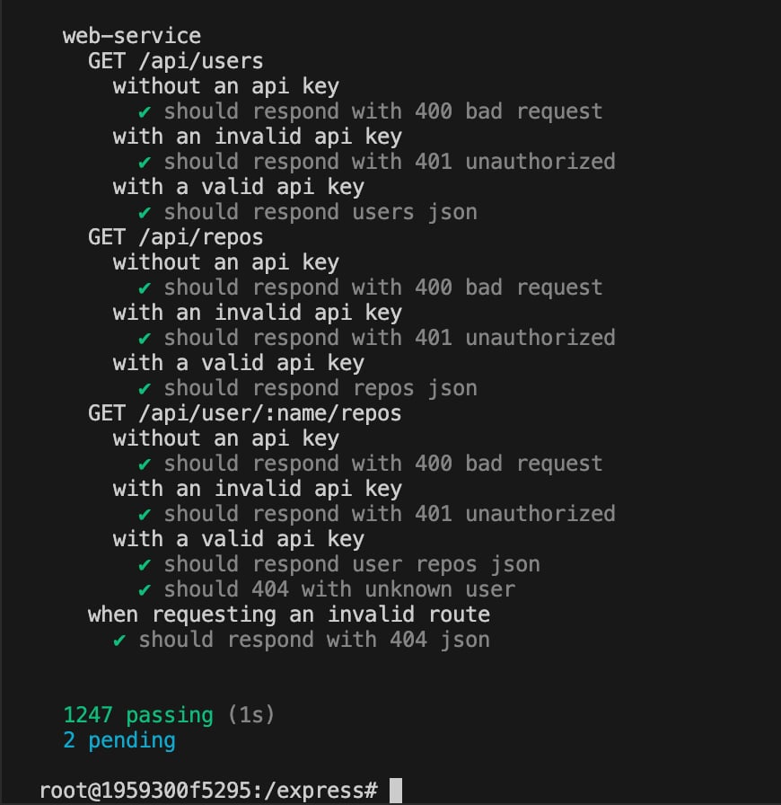
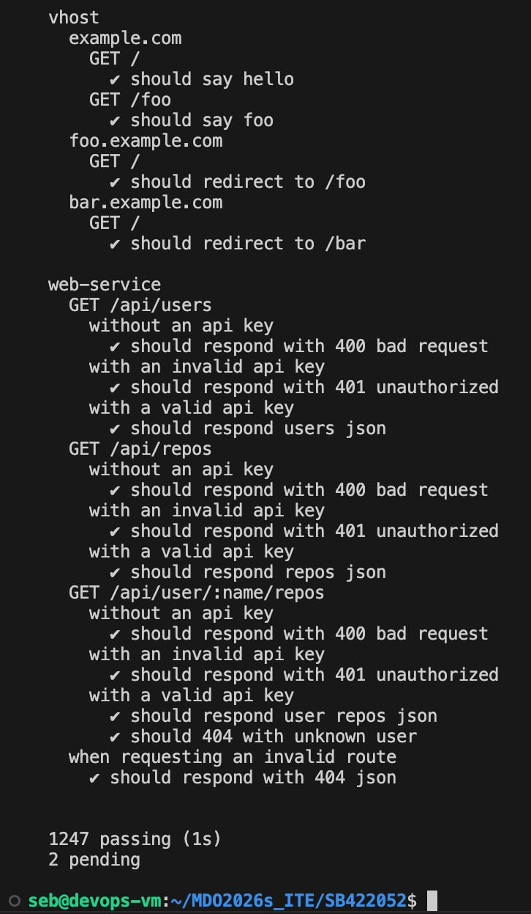
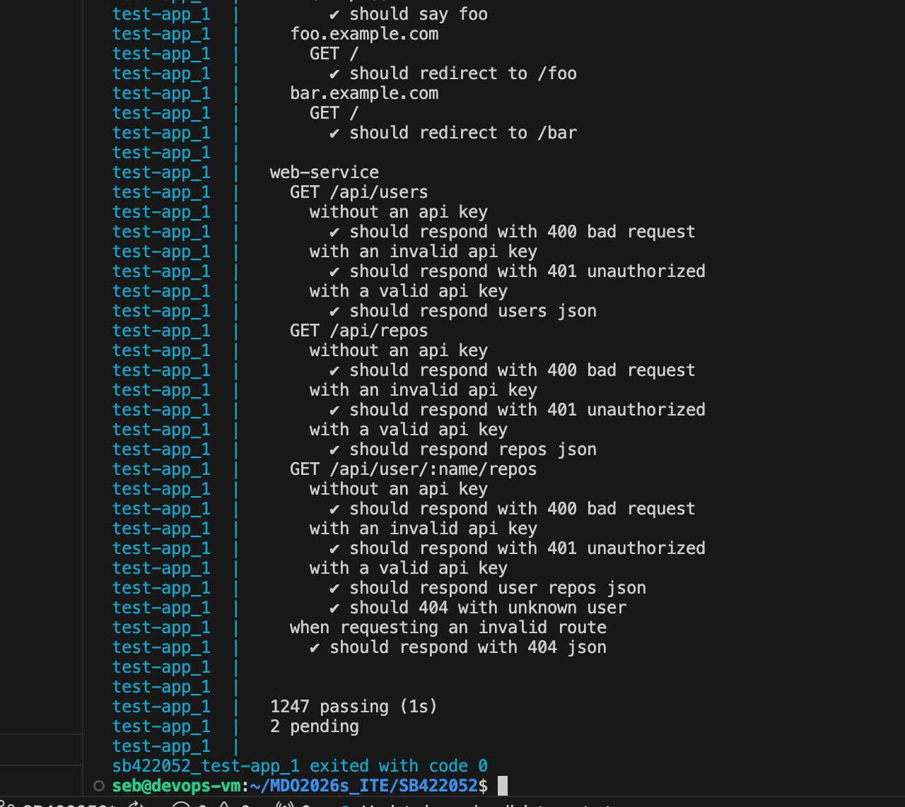

# Sprawozdanie SB422052
Wszystkie punkty zrealizowane: UTM (Ubuntu), SSH, Klucze, Git Hook.

### Dowody wykonania zadań z Dockera:

1. Instalacja środowiska Docker bezpośrednio z repozytorium Ubuntu:

2. Weryfikacja instalacji - uruchomienie testowego kontenera hello-world:

3. Pobranie i interaktywne uruchomienie obrazu busybox oraz weryfikacja wersji:

4. Kontener Ubuntu - aktualizacja pakietów i instalacja procps wewnątrz systemu:

5. Utworzenie pliku Dockerfile (zastosowanie dobrych praktyk m.in. COPY zamiast git clone) i budowa własnego obrazu:

6. Weryfikacja zawartości obrazu, globalne czyszczenie środowiska (prune) i wysłanie pliku na GitHub:

---
---
## Zajęcia 03: Dockerfiles, kontener jako definicja etapu

### 1. Wybór projektu i ręczny build w kontenerze
Jako projekt na zajęcia wybrałem **Express.js** (popularny framework backendowy w środowisku Node.js). 
* Repozytorium: `https://github.com/expressjs/express.git`
* Licencja: otwarta (MIT).
* Środowisko budowania: Zamiast klasycznego `make build` i `make test`, w ekosystemie Node używa się menedżera pakietów. Buildem jest tu `npm install`, a testy odpala się poleceniem `npm test`.

Najpierw przetestowałem wszystko ręcznie. Odpaliłem bazowy kontener w trybie interaktywnym (`docker run -it node:20 bash`), sklonowałem w nim repozytorium, zainstalowałem paczki i uruchomiłem testy. Zadziałało bez problemu, a na końcu testy wyrzuciły bardzo czytelny raport końcowy (poniżej dowód):

 

### 2. Automatyzacja zadania (dwa pliki Dockerfile)
Następnie zautomatyzowałem ten proces i zgodnie z poleceniem rozbiłem go na dwa osobne pliki:
1. `Dockerfile.build` - bierze czystego Node'a, kopiuje kod z repozytorium i instaluje wszystkie zależności (odpowiada za sam etap builda).
2. `Dockerfile.test` - jako bazy używa obrazu zbudowanego krok wcześniej i ma tylko jedno zadanie: odpalić testy jednostkowe.

Tak wygląda wynik zautomatyzowanych testów po zbudowaniu i odpaleniu drugiego obrazu:

### 3. Docker Compose
Żeby nie odpalać tych kontenerów z recznie, spiąłem całość w kompozycję. Utworzyłem plik `docker-compose.yml`, który po wpisaniu `docker compose up` sam zajmuje się zbudowaniem etapu testowego i wyrzuca logi na ekran:

