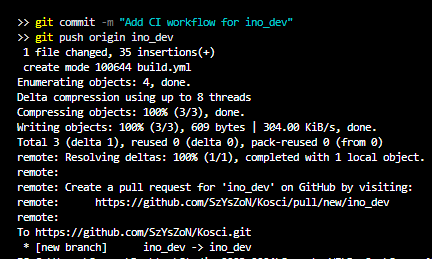
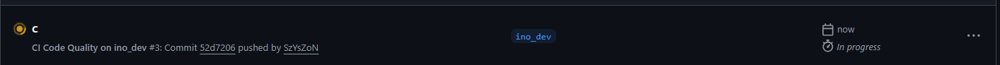

# Sprawozdanie – GitHub Actions CI/CD

## Cel zadania

Celem laboratorium było zapoznanie się z koncepcją GitHub Actions oraz stworzenie własnego workflow CI reagującego na zmiany w dedykowanej gałęzi `ino_dev`. Workflow miał wykonywać analizę jakości kodu i zapisywać wynik jako artefakt.

---

## Repozytorium

Projekt to prosta aplikacja webowa składająca się z plików:
- `index.html`
- `style.css`
- `game.js`

Ze względu na brak klasycznego systemu budowania (brak `package.json`, `pom.xml` itp.), zamiast buildu zastosowano analizę jakości kodu przy użyciu narzędzia **ESLint**.

---

## Trigger

Workflow reaguje na zdarzenie `push` oraz `pull_request` do gałęzi `ino_dev`:

```yaml
on:
  push:
    branches:
      - ino_dev
  pull_request:
    branches:
      - ino_dev
```

---

## Plik workflow

Plik `.github/workflows/build.yml` zawiera następujące kroki:

```yaml
name: CI Code Quality on ino_dev

on:
  push:
    branches:
      - ino_dev
  pull_request:
    branches:
      - ino_dev

jobs:
  lint:
    runs-on: ubuntu-latest

    steps:
      - name: Checkout code
        uses: actions/checkout@v4

      - name: Set up Node.js
        uses: actions/setup-node@v4
        with:
          node-version: '22'

      - name: Install ESLint
        run: npm install eslint --save-dev

      - name: Run ESLint
        run: npx eslint *.js --format json --output-file eslint-report.json || true

      - name: Upload ESLint report as artifact
        uses: actions/upload-artifact@v4
        with:
          name: eslint-report
          path: eslint-report.json
          retention-days: 7
```

---

## Przebieg

### 1. Dodanie workflow do gałęzi `ino_dev`

Plik `build.yml` został dodany do folderu `.github/workflows/` i wypchnięty na gałąź `ino_dev`:



### 2. Workflow w trakcie wykonania

Po pushu GitHub automatycznie uruchomił workflow. Na screenshocie widoczny jest run w statusie **In progress**:



### 3. Zakończony pomyślnie

Workflow zakończył się sukcesem w czasie ok. 15 sekund:


---

## Artefakt

Workflow zapisuje raport ESLint jako artefakt (`eslint-report.json`) dostępny do pobrania przez 7 dni w zakładce **Actions** na GitHubie, zgodnie z dokumentacją [`actions/upload-artifact@v4`](https://docs.github.com/en/actions/writing-workflows/choosing-what-your-workflow-does/storing-and-sharing-data-from-a-workflow).

---

## Cennik / Plan darmowy

GitHub Actions w planie darmowym (Free) oferuje:
- **2 000 minut/miesiąc** dla prywatnych repozytoriów
- **Nielimitowane minuty** dla publicznych repozytoriów
- **500 MB** przestrzeni na artefakty

Wykonany workflow zajął ~15 sekund, co mieści się w darmowym limicie.

---

## Wnioski

GitHub Actions pozwala w prosty sposób zautomatyzować procesy CI/CD bezpośrednio w repozytorium. Dzięki triggerowi opartemu na gałęzi `ino_dev` workflow uruchamia się automatycznie przy każdym pushu, bez ingerencji w główną gałąź projektu (`main`). Analiza jakości kodu z ESLint stanowi wartościową alternatywę dla buildu w przypadku projektów frontendowych bez systemu kompilacji.
