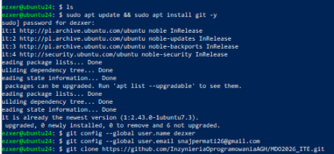
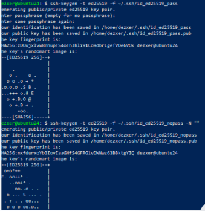
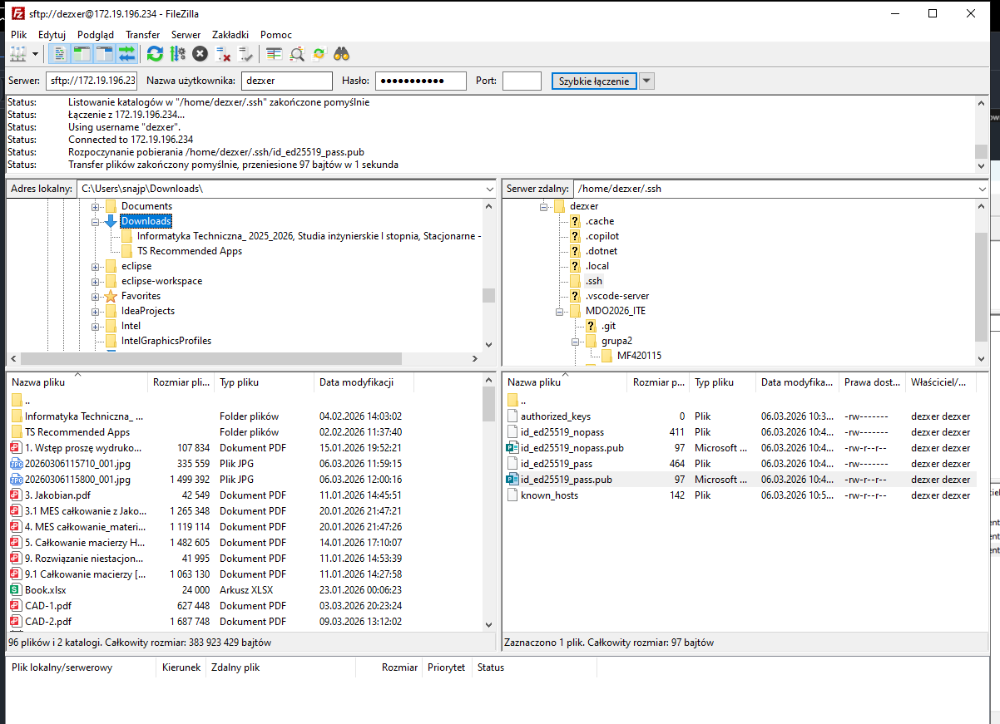
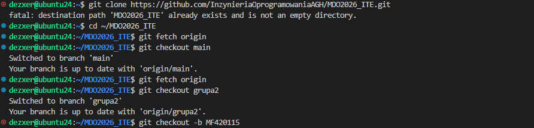
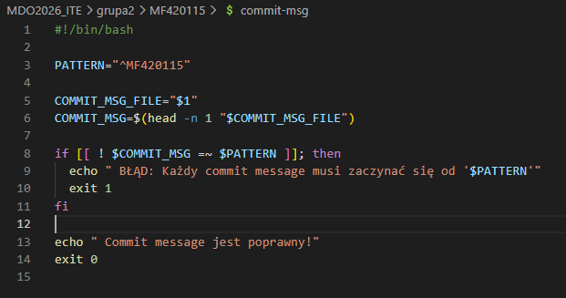
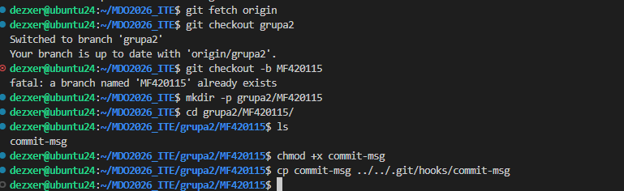

Sprawozdanie: Przygotowanie stanowiska pracy – Git, SSH i Gałęzie
Autor: dezxer (MF420115)

Data: 12 marca 2026 r.

Środowisko: Ubuntu 24.04.4 LTS (Virtual Machine / Hyper-V), Windows PowerShell (Host)/ Visual Studio Code (VSC)

1. Przedstawienie środowiska pracy
Zgodnie z wymaganiami sprzętowymi, system operacyjny Ubuntu został zainstalowany w maszynie wirtualnej (Hyper-V). Praca odbywa się bez środowiska graficznego, wyłącznie poprzez terminal.

Host: Windows 10 z dostępem przez SSH (PowerShell potem VSC).

Gość: Ubuntu 24.04.4 LTS (IP: 172.26.54.60).

Użytkownik: dezxer

2. Realizacja zadań
2.1 Git – Instalacja i pierwsze klonowanie
Pierwszym krokiem była instalacja klienta Git oraz konfiguracja tożsamości użytkownika globalnego. Następnie sklonowano repozytorium przedmiotowe MDO2026_ITE za pomocą protokołu HTTPS.

2.2 SSH – Tworzenie kluczy i zabezpieczenia
Wygenerowano dwa klucze SSH typu ED25519 (zgodnie z wymogiem kluczy innych niż RSA).

Klucz zabezpieczony hasłem: id_ed25519_pass.

Klucz bez hasła: id_ed25519_nopass.

2.3 Narzędzia – Wymiana plików
Skonfigurowano dostęp SFTP w celu natychmiastowej wymiany plików między hostem a maszyną wirtualną.

2.4 Gałęzie – Struktura i praca na branchach
Praca została zorganizowana zgodnie z modelem gałęzi grupy:

Przełączono się na gałąź main, a następnie na gałąź grupy grupa2.

Utworzono własną gałąź roboczą o nazwie MF420115.

Wewnątrz katalogu grupy utworzono katalog osobisty: grupa2/MF420115/.

2.5 Automatyzacja – Git Hook (commit-msg)
Napisano skrypt w Bashu (commit-msg), który weryfikuje treść wiadomości commita. Skrypt sprawdza, czy każda wiadomość zaczyna się od identyfikatora MF420115. Jeśli warunek nie jest spełniony, commit zostaje przerwany.

Skopiowanie pliku do odpowiedniego folderu i nadanie uprawnienień tak by uruchamiał się za każdym razem kiedy robisz commita

3. Dokumentacja procesu i historia poleceń
Zrzuty ekranu zostały osadzone bezpośrednio w treści sprawozdania (inline). Wszystkie pliki graficzne oraz skrypt commit-msg znajdują się w katalogu sprawozdania.

Listing historii poleceń (Bash):
   1  git clone https://github.com/uzytkownik/repo-przedmiotowe.git
    2  git clone https://github.com/InzynieriaOprogramowaniaAGH/MDO2026_ITE.git
    3  cd ~/MDO2026_ITE
    4  git fetch origin
    5  git checkout main
    6  git checkout grupa2
    7  git checkout -b MF420115
    8  mkdir -p grupa2/MF420115
    9  cd grupa2/MF420115/
   10  nano commit-msg
   11  ls
   12  sudo apt update && sudo apt install git -y
   13  git config --global user.name dezxer
   14  git config --global user.email snajpermati26@gmail.com
   15  git clone https://github.com/InzynieriaOprogramowaniaAGH/MDO2026_ITE.git
   16  ssh-keygen -t ed25519 -f ~/.ssh/id_ed25519_pass 
   17  ssh-keygen -t ed25519 -f ~/.ssh/id_ed25519_nopass -N ""
   18  cat ~/.ssh/id_ed25519_pass.pub
   19  git clone git@github.com:organizacja/repo-przedmiotowe.git repo-ssh
   20  git clone https://github.com/InzynieriaOprogramowaniaAGH/MDO2026_ITE.git
   21  cd ~/MDO2026_ITE
   22  git fetch origin
   23  git checkout main
   24  git fetch origin
   25  git checkout grupa2
   26  git checkout -b MF420115
   27  mkdir -p grupa2/MF420115
   28  cd grupa2/MF420115/
   29  ls
   30  chmod +x commit-msg
   31  cp commit-msg ../../.git/hooks/commit-msg
   32  ls
   33  cd ~/MDO2026_ITE
   34  git branch
   35  git status
   36  cd grupa2/
   37  ls
   38  git checkout -b MF420115
   39  chmod +x commit-msg
   40  ls
   41  cd MF420115/
   42  chmod +x commit-msg
   43  cp commit-msg ../../.git/hooks/commit-msg
   44  history
4. Finalizacja
Ostatnim krokiem jest wypchnięcie zmian na zdalne repozytorium (gałąź MF420115) i wystawienie Pull Requesta do gałęzi grupa2.