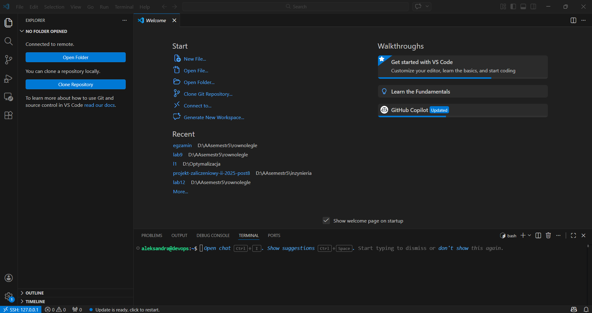
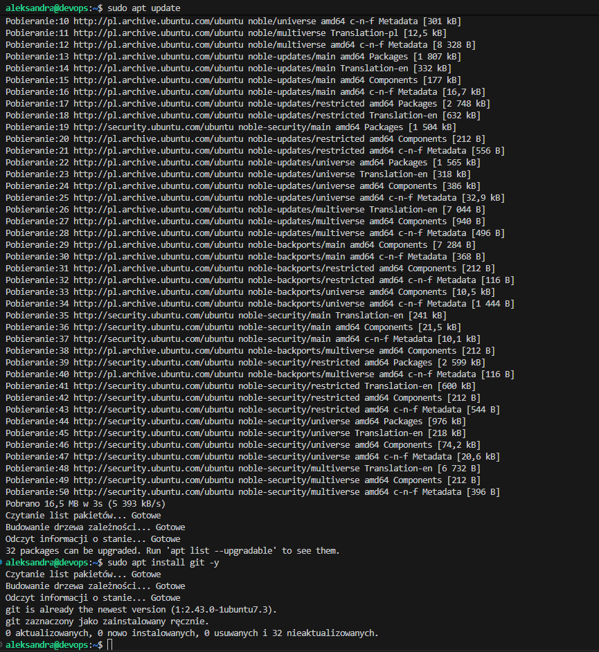
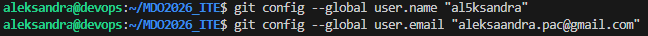
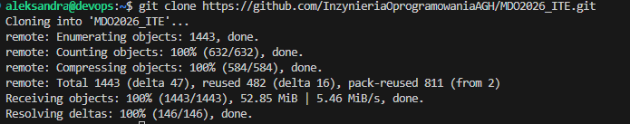
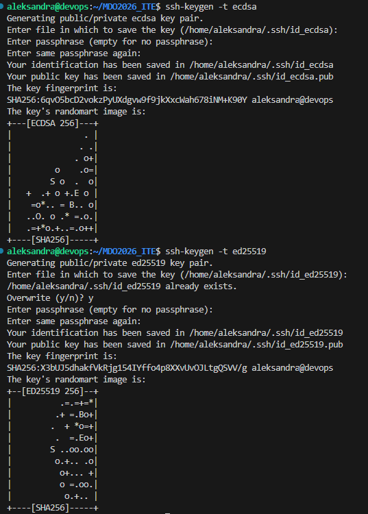
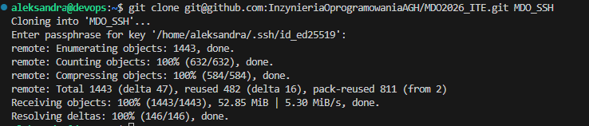
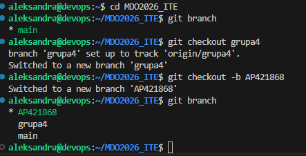
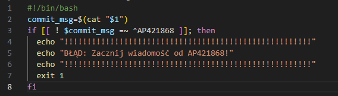

# 1. Zalogowanie do maszyny

# 2. Instalacja Git

# 3. Konfiguracja uzytkownika Git

# 4. Klonowanie przez HTTPS

# 5. Utworzenie kluczy SSH

# 6. Klonowanie repozytorium z użyciem SSH

# 7. Utworzenie własnej gałęzi

# 8. Githook

