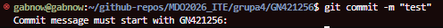

# Git pobrany na maszynie

# Klonowanie repo

użyto personal access token githuba

# Tworzenie kluczy SSH
1. Chroniony hasłem klucz ed25519

2. Nie chroniony klucz ecdsa


Jeden z tych kluczy został dodany do konta github aby służyć jako klucz dostępu, dzięki czemu możemy sklonować repo przez ssh, lecz najpierw sprawdzimy czy działa połączenie

Po otrzymaniu takiego komunikatu wiadomo że jest ok


# Tworzenie nowej gałęzi repozytorium


Po stworzeniu odpowiedniego katalogu został napisany git hook (treść na końcu sprawozdania)




```{bash}
git
git clone {link}
ssh-keygen -t ed25519 -C "Klucz-Na-Zaj-ed25519" -f ~/.ssh/id_ed25519_na_zaj
ssh-keygen -t ecdsa -b 521 -C "Klucz-Na-Zaj-ed25519" -f ~/.ssh/id_ed25519_na_zaj
ssh -T git@github
git clone git@github.com:InzynieriaOprogramowaniaAGH/MDO2026_ITE.git
git checkout main
git checkout grupa4
git checkout -b GN421256


```

# Treść GitHook
```{bash}
#!/bin/bash

PREFIX="GN421256: "

if ! grep -q "^$PREFIX" "$1"; then
    echo "Commit message must start with $PREFIX"
  exit 1
fi
```