# Sprawozdanie z zajęć 01 – Wprowadzenie, Git, Gałęzie, SSH

Autor: **MN420239**  
Grupa: **grupa 4**  
Data: **11.03.2026**

---

## 1. Przygotowanie środowiska i Git

Na początku przygotowano środowisko pracy na maszynie wirtualnej z systemem Linux Ubuntu.  
Zainstalowano klienta **Git** oraz narzędzia umożliwiające korzystanie z protokołu **SSH**.

Do pracy z kodem wykorzystano **Cursor - fork Visual Studio**, natomiast do łączenia się z maszyną wirtualną przez SSH zastosowano program **Termius**.

Następnie sklonowano repozytorium przedmiotowe z GitHub.

**Opis zdjęcia:**  
Repozytorium przedmiotowe otwarte w środowisku Cursor.

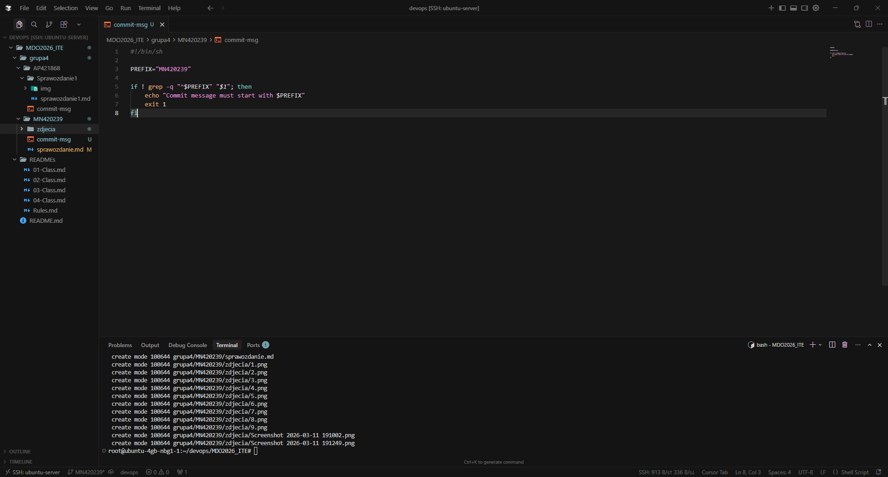

---

## 2. Generowanie kluczy SSH

Kolejnym krokiem było wygenerowanie dwóch kluczy SSH innych niż RSA.

Wykorzystano polecenia:

```bash
ssh-keygen -t ed25519 -C "github-key1"
ssh-keygen -t ecdsa -b 521 -C "github-key2"
```

Pierwszy klucz został zabezpieczony hasłem.

**Opis zdjęcia:**  
Proces generowania klucza SSH typu ed25519.

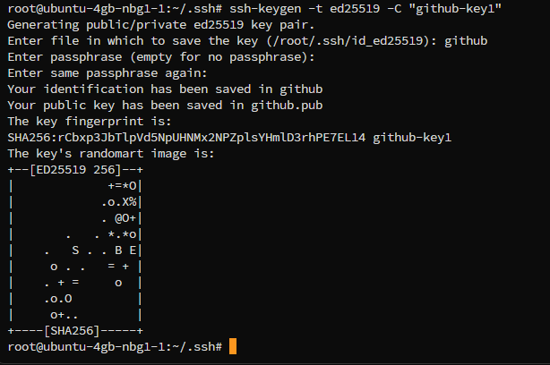

**Opis zdjęcia:**  
Generowanie drugiego klucza SSH typu ECDSA.

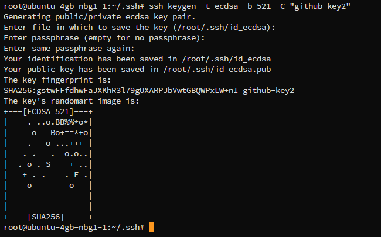

---

## 3. Dodanie kluczy do ssh-agent

Po wygenerowaniu kluczy dodano je do **ssh**, aby mogły być używane podczas autoryzacji z GitHub.

```bash
ssh-add ~/.ssh/github
ssh-add ~/.ssh/id_ecdsa
```

**Opis zdjęcia:**  
Dodanie klucza do folderu ssh.

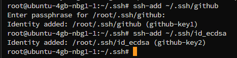

Następnie sprawdzono listę aktywnych kluczy.

```bash
ssh-add -l
```

**Opis zdjęcia:**  
Lista kluczy załadowanych do ssh-agent.

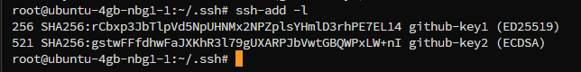

---

## 4. Test połączenia SSH z GitHub

Po dodaniu kluczy przetestowano połączenie z GitHub przy użyciu polecenia:

```bash
ssh -T git@github.com
```

Połączenie zostało poprawnie uwierzytelnione.

**Opis zdjęcia:**  
Test połączenia SSH z GitHub.

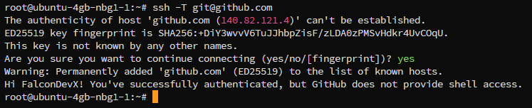

---

## 5. Klonowanie repozytorium przez SSH

Po poprawnej konfiguracji kluczy sklonowano repozytorium przedmiotowe z wykorzystaniem protokołu SSH:

```bash
git clone git@github.com:InzynieriaOprogramowaniaAGH/MDO2026s_ITE
```

**Opis zdjęcia:**  
Klonowanie repozytorium przez SSH.

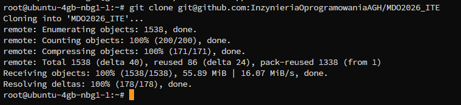

---

## 6. Praca na gałęziach

Po sklonowaniu repozytorium przełączono się na odpowiednią gałąź oraz utworzono gałąź roboczą o nazwie:

```bash
git checkout -b MN420239
```

**Opis zdjęcia:**  
Utworzenie i przełączenie się na gałąź `MN420239`.

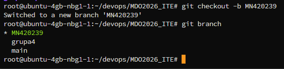

---

## 7. Git hook sprawdzający commit message

Przygotowano **git hook**, który sprawdza czy komunikat commita zaczyna się od identyfikatora `MN420239`.

Hook został zapisany w pliku:

```text
.git/hooks/commit-msg
```

Treść skryptu:

```bash
#!/bin/sh

PREFIX="MN420239"

if ! grep -q "^$PREFIX" "$1"; then
    echo "Commit message must start with $PREFIX"
    exit 1
fi
```

Hook blokuje wykonanie commita, jeśli komunikat nie zaczyna się od wymaganego prefiksu.

**Opis zdjęcia:**  
Próba wykonania commita z niepoprawnym komunikatem zablokowanym przez hooka.

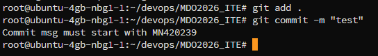

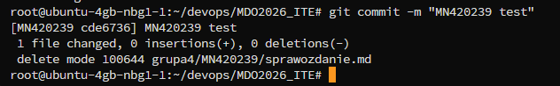

---

## 8. Dodanie kluczy SSH do GitHub

Publiczne klucze dodano do ustawień konta GitHub w sekcji **SSH keys**, dzięki czemu możliwe jest uwierzytelnianie przy użyciu SSH.

**Opis zdjęcia:**  
Widok ustawień GitHub z dodanymi kluczami SSH.

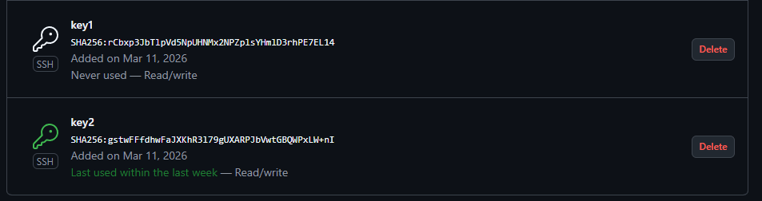

---

## 9. Commit zmian

Po przygotowaniu plików wykonano commit z poprawnym komunikatem zaczynającym się od identyfikatora:

```bash
git commit -m "MN420239 test"
```

**Opis zdjęcia:**  
Wykonanie poprawnego commita w repozytorium.

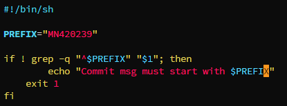

---

## Podsumowanie

Podczas zajęć:

- przygotowano środowisko pracy z Git i SSH,  
- wygenerowano dwa klucze SSH (ed25519 oraz ecdsa),  
- dodano klucze do `ssh-agent` oraz do konta GitHub,  
- przetestowano połączenie SSH z GitHub,  
- sklonowano repozytorium przy użyciu protokołu SSH,  
- utworzono gałąź `MN420239`,  
- przygotowano git hook sprawdzający poprawność komunikatu commita.


