# Sprawozdanie z zajęć 02

Autor: **MN420239**  
Grupa: **grupa 4**  
Data: **13.03.2026**

---

W ramach ćwiczenia zainstalowano Dockera w systemie Ubuntu z użyciem repozytorium dystrybucji. 

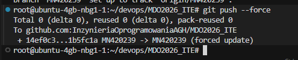

Uruchomiono przykładowe obrazy Dockera: `hello-world`, `busybox` oraz `ubuntu`, sprawdzając ich rozmiary oraz kody wyjścia. 

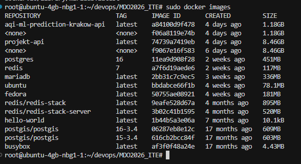

Uruchomienie obrazu `busybox`

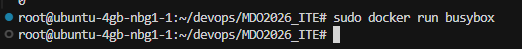

Połączenie się z busybox interaktywnie oraz wywołanie numeru wersji

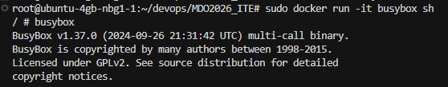

Uruchomienie kontener z systemem `ubuntu`, zaprezentowano proces `PID1` wewnątrz kontenera oraz procesy Dockera na hoście, a następnie zaktualizowano pakiety i zakończono pracę w kontenerze. 

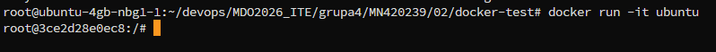

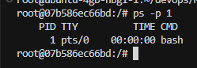

Przygotowano własny plik `Dockerfile` (docker-test/Dockerfile) bazujący na obrazie `ubuntu:22.04`, instalujący `git` oraz klonujący repozytorium `MDO2026_ITE`. 

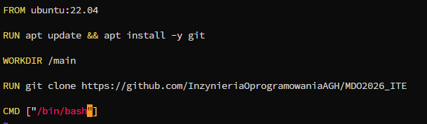

Następnie został zbudowany obraz kontenera na podstawie wcześniejszego pliku `Dockerfile`.  

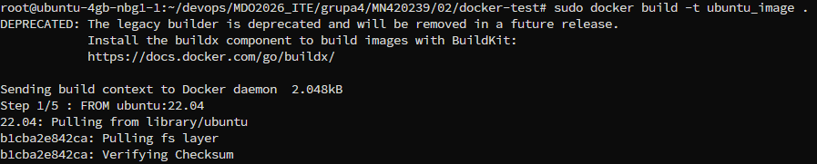

Kontener uruchomiono w trybie interaktywnym i zweryfikowano obecność sklonowanego repozytorium.

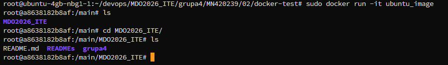

Na koniec wyświetlono listę uruchomionych oraz zakończonych kontenerów, wyczyszczono zakończone kontenery i usunięto nieużywane obrazy z lokalnego magazynu. 

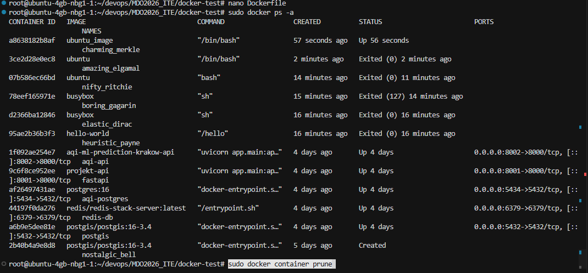

Czyszczenie obrazów

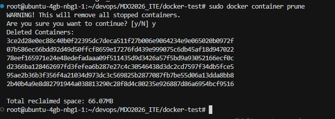

Plik `Dockerfile` dodano do katalogu sprawozdania zgodnie z poleceniem. 

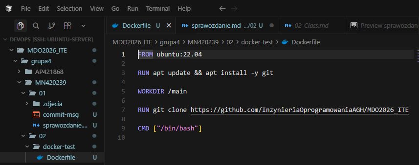
