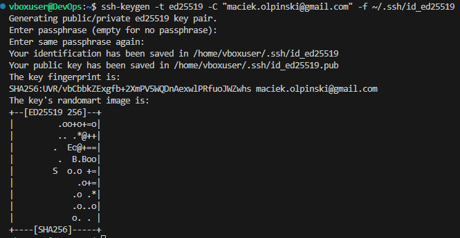
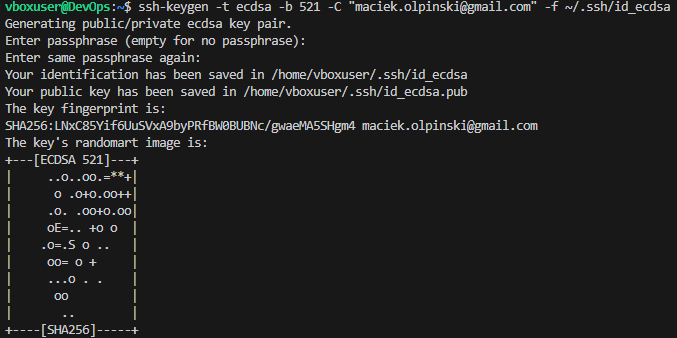
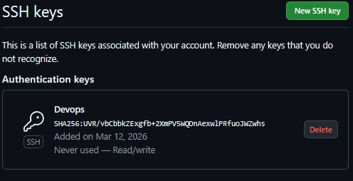
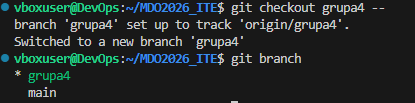
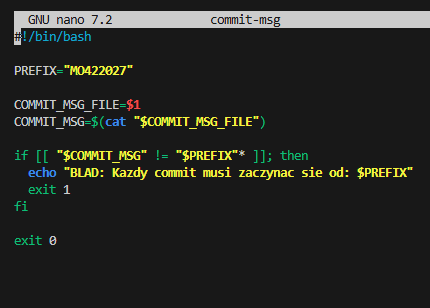
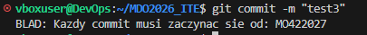

# Sprawozdanie MO420227

## 1. Konfiguracja środowiska
* **Git:** Zainstalowano, skonfigurowano dane użytkownika i sklonowano repozytorium przez SSH.
* **SSH:** Wygenerowano klucze (Ed25519 z hasłem oraz ECDSA). 

Skonfigurowano dostęp do GitHub.

* **IDE:** Skonfigurowano zdalną pracę w VS Code (Remote-SSH).

## 2. Praca z gałęziami i Git Hook
* Utworzono gałąź: `MO420227`.

* Wdrożono skrypt `commit-msg` w `.git/hooks/`, wymuszający prefiks `MO420227`.

## 3. Dowody
**Zrzut z Pull Requesta:**

