# Sprawozdanie: Środowisko skonteneryzowane

**Autor:** MO420227
**Zadanie:** Zestawienie i weryfikacja środowiska kontenerów Docker.

## 1. Instalacja i test obrazów
Zainstalowano pakiet docker. Zweryfikowano działanie demona poprzez uruchomienie obrazu `hello-world`.

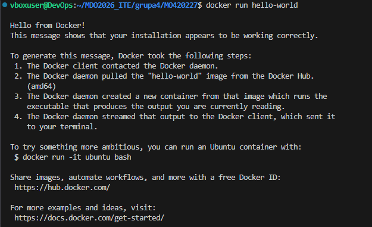

## 2. Praca z kontenerami (Busybox i Ubuntu)
Uruchomiono kontenery `busybox` oraz `ubuntu`. Przeprowadzono testy interaktywne, weryfikując wersje oprogramowania oraz strukturę procesów.

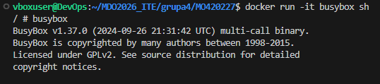

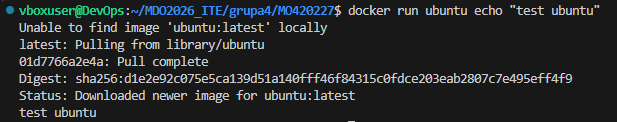

Zaktualizowano pakiety.

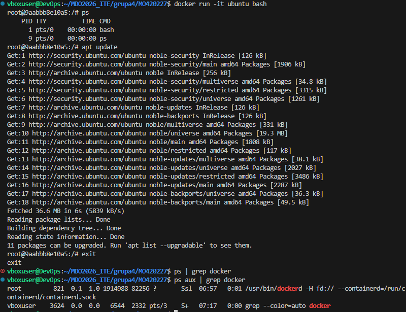

## 3. Własny Dockerfile
Stworzono plik `Dockerfile`, w którym zautomatyzowano instalację `git`-a oraz pobranie repozytorium przedmiotowego.

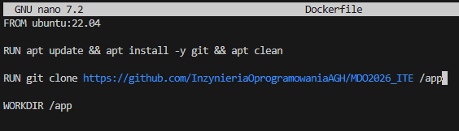

Zbudowano kontener.

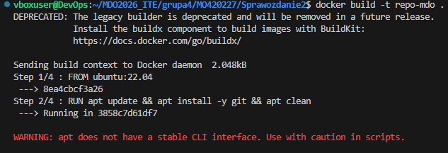

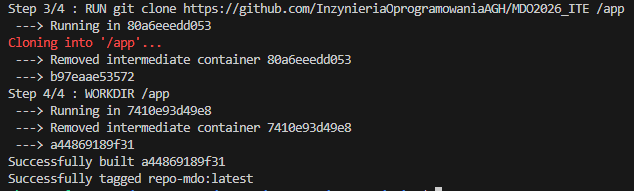

Uruchomiono kontener w trybie interaktywnym celem weryfikacji poprawnego klonowania repozytorium.

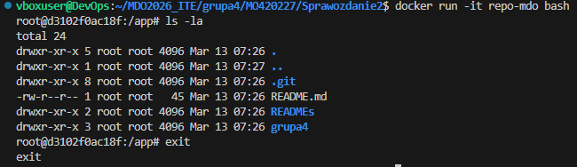

## 4. Zarządzanie zasobami
W celu utrzymania porządku w magazynie lokalnym, wyświetlono wszystkie kontenery, a następnie przeprowadzono procedurę czyszczenia nieużywanych zasobów za pomocą komend `prune`.

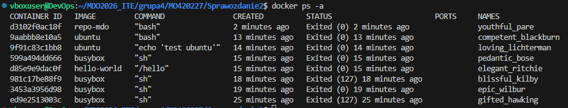

Usunięto nieużywane kontenery.

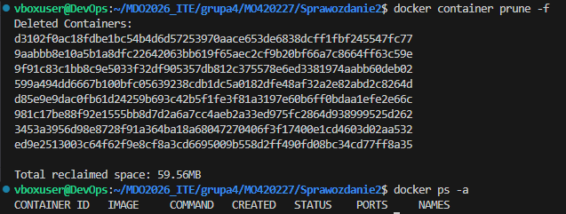

Usunięto nieużywane obrazy.

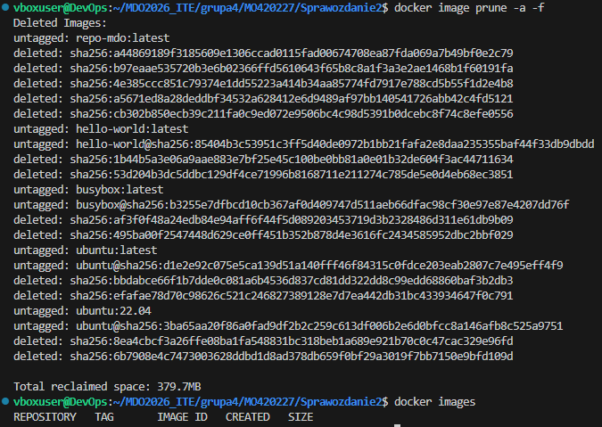